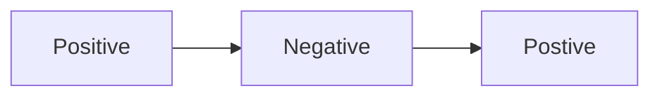
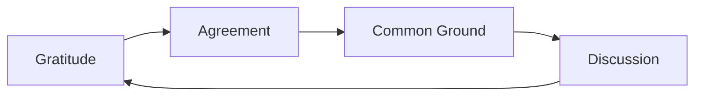
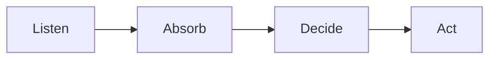

# Fearless feedback <!-- omit in toc -->

- [Feedback matrix](#feedback-matrix)
- [Delivering feedback](#delivering-feedback)
  - [Compliment Sandwich](#compliment-sandwich)
  - [GROW model](#grow-model)
  - [Shoutouts](#shoutouts)
- [Receiving feedback](#receiving-feedback)
  - [Gratitude, Agreement, and Discussion](#gratitude-agreement-and-discussion)
  - [LADA Model](#lada-model)
- [Key takeaways](#key-takeaways)

Fearless feedback is feedback which is direct, honest, timely, brief, constructive, and provided with good intention.

Many people struggle with giving or receiving feedback, which is normal. Through relfex people become defensive or offended, espeically if the feedback is not delivered well.

Feedback, however, is integral to growth and confidence - through celebrating achievements, validating actions or opinions, and learning. It provides a mutual understanding of a situation, action, or emotion, to allow for easy and respectful communication.

## Feedback matrix

There are four different types of feedback that exist on this spectrum.

<!-- Mimicking a cartensian plane (XY axis) -->

|             |              |              |
| :---------- | :----------: | -----------: |
|             | **Positive** |
| **General** |      +       | **Specific** |
|             | **Negative** |              |

**Examples of each type of feedback:**

> Positive, general: "_Harold, you did a great job the other day!_"
>
> Negative, general: "_Emerald, I saw that PR you put through. It was really bad._"
>
> Positive, specific: "_Harold, you did a great presentation on Wednesday, you were so confident. I learned a lot about how to use GitHub._"
>
> Negative, specific: "_Emerald, I saw PR #70, some of the naming conventions were did not follow the contribution guide, making it hard to understand._"

Key takeaways:

- Negative feedback should always be specific
- General feedback for positive feedback is okay, but not ideal
- Specific feedback is the most impactful and the most productive
- Specifics are the best way to ensure that feedback is taken on-board and helpful

## Delivering feedback

When delivering feedback it is important to ask for permission beforehand. It is expected that some days are not going to be an appropriate times for feedback. Please do not deliver feedback when you or them are upset or angry. For feedback to be productive it is best to be level-headed. Willingness to listen and respect the feedback is a major part of the process. The outcome will not be productive if you or them are not willing to listen with an open-mind.

It can be as simple as a quick message: "_Is now an okay time for some feedback?_" or "_Would you be willing to hear some feedback from me?_".

Feedback is used to help someone improve and learn, it is not a criticism of a person's skills or intelligence. Assuming positive intent, from both parties, in all feedback can reduce miscommunication or offence. However, this is a skill that takes time and practice.

Particularly when providing constructive feedback, it is important to always seek to understand the root cause and context for a situation. Never assume to know everything about a person and make judgements. Feedback is designed to provide opportunities and create conversations for improvement. Being open to listen to the whole context can allow you to provide more specific and productive feedback, which is more beneficial for the individual.

Building relationships with each other can help facilitate the feedback process. The stronger your rapport the more honest the feedback. However rapport does not dismiss professionalism, feedback can be critical and it is important that it follows communication guideline and standards. Be proactive and ask for feedback from your peers, do not wait for someone to find you. If you ask for general feedback, you should expect a general response.

The environment can play a large role in the willingness and reaction to feedback. Creating a safe space allows for effective and professional communication. For one-on-one feedback, take it to a private space and make time for an active discussion around the feedback. Ensure that there are no non-verbal power imbalances within the discussion (e.g. You standing, and them sitting).

How you frame the feedback can influence the discussion. Feedback, especially negative feedback, is not a throughaway comment, it needs to be shaped around context and values. Different models for feedback exist, such as the Compliment Sandwich or the GROW model. Breaking the feedback into actionable sections can also help in understanding and plans going forwards.

### Compliment Sandwich

The Compliment Sandwich wraps constructive critisim within praise. This can be useful for people who you do not have rapport or if you are new to giving feedback. It is an easy and less destructive model to provide feedback.

### GROW model

**Goal:** What is your goal? What were you trying to achieve?

**Reality:** What is the curent situation? Did you think that it worked well?

**Options:** What are the options moving forward? What could be done differently?

**Will:** What will be done now? What are the next steps? Your opinion?

The GROW model is for deeper conversation around feedback. This framework naturally places feedback within the context of the team or project goals. It is also important that you ask yourself these questions. One should reflect and facilitate self-development and awareness before providing feedback.

### Shoutouts

Recognition is a key transformative tactic. Showing appreciation to team members contributions influences engagement behaviour, and acknowledges to team members that their work is seen.

1. Shout out to people that did a great job in our `Shoutouts!` MS Teams channel. Everyone in the company is in this channel so please don't be shy.
1. Consider other channels where recognition can be acknowledged: team meetings, etc.
1. Please be as timely as possible with your recognition.

## Receiving feedback

Receiving feedback follows similar principles to delivery, however, in this case it is the response that changes.

Mentally prepare to receive the feedback. Ideally, you should have given permission or asked for the feedback. Be patient, now is the time to acknowledge and listen to the advice given. Work on developing a growth mindset. This will help you step back from the defense and accept feedback as a way to improve and learn.

Again, you should always assume positive intent. Being given feedback is not a critisim on the work done, it is merely advice to improve and be even better next time around. Do not interupt them as they are speaking. Listen to the whole story, rather than formulate challenges and excuses.

The first response should be gratitude. Giving feedback takes a lot of courage and can be risky. People are often reluctant to share all their thoughts, creating a safe space can allow them to extract all feedback. Saying "_Thank you_" will put you in a constructive frame of mind. Gratitude demonstrates you are willing to listen and learn.

<!-- WIP: If you are ever uncomfortable with a setting, say something. They may be unaware of the situation or feeling arising. Feedback should be a learning opportunity, not a -->

If you want more specific information, take the time to restate what they have told you, and ask. Seeking to understand goes both ways. Even if you disagree with some of the message, there is always something to learn. Actively trying to understand another perspective can help you to reach their conclusions.

Similar to deliverying feedback, there are some frameworks you can employ.

### Gratitude, Agreement, and Discussion

It is okay to disagree with some of the feedback. However, it is important to be conscious of the risk they have taken in giving feedback.
Always state where you agree before discussing where you disagree.
Agreement is a much similar conversation and can be short. It will also make you seem less defensive, leading to a more productive conversation following.
Disagreement is a much larger discussion. You do not have to agree with their feedback, however, you should seek to understand where they are coming from. Odds are they are not the only one who thinks this way.

### LADA Model

**Listen:** Listening to the other person allows the other person to express and refine their thoughts. Be patient. Ask questions like "_Is there anything else you want to tell me?_" or "_Feel free to send more feedback if you think of anything else_". Be mindful of the tone of your voice.

**Absord:** Take the time to seek to understand and clarify the feedback fiven to you. Asking questions for clarification and examples can help to build a more detailed understanding. These are not posed as a challenge to the person, but to receive and absorb. Questions can be:

- Can you give me an example?
- What would you have done?
- What would your preference have been?

If all the feedback is positive, it can be difficult to identify the areas for growth. Some questions to help are:

- Is there something that you think I can improve on?
- Do you think I could have done something differently?

**Decide:** This stage is occurs both during the conversation and after. It is reflection and introspection. Here you deciede whether the feedback is legitimate and something to be actioned. It is important not to become defensive, but you can disagree with the feedback. To disagree must be polite and can be discussed with the giver. The deciding stage can help with prioritising the actions to address.

**Act:** This stage is about creating actionable items derived from feedback. Not all feedback is actionable through outcomes or goals. Some feedback is about awareness and is highly situational. It is an important skill to learn how to action and assess feedback.

The LADA model encourages the giver to freely convey their thoughts and you to dig deeper into the details of the feedback. By asking questions and going further you may uncover new information that might be valuable to your learning.

## Key takeaways

- Ask for permission
- Assume positive intent
- Seek to understand
- Build rapport
- Consider poisitioning
- Consider framing
- Be specific
