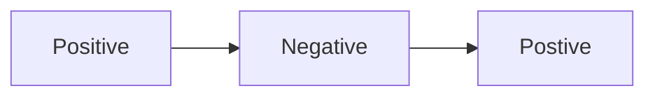

# Fearless feedback <!-- omit in toc -->

- [Feedback matrix](#feedback-matrix)
- [Feedback delivery](#feedback-delivery)
  - [Compliment Sandwich](#compliment-sandwich)
  - [GROW model](#grow-model)
  - [Shoutouts](#shoutouts)
- [Key takeaways](#key-takeaways)

Fearless feedback is feedback which is direct, honest, timely, brief, constructive, and provided with good intention.

Many people struggle with giving or receiving feedback, which is normal. Through relfex people become defensive or offended, espeically if the feedback is not delivered well.

Feedback, however, is integral to growth and confidence - through celebrating achievements, validating actions or opinions, and learning. It provides a mutual understanding of a situation, action, or emotion, to allow for easy and respectful communication.

## Feedback matrix

There are four different types of feedback that exist on this spectrum.

|             |              |              |
| :---------- | :----------: | -----------: |
|             | **Positive** |
| **General** |      +       | **Specific** |
|             | **Negative** |              |

**Examples of each type of feedback:**

> Positive, general: "_Harold, you did a great job the other day!_"
>
> Negative, general: "_Emerald, I saw that PR you put through. It was really bad._"
>
> Positive, specific: "_Harold, you did a great presentation on Wednesday, you were so confident. I learned a lot about how to use GitHub._"
>
> Negative, specific: "_Emerald, I saw PR #70, some of the naming conventions were did not follow the contribution guide, making it hard to understand._"

Key takeaways:

- Negative feedback should always be specific
- General feedback for positive feedback is okay, but not ideal
- Specific feedback is the most impactful and the most productive
- Specifics are the best way to ensure that feedback is taken on-board and helpful

## Feedback delivery

When delivering feedback it is important to ask for permission beforehand. It is expected that some days are not going to be an appropriate times for feedback. Please do not deliver feedback when you or them are upset or angry. For feedback to be productive it is best to be level-headed. Willingness to listen and respect the feedback is a major part of the process. The outcome will not be productive if you or them are not willing to listen with an open-mind.

It can be as simple as a quick message: "_Is now an okay time for some feedback?_" or "_Would you be willing to hear some feedback from me?_".

Feedback is used to help someone improve and learn, it is not a criticism of a person's skills or intelligence. Assuming positive intent, from both parties, in all feedback can reduce miscommunication or offence. However, this is a skill that takes time and practice.

Particularly when providing constructive feedback, it is important to always seek to understand the root cause and context for a situation. Never assume to know everything about a person and make judgements. Feedback is designed to provide opportunities and create conversations for improvement. Being open to listen to the whole context can allow you to provide more specific and productive feedback, which is more beneficial for the individual.

Building relationships with each other can help facilitate the feedback process. The stronger your rapport the more honest the feedback. However rapport does not dismiss professionalism, feedback can be critical and it is important that it follows communication guideline and standards. Be proactive and ask for feedback from your peers, do not wait for someone to find you. If you ask for general feedback, you should expect a general response.

The environment can play a large role in the willingness and reaction to feedback. Creating a safe space allows for effective and professional communication. For one-on-one feedback, take it to a private space and make time for an active discussion around the feedback. Ensure that there are no non-verbal power imbalances within the discussion (e.g. You standing, and them sitting).

How you frame the feedback can influence the discussion. Feedback, especially negative feedback, is not a throughaway comment, it needs to be shaped around context and values. Different models for feedback exist, such as the Compliment Sandwich or the GROW model. Breaking the feedback into actionable sections can also help in understanding and plans going forwards.

### Compliment Sandwich

The Compliment Sandwich wraps constructive critisim within praise. This can be useful for people who you do not have rapport or if you are new to giving feedback. It is an easy and less destructive model to provide feedback.

### GROW model

**Goal:** What is your goal? What were you trying to achieve?

**Reality:** What is the curent situation? Did you think that it worked well?

**Options:** What are the options moving forward? What could be done differently?

**Will:** What will be done now? What are the next steps? Your opinion?

The GROW model is for deeper conversation around feedback. This framework naturally places feedback within the context of the team or project goals. It is also important that you ask yourself these questions. One should reflect and facilitate self-development and awareness before providing feedback.

### Shoutouts

Recognition is a key transformative tactic. Showing appreciation to team members contributions influences engagement behaviour, and acknowledges to team members that their work is seen.

1. Shout out to people that did a great job in our `Shoutouts!` MS Teams channel. Everyone in the company is in this channel so please don't be shy.
1. Consider other channels where recognition can be acknowledged: team meetings, etc.
1. Please be as timely as possible with your recognition.

## Key takeaways

- Ask for permission
- Assume positive intent
- Seek to understand
- Build rapport
- Consider poisitioning
- Consider framing
- Be specific
