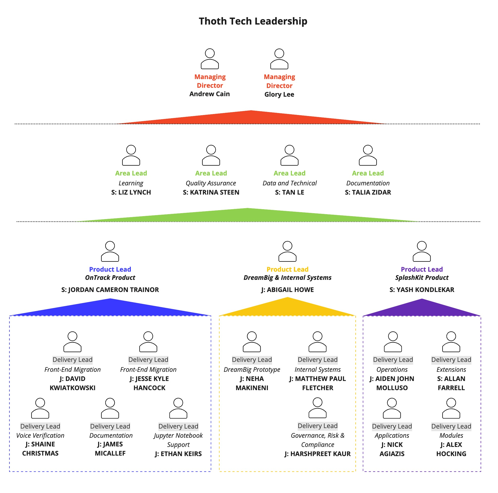
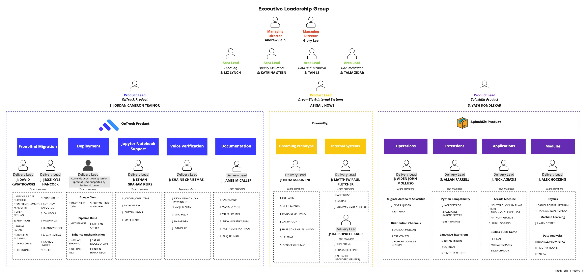

# Executive Summary

Thoth Tech (est. 2022) is a new software development company currently building from the ground up
in Melbourne Australia. Thoth Tech’s mission is to build, operate, and deploy education
technologies, creating tools that enhance education outcomes by empowering students, connecting them
with tutors, and facilitating personalised learning experiences. We value our people, and we value
excellence: We are people-focused, aim to produce sustainable products of excellent quality, and
provide frameworks that provide a safe environment for learning and support of our team.

This report is for stakeholders, investors, and employees, and will outline the company structure,
charter, objectives – both short and long term, and explore each product’s goals in depth.

Within the first third of 2022, Thoth Tech has recruited approximately 92 employees including four
area leads, three product leads and eleven delivery leads. There will be another recruitment phase
during the other two thirds of the year and an expected exit rate of 50 percent, with the potential
for internships throughout the company.

Along with recruitment, Thoth Tech has taken onboard three external products, two live and
well-established products – **OnTrack** and **SplashKit** – and **DreamBig\_** a in development
product which will leverage the OnTrack technology stack. Thoth Tech will also be creating our
internal architecture and platform for employees throughout this third of the year, referred to as
the **Internal Systems** project.

Both the OnTrack and SplashKit products have been identified as requiring extensions and additional
features to improve the quality and usability of the product. OnTrack is a platform designed to
facilitate student learning and reducing the pressure of achieving unrealistic grades. The focus is
on providing a tailored learning experience, using tasks and a portfolio assessment. This product is
live and is currently being upgraded to newer technology stacks and improving security and
documentation. SplashKit is currently a 2D game development Software Development Kit used to teach
coding to beginners. It has been identified that SplashKit can be expanded to explore other areas
and languages. The DreamBig product is in response to a need identified by Deakin, to provide a
personalised development roadmaps to enhance students’ employability.

Due to a partnership with the School of IT at Deakin University, Thoth Tech and the subsequent
products are funded, supported, and leveraged by Deakin. However, all contributions by Thoth Tech
members are acknowledged due to the Open-Source nature of the company. Deakin provides ground zero
end-user testing and focus groups for product improvements.

\_\_\_\_\_\_\_\_\_\_\_\_\_\_\_\_\_\_\_\_

Andrew Cain,

_Managing Director_

\_\_\_\_\_\_\_\_\_\_\_\_\_\_\_\_\_\_\_\_

Glory Lee,

_Managing Director_

# Contents

- [Roles and Responsibilities](#roles-and-responsibilities)
- [Mission](#mission)
- [Values](#values)
- [Team Culture](#team-culture)
- [Roles](#roles)
- [Metrics of success](#metrics-of-success)
- [Standards of quality](#standards-of-quality)
- [Thoth-Tech Senior Leadership](#thoth-tech-senior-leadership)
  - [Thoth Tech Area Lead Project](#thoth-tech-area-lead-project)
    - [Overview, Goals, and Objectives](#overview-goals-and-objectives)
    - [Aims for Trimester](#aims-for-trimester)
    - [Deliverables](#deliverables)
      - [Short-term](#short-term)
      - [Long-term](#long-term)
    - [Project Mid-Trimester Progress](#project-mid-trimester-progress)
    - [Leadership Projects Forecast](#leadership-projects-forecast)
    - [Project End of Trimester Progress](#project-end-of-trimester-progress)
- [OnTrack](#ontrack)
  - [OnTrack Product Projects Forecast](#ontrack-product-projects-forecast)
  - [Front-End Migration Project](#front-end-migration-project)
    - [Overview, Goals, and Objectives](#overview-goals-and-objectives-1)
    - [Aims for Trimester](#aims-for-trimester-1)
    - [Deliverables](#deliverables-1)
    - [Project Members (18)](#project-members-18)
    - [Project Mid-Trimester Progress](#project-mid-trimester-progress-1)
    - [Project End of trimester Progress](#project-end-of-trimester-progress-1)
  - [Deployment Project](#deployment-project)
    - [Overview, Goals, and Objectives](#overview-goals-and-objectives-2)
    - [Aims for Trimester](#aims-for-trimester-2)
    - [Deliverables](#deliverables-2)
      - [Google Cloud](#google-cloud)
      - [Pipeline Build](#pipeline-build)
      - [Enhance Authentication](#enhance-authentication)
    - [Project Members (9)](#project-members9)
    - [Project Mid-Trimester Progress](#project-mid-trimester-progress-2)
      - [Google Cloud](#google-cloud-1)
      - [Pipeline Build](#pipeline-build-1)
      - [Enhance Authentication](#enhance-authentication-1)
    - [Project End of Trimester Progress](#project-end-of-trimester-progress-2)
  - [Jupyter Notebook Support Project](#jupyter-notebook-support-project)
    - [Overview, Goals, and Objectives](#overview-goals-and-objectives-3)
    - [Aims for Trimester](#aims-for-trimester-3)
    - [Deliverables](#deliverables-3)
    - [Project Members (5)](#project-members-5)
    - [Project Mid-Trimester Progress](#project-mid-trimester-progress-3)
    - [Project End of Trimester Progress](#project-end-of-trimester-progress-3)
  - [Voice Verification Project](#voice-verification-project)
    - [Overview, Goals, and Objectives](#overview-goals-and-objectives-4)
    - [Aims for Trimester](#aims-for-trimester-4)
    - [Deliverables](#deliverables-4)
    - [Project Members (6)](#project-members6)
    - [Project Mid-Trimester Progress](#project-mid-trimester-progress-4)
    - [Project End of Trimester Progress](#project-end-of-trimester-progress-4)
  - [Documentation Project](#documentation-project)
    - [Overview](#overview)
    - [Aims for Trimester](#aims-for-trimester-5)
    - [Deliverables](#deliverables-5)
    - [Project Members (7)](#project-members-7)
    - [Project Mid-Trimester Progress](#project-mid-trimester-progress-5)
    - [Project End of Trimester Progress](#project-end-of-trimester-progress-5)
- [SplashKit](#splashkit)
  - [Splash Product Projects Forecast](#splash-product-projects-forecast)
  - [Operations – Migrating Arcana to SplashKit Project](#operations--migrating-arcana-to-splashkit-project)
    - [Overview, Goals, and Objectives](#overview-goals-and-objectives-5)
    - [Aims for Trimester](#aims-for-trimester-6)
    - [Deliverables](#deliverables-6)
    - [Short-term](#short-term-9)
      - [Long-term](#long-term-7)
    - [Project Members (3)](#project-members3)
    - [Project Mid-Trimester Progress](#project-mid-trimester-progress-6)
    - [Project End of Trimester Progress – Migrate Arcana to Splashkit](#project-end-of-trimester-progress--migrate-arcana-to-splashkit)
  - [Operations – Distribution Channels Project](#operations--distribution-channels-project)
    - [Overview, Goals, and Objectives](#overview-goals-and-objectives-6)
    - [Aims for Trimester](#aims-for-trimester-7)
    - [Deliverables](#deliverables-7)
    - [Project Members (4)](#project-members4)
    - [Project Mid-Trimester Progress](#project-mid-trimester-progress-7)
    - [Project End of Trimester Progress – Distributions Channels](#project-end-of-trimester-progress--distributions-channels)
  - [Extensions Project](#extensions-project)
    - [Overview, Goals, and Objectives](#overview-goals-and-objectives-7)
    - [Aims for Trimester](#aims-for-trimester-8)
    - [Deliverables](#deliverables-8)
    - [Project Members (8)](#project-members8)
    - [Project Mid-Trimester Progress](#project-mid-trimester-progress-8)
    - [Project End of Trimester Progress](#project-end-of-trimester-progress-6)
  - [Applications – Arcade Machine Project](#applications--arcade-machine-project)
    - [Overview, Goals, and Objectives](#overview-goals-and-objectives-8)
    - [Aims for Trimester](#aims-for-trimester-9)
    - [Deliverables](#deliverables-9)
    - [Project Members (5)](#project-members5)
    - [Project Mid-Trimester Progress](#project-mid-trimester-progress-9)
    - [Project End of Trimester Progress](#project-end-of-trimester-progress-7)
  - [Applications – Build a Cool Game Project](#applications--build-a-cool-game-project)
    - [Overview, Goals, and Objectives](#overview-goals-and-objectives-9)
    - [Aims for Trimester](#aims-for-trimester-10)
    - [Project Members (4)](#project-members4-1)
    - [Project Mid-Trimester Progress](#project-mid-trimester-progress-10)
    - [Project End of Trimester Progress](#project-end-of-trimester-progress-8)
  - [Modules Project](#modules-project)
    - [Overview, Goals, and Objectives](#overview-goals-and-objectives-10)
    - [Aims for Trimester](#aims-for-trimester-11)
    - [Deliverables](#deliverables-10)
      - [Short-term](#short-term-15)
      - [Long-term](#long-term-13)
    - [Project Members (8)](#project-members-8)
    - [Project Mid-Trimester Progress](#project-mid-trimester-progress-11)
    - [Project End of Trimester Progress](#project-end-of-trimester-progress-9)
- [DreamBig](#dreambig)
  - [DreamBig Prototype Project Forecast](#dreambig-prototype-project-forecast)
  - [DreamBig Prototype Project](#dreambig-prototype-project)
    - [Overview, Goals, and Objectives](#overview-goals-and-objectives-11)
    - [Aims for Trimester](#aims-for-trimester-12)
    - [Deliverables](#deliverables-11)
    - [Project Members (7)](#project-members-7-1)
    - [Project Mid-Trimester Progress](#project-mid-trimester-progress-12)
    - [Project End of Trimester Progress](#project-end-of-trimester-progress-10)
- [Internal Systems](#internal-systems)
  - [Internal Systems Product Project Forecast](#internal-systems-product-project-forecast)
  - [Internal Systems Project](#internal-systems-project)
    - [Overview, Goals, and Objectives](#overview-goals-and-objectives-12)
    - [Aims for Trimester](#aims-for-trimester-13)
    - [Deliverables](#deliverables-12)
    - [Project Members (4)](#project-members4-2)
    - [Mid-Trimester Progress](#mid-trimester-progress)
    - [Project End of Trimester Progress](#project-end-of-trimester-progress-11)
  - [Government, Risk and Compliance](#government-risk-and-compliance)
    - [Overview, Goals, and Objectives](#overview-goals-and-objectives-13)
    - [Aims for Trimester](#aims-for-trimester-14)
    - [Deliverables](#deliverables-13)
    - [Project Members (4)](#project-members-4)
    - [Project Mid-Trimester Progress](#project-mid-trimester-progress-13)
    - [Project End of Trimester Progress](#project-end-of-trimester-progress-12)
- [Showcase Videos](#showcase-videos)
- [Appendix](#appendix)

# Leadership Team

## Roles and Responsibilities

<table>
<colgroup>
<col style="width: 12%" />
<col style="width: 29%" />
<col style="width: 31%" />
<col style="width: 25%" />
</colgroup>
<thead>
<tr class="header">
<th></th>
<th><strong>Role</strong></th>
<th><strong>Responsibilities</strong></th>
<th><strong>Skills</strong></th>
</tr>
</thead>
<tbody>
<tr class="odd">
<td><strong>Managing Director</strong></td>
<td>The role of the managing director is to oversee the Thoth Tech
company executive leadership team to ensure they are running the company
effectively and value is being added to the Thoth Tech products by the
projects they are supporting.</td>
<td><ul>
<li>

Provide guidance to executive leadership team

</li>
<li>

Provide high-level vision for the ongoing goals of the company

</li>
<li>

Provide a consistent company strategy due to low retention

</li>
</ul></td>
<td><ul>
<li>

Leadership

</li>
<li>

Communication

</li>
<li>

Mentor

</li>
<li>

Decision-making

</li>
</ul></td>
</tr>
<tr class="even">
<td><strong>Area</strong> <strong>Lead</strong></td>
<td>The role of the Area lead is to drive their area focus across all
products and projects of their area. They also organise, lead, guide,
and support Product and Delivery leads achieve their project goals.</td>
<td><ul>
<li>

Establish company structure, systems &amp; processes

</li>
<li>

Establish a leadership cadence

</li>
<li>

Drive a focus on Technical Learning, Data, Documentation and Quality
Assurance

</li>
<li>

Support Product leads with product vision

</li>
<li>

Support Delivery leads with their project

</li>
<li>

Proactively identify blockers and opportunities

</li>
</ul></td>
<td><ul>
<li>

Leadership

</li>
<li>

Organisation

</li>
<li>

Interpersonal Savvy

</li>
<li>

Problem-Solving

</li>
<li>

Collaborative

</li>
<li>

Mentor

</li>
<li>

Communication

</li>
<li>

Presentation

</li>
<li>

Stakeholder management

</li>
</ul></td>
</tr>
<tr class="odd">
<td><strong>Product Lead</strong></td>
<td>The role of the Product lead is to lead and support delivery leads
in projects related to their product to ensure ongoing success.</td>
<td><ul>
<li>

Drive the product in the direction determined by the Managing
Directors and Area Leads.

</li>
<li>

Strong drive towards toward objectives with bias for action

</li>
<li>

Proactively identify blockers and opportunities

</li>
<li>

Support delivery leads where needed

</li>
<li>

Make thoughtful decisions motivated by data and research

</li>
<li>

Be transparent and accountable by visualising objectives

</li>
</ul></td>
<td><ul>
<li>

Communication

</li>
<li>

Empathy

</li>
<li>

Interpersonal Savvy

</li>
<li>

Collaborative

</li>
<li>

Leadership

</li>
<li>

Stakeholder management

</li>
</ul></td>
</tr>
<tr class="even">
<td><strong>Delivery Lead</strong></td>
<td>The role of the Delivery lead is to lead, organise and support their
project teams to ensure ongoing success.</td>
<td><ul>
<li>

Establish a team cadence

</li>
<li>

Build rapport with all team members to foster a cohesive and
collaborative environment

</li>
<li>

Strong drive towards objectives with bias for action

</li>
<li>

Proactively identify blockers and opportunities

</li>
<li>

Communication on what the team is doing, their plans and what is
needed

</li>
</ul></td>
<td><ul>
<li>

Communication

</li>
<li>

Empathy

</li>
<li>

Interpersonal Savvy

</li>
<li>

Collaborative

</li>
<li>

Leadership

</li>
<li>

Stakeholder management

</li>
</ul></td>
</tr>
</tbody>
</table>

# Trimester Goals and Objectives

This trimester, Thoth Tech has set out to achieve the following objectives:

**Objective 1: Establish Thoth Tech as a company in line with our mission and values.**

- Create a company mission and values.
- Create a company organisation structure.
- Clearly define leadership roles and responsibilities.
- Establish the Thoth Tech Repo.
- Establish a Thoth Tech project branching structure and approval process.
- Establish a Quality Assurance Policy and process.
- Establish standards and expectations of product development.
- Establish an Onboarding process.
- Establish Documentation guidelines for Thoth Tech.
- Establish a handover and Offboarding process.
- Establish an internal website for centralised documentation visibility.

**Objective 2: Create a safe, supportive, and collaborative company culture that empowers our
employees to learn and develop their skills.**

- Create a company culture where feedback is welcome, and success is celebrated.
- Support development of chosen skills in every team member.
- Develop soft skills in leadership team.
- Empower those embracing learning of new skills, to pass their knowledge on to other team members.
- Create a psychologically safe space for collaboration to thrive.
- Optimise the company experience for future employees.
- Build an internal static website to host all documentation and relevant resources for the company

**Objective 3: Add value to the SplashKit Product by extending functionality and languages**

- Migrate Arcana from SwinGame to create an easier and smoother installation of product.
- Improve the SplashKit product through realistic physics, data visualisations and machine learning.
- Improve SplashKit language compatibilities to expand learning accessibility for users.
- Create a way to showcase games created in SplashKit

**Objective 4: Add value to the OnTrack Product by adding and enhancing features**

- Add Voice Verification as a new feature.
- Add Jupyter notebook support as a new feature.
- Create a company hosted deployment of OnTrack.
- Move OnTrack front-end away from legacy technologies.
- Analyse, update, improve and create retrospective OnTrack documentation.

**Objective 5: Create the DreamBig prototype as a new product that adds value to the Thoth Tech
company**

- Build the vision and strategy for the DreamBig product.
- Create a DreamBig prototype as proof of concept.

# Company Charter

The Thoth Tech charter is a crucial tool for guiding our team, navigating decisions, establishing
boundaries, and aligning the team on how we work together. It defines how as a company we work
together to achieve success.

Our charter comprises of the following:

- **Mission:** As a team, what are we trying to achieve?
- **Values:** What do we care about?
- **Team Culture:** How will we work together, what do we expect?
- **Roles:** What roles do we need and what are the responsibilities of each role?
- **Metrics of Success:** What does success look like to us?
- **Standards of Quality:** What are our standards for high quality work?

## Mission

Our mission is to build, operate and deploy world class education technologies. This is achieved by
creating accessible tools that enhance education outcomes by empowering students, connecting them
with tutors and facilitating personalised learning experiences.

## Values

Our values describe how we work, what we represent, and guide us to be the kind of company and team
members we want to be. When we live up to these values we will:

**Be people-focused**

We expect the best from each other, give each other the benefit of the doubt, encourage each other
to take initiative to improve ourselves and the company, and provide direct and constructive help to
each other. We collaborate with kindness while being respectful of each other.

**Uphold sustainable excellence**

We create working, maintainable, and understandable software that is enjoyable and easy to use. We
strive to do it in a way that is sustainable for our team members and for our environment.

**Be inclusive and supportive**

We celebrate diverse perspectives and embrace uncomfortable ideas and conversations. We facilitate
an environment in which all team members feel psychologically safe enough to make requests for what
they need to do their job. We learn through failures while continually working to make things
better.

## Team Culture

- Our employees will always operate with transparency and accountability.
- We strive to always assume positive intent in our communication with each other.
- We promote individual empowerment, with group support.
- We achieve through iteration - progress before result is to be expected.

## Roles

- Roles and responsibilities should be clearly defined.
- Decision-making should be made based on company values and evidence.

## Metrics of success

- We take pride in our work
- We celebrate success regularly
- We collaborate and mentor with each other to share our learning.
- We define our success.
- We do not take shortcuts.

## Standards of quality

- Security and privacy are paramount.
- Everything we do must be well documented for ourselves and for the future.
- What we do should be easy to understand.
- Build everything with re-usability and iteration in mind.
- User satisfaction is key.

# Company Structure

The Company is broken up based on product, with the area leads spread company wide. There is a tier
system built into the company structure – directors, area leads, product leads, delivery leads, then
team members. This structure is primarily about support, guidance, and feedback, rather than
authority.

Each employee has chosen their own role title based on their interests, skills, experience and what
they want to develop.

The company structure is linked
[here](https://deakin365.sharepoint.com/:b:/s/ThothTech2-Leadership/ERuLF9JWzz5HvF68OG7D_EgBQ14uMdrGKXuS2fvNEWE_WQ?e=ihX3Wt)
and available on the next page.

## Thoth-Tech Senior Leadership

The Thoth-Tech Senior Leadership Team Project’s main objective is to ensure that all project teams
are set up with systems, processes, training, and support to achieve their project deliverables, and
therefore the company objectives and goals. This means that the Thoth Tech company needs to be
established and grown in line with a strong company vision and values, it requires the guidance of a
committed leadership team.

- **Learning Lead**: Liz Lynch
- **Documentation Lead**: Talia Zidar
- **Quality Assurance Lead**: Katrina Steen
- **Data and Technical Lead**: Tan Le

### Thoth Tech Area Lead Project

#### Overview, Goals, and Objectives

The Senior Leadership Team’s goal is to provide overarching support, structure and processes to
drive the fulfillment of the company’s
[goals and objectives](https://github.com/thoth-tech/handbook/blob/main/docs/company/reports/t1-2022/company-report-v1.md#trimester-goals-and-objectives)
as described earlier in this report. This includes establishing a company mission statement,
charter, and culture through communication and establishing foundational frameworks and guidance to
support company member engagement and project delivery in line with company values. In the
short-term, the leadership team aims to establish a culture and processes that promote people-focus,
inclusion, and sustainable excellence. Long-term, the aim is for further evolution and refinements
to provide even better support of members and processes and resourced to support increasingly
quality, maintainable, and sustainable products. Our goal is to be one of the best companies to be a
member of, providing some of the best products for stakeholders.

#### Aims for Trimester

Aims for the trimester include establishing a supportive and inclusive company culture, establishing
the Thoth-Tech company mission, values, structure, roles and responsibilities, onboarding, handover
and offboarding processes, quality assurance and documentation guidelines.

#### Deliverables

##### Short-term

- Create Company mission statement, charter, and values.
- Build a company that lives by these values
- Create Company organisation structure
- Allocated team and projects for OnTrack, SplashKit, DreamBig and Internal Products
- Define leadership roles and responsibilities
- Create branching structure and approval process.
- Create Quality Assurance policy and process.
- Create Onboarding process.
- Create Offboarding process
- Create handover process
- Establish Thoth Tech Handbook Repo
- Document all processes created in handbook
- Establish leadership team for T2
- Add value to OnTrack, DreamBig and SplashKit by supporting project teams to help achieve their
  deliverables
- Develop roadmap for T2
- Provide training and resources to support the Thoth Tech project teams

##### Long-term

- Improve diversity in leadership roles (across Senior Leadership, Product and Delivery leaders)
- Continue to drive the values and culture established in T1 2022
- Iterate and improve the existing processes created in T1 2022
- Ensure resources and training are provided to deliver the company goals and objectives
- Provide training and resources to support the Thoth Tech project teams

#### Project Mid-Trimester Progress

##### Project health

The Senior Leadership Team project is healthily and is progressing at a sufficient pace to complete
all planned T1 deliverables.

##### Summary

Each lead has been championing the direction and vision of each area; however, the whole leadership
team has been responsible for collaboratively executing tasks identified by all area leads. This
approach has enabled the leadership project team to have delivered a significant portion of the
Short-term by the mid-trimester break.

##### High-level overview

<table style="width:100%;">
<colgroup>
<col style="width: 33%" />
<col style="width: 32%" />
<col style="width: 33%" />
</colgroup>
<thead>
<tr class="header">
<th>Backlog</th>
<th><strong>In Progress</strong></th>
<th><strong>Completed</strong></th>
</tr>
</thead>
<tbody>
<tr class="odd">
<td><ul>
<li>
Create Offboarding process
</li>
<li>
Develop talent, establish, and onboard leadership team for
T2
</li>
<li>
Develop roadmap for T2
</li>
<li>
Improve diversity in leadership roles (across Senior Leadership,
Product and Delivery leaders)
</li>
<li>
Continue to drive the values and culture established in T1
2022
</li>
<li>
Iterate and improve the existing processes created in T1
2022
</li>
<li>
Ensure resources and training are provided to deliver the company
goals and objectives
</li>
</ul></td>
<td><ul>
<li>
Build a company that lives by Company values
</li>
<li>
Document all processes created in handbook
</li>
<li>
Provide training and resources to support the Thoth Tech project
teams
</li>
<li>
Add value to OnTrack, DreamBig and SplashKit by supporting
project teams to help achieve their deliverables
</li>
<li>
Build relevant and crucial skills within the company
</li>
<li>
Provide training and resources to support the Thoth Tech project
teams
</li>
</ul></td>
<td><ul>
<li>
Crafted and documented company mission statement, charter, and
values
</li>
<li>
Create Company organisation structure
</li>
<li>
Allocated teams and projects for OnTrack, SplashKit, DreamBig and
Internal Products
</li>
<li>
Define leadership roles and responsibilities
</li>
<li>
Create branching structure and approval process.
</li>
<li>
Create Quality Assurance policy and process.
</li>
<li>
Testing, development processes and supportive references
</li>
<li>
Create Onboarding process.
</li>
<li>
Establish Thoth Tech Handbook Repo
</li>
<li>
Create Data Strategy
</li>
</ul></td>
</tr>
</tbody>
</table>

##### Additional information and links

- [Thoth-Tech Handbook](https://github.com/thoth-tech/handbook)
  - [Company Charter](https://github.com/thoth-tech/handbook/blob/main/docs/company/charter.md)
  - [Communication Guide](https://github.com/thoth-tech/handbook/blob/main/docs/communication/communication.md)
  - [Quality Assurance Overview](https://github.com/thoth-tech/handbook/blob/main/docs/processes/quality-assurance/quality-assurance-overview.md)
  - [Data Strategy](https://github.com/thoth-tech/handbook/blob/main/docs/data/data-strategy.md)
- [Thoth-Tech Leadership Trello Board](https://trello.com/b/9jms2uly/thoth-leadership)
- All workshop recordings
  - [Company-wide meeting](https://deakin365.sharepoint.com/:v:/s/ThothTech2/EVQNqqrUceBGqbyJZJngL-UBcqfXQxOuuxUNB2CszP9zew?e=zpysKY)
  - [D/HD Workshop](https://deakin365.sharepoint.com/:v:/s/ThothTech2/ESlcEp9QlkpAuzF7wWU_9OUB1XNwkaF2RFbdXZ1fiNdnXA?e=60bO3w)
  - [GitHub Repos Q&A](https://deakin365.sharepoint.com/:v:/s/ThothTech2/EU-YLlYtlkVErKiZnxcyU08BV9aUUGa3i1Bah6rRhnWrtg?e=pr2yIB)
  - [Quality Assurance Q&A](https://deakin365.sharepoint.com/:v:/s/ThothTech2/EeWt4zp0a7BLvE_I9lsPCxYBfIV_pSNRACesr1tqGQaqdg?e=7cTbM4)
  - [Documentation Workshop](https://deakin365.sharepoint.com/:v:/s/ThothTech2-Leadership/EQDksW01djxApiu0sYTpjcEBrd4znkVqhVXGhfgGF3Nhxw?e=TNUB8c)
- Miro board
  - [Company Structure](https://miro.com/app/board/uXjVOHtYWxs=/?share_link_id=972664923450)
  - [Recruitment](https://miro.com/app/board/uXjVOGWn4k4=/?share_link_id=96134372071)
  - [Company Values](https://miro.com/app/board/uXjVOHw0M_4=/?share_link_id=475081156944)
  - [Meeting Planner](https://miro.com/app/board/uXjVODy7l5o=/?share_link_id=47668865516)
  - [Proposed Branching Structure](https://miro.com/app/board/uXjVOGFri3o=/?share_link_id=513226504802)
- [PR list (Thoth Tech Handbook Repo)](https://github.com/thoth-tech/handbook/pulls?q=is%3Apr+is%3Aclosed)
  (All PRs in this handbook are either created or reviewed by Area Leads)

##### Blockers

The primary blocker that we have consistently needed to mitigate has been communication, and
engagement. The Thoth Tech company has approximately 100 team members

##### Additional notes or highlights

The focus of the next half of trimester will be establishing and documenting an Offboarding and
handover process, detailing the T2 Roadmap, building confidence in skills the Thoth Tech company
members have been learning, developing talent to establish the core T2 leadership team, and setting
them up for success.

##### Indicate any changes to plans for the project

There have been some areas of flux regarding project teams. We had a few team members request early
on to change from their allocated projects, however this was minimal and utilising the onboarding
form responses to create project teams was deemed highly successful. The leadership team project has
also had to manage some company members arriving four weeks late into the company, and this required
late changes to company structure and high-level project guidance.

The leadership team project has also updated the role names for each area lead, to better reflect
the value that each lead is adding to the project, and to the company. This was expected, as there
were many unknowns when the project was established, and iteration and decisions based on evidence
was key – as outlined by the company charter.

##### Forecast

All deliverables complete, with a new leadership team set up for success to continue the work and
vision of Thoth Tech objectives. Refer to forecast below.

#### Leadership Projects Forecast

[Leadership Forecast](https://deakin365.sharepoint.com/:b:/s/ThothTech2-Leadership/ERCuJ3aP_rNDh7ZPNPU8H_8B4bvJ7e1zwqkjLQ2MWUPMuQ?e=m2N8ZM)

#### Project End of Trimester Progress

##### Project health

This project is healthy.

##### Summary

The area leads have achieved all short-term aims, building upon the strong company foundation
established earlier in the trimester. Continuing to document and evolve QA, documentation, and data
strategy, and continuing to support each other in running company operations. Work has been
completed for the offboarding and handover processes, detailing the T2 Roadmap, establishing a core
T2 leadership team, and preparing the company for T2 to ensure the company culture and progress on
company objectives can be successfully carried forward into future trimesters.

##### High-level overview

<table>
<colgroup>
<col style="width: 24%" />
<col style="width: 28%" />
<col style="width: 25%" />
<col style="width: 21%" />
</colgroup>
<thead>
<tr class="header">
<th>Backlog </th>
<th>In Progress </th>
<th>Completed </th>
<th>PR/Relevant documentation links </th>
</tr>
</thead>
<tbody>
<tr class="odd">
<td><ul>
<li>
Continue to drive the values and culture established in T1
2022
</li>
<li>
Improve diversity in leadership roles (across Senior Leadership,
Product and Delivery leaders)  
</li>
<li>
Iterate and improve the existing processes created in T1
2022 
</li>
</ul></td>
<td><ul>
<li>
Provide training and resources to support the Thoth Tech project
teams (<em>ongoing</em>) 
</li>
<li>
Add value to Ontrack, DreamBig and SplashKit by supporting
project teams to help achieve their
deliverables (<em>ongoing</em>) 
</li>
<li>
Ensure resources and training are provided to deliver the company
goals and objectives (<em>ongoing</em>) 
</li>
</ul></td>
<td><ul>
<li>
Craft and document company mission statement, charter, and
values  
</li>
<li>
Define leadership roles and responsibilities
</li>
<li>
Create Company organisation structure  
</li>
<li>
Allocated teams and projects for OnTrack, SplashKit, DreamBig and
Internal Products
</li>
<li>
Establish Thoth Tech Handbook Repo and document all processes
created.
</li>
<li>
Create Quality Assurance policy and process. 
</li>
<li>
Create branching structure and approval process. 
</li>
<li>
Testing, development processes and supportive
references 
</li>
<li>
Create Data Strategy
</li>
<li>
Create Onboarding process.  
</li>
<li>
Build a company that lives by Company values 
</li>
<li>
Leadership recommendations for T2
</li>
<li>
Handover, offboarding process and Showcase completed
</li>
</ul></td>
<td><ul>
<li>
<a
href="https://github.com/thoth-tech/handbook/blob/main/docs/company/charter.md">Company
Charter</a>,  
<a
href="https://github.com/thoth-tech/handbook/blob/main/docs/company/roles.md">Roles</a>
</li>
<li>
<a
href="https://miro.com/app/board/uXjVOHtYWxs=/?share_link_id=972664923450">Company
Structure</a> (Miro)
</li>
<li>
<a
href="https://miro.com/app/board/uXjVOGWn4k4=/?share_link_id=96134372071">Recruitment</a> (Miro)
</li>
<li>
<a href="https://github.com/thoth-tech/handbook">Thoth-Tech
Handbook</a>
</li>
<li>
<a
href="https://github.com/thoth-tech/handbook/blob/main/docs/learning/training/index.md">Training
Documentation</a> 
</li>
<li>
<a
href="https://github.com/thoth-tech/handbook/blob/main/docs/processes/quality-assurance/quality-assurance-overview.md">Quality
Assurance Overview</a>, <a
href="https://github.com/thoth-tech/handbook/blob/main/docs/processes/quality-assurance/git-contribution-guide.md#branching-guidelines">Branching
Guidelines</a>
</li>
<li>
<a
href="https://github.com/thoth-tech/handbook/blob/main/docs/processes/quality-assurance/testing-and-dev.md">Testing
and Development</a>
</li>
<li>
<a
href="https://github.com/thoth-tech/handbook/blob/main/docs/data/index.md">Data
and Data Strategy</a>
</li>
<li>
<a
href="https://github.com/thoth-tech/handbook/blob/main/docs/peopleops/onboarding/onboarding-process.md">Onboarding
process</a>
</li>
<li>
<a
href="https://github.com/thoth-tech/handbook/blob/main/docs/projects/t1-2022/thoth-tech-leadership/t2-leadership-project-recommendations.md">T2
Leadership Recommendations</a>
</li>
<li>
<a
href="https://github.com/thoth-tech/handbook/blob/main/docs/peopleops/offboarding/offboarding-process.md">Offboarding
Process</a>
</li>
<li>
<a
href="https://deakin365.sharepoint.com/:v:/r/sites/ThothTech2/Shared%20Documents/General/Company%20OnTrack%20Tasks/Showcase%20Videos/Thoth%20Tech%20Showcase%20Video.mp4?csf=1&amp;web=1&amp;e=7ma00Z">Showcase</a>
</li>
</ul>

 
</td>
</tr>
</tbody>
</table>

##### Aims for Trimester Status 

The Area Leads have successfully completed the aims for Trimester 1, including establishing a
supportive and inclusive company culture, company mission, values, structure, roles and
responsibilities, completing onboarding, handover and offboarding processes, creating quality
assurance, and documentation guidelines.

##### Deliverables Status 

###### Short-term

Area Leads have successfully completed all Short-term, and since the last company report have
achieved the following:

- Created Offboarding process
- Created handover process
- Documented all processes created in handbook
- Established leadership team for T2
- Added value to OnTrack, DreamBig and SplashKit by supporting project teams to help achieve their
  deliverables
- Developed roadmap for T2
- Continued to provide training and resources to support the Thoth Tech project teams

###### Long-term

- Continue to drive the values and culture established in T1
  2022 ([Trello](https://trello.com/c/BavHrp5i/89-drive-the-values-and-culture-established-in-t1-2022))

- Iterate and improve the existing processes created in T1
  2022 ([Trello](https://trello.com/c/Fy7XbtGe/88-iterate-and-improve-the-existing-processes-created-in-t1-2022))

- Provide training and resources to support the Thoth Tech project
  teams ([Trello](https://trello.com/c/axjurzZK/87-provide-training-and-resources-to-support-thoth-tech-project-teams))

- Onboard members for T2 ([Trello](https://trello.com/c/Lwz9L3TD/20-onboarding-starter))

- Investigate potential for expanding existing QA documentation, leveraging on work done by project
  teams so far, to provide additional detail and support around QA testing strategy frameworks and
  tools
  ([Trello](https://trello.com/c/J7TkzIvT/61-test-strategy-opportunities-for-further-qa-detail-and-alignment))

- Drive diversity in leadership roles (across Area and Delivery leaders)
  ([Trello](https://trello.com/c/l6g9B5hn/90-improve-diversity-in-leadership-roles-across-senior-leadership-product-and-delivery-leaders))

##### Team Key Achievements 

<table>
<colgroup>
<col style="width: 60%" />
<col style="width: 39%" />
</colgroup>
<thead>
<tr class="header">
<th>Achievement </th>
<th>Contributor </th>
</tr>
</thead>
<tbody>
<tr class="odd">
<td>
Company creation and structuring: 

<ul>
<li>
Created Company organisation structure 
</li>
<li>
Defined leadership roles and responsibilities​ 
</li>
<li>
Onboarded 100 team members​ 
</li>
<li>
Allocated team members to projects based on requested products
and skills​ 
</li>
</ul></td>
<td>Liz Lynch, Talia Zidar, Katrina Steen, Tan Le </td>
</tr>
<tr class="even">
<td>Thoth Tech Handbook Repo established, and processes and artifacts
documented. </td>
<td>Tan Le (established), contributed to by Liz Lynch, Talia Zidar,
Katrina Steen </td>
</tr>
<tr class="odd">
<td>
Quality Assurance policy and process:​ 

<ul>
<li>
Created branching structure and approval process. ​ 
</li>
<li>
Created testing, development processes and supportive
references​ 
</li>
</ul></td>
<td>Katrina Steen </td>
</tr>
<tr class="even">
<td>
Data Strategy: 

<ul>
<li>
Created Data Strategy and Metrics Template​ 
</li>
<li>
Created Testing Strategy Template​
</li>
</ul></td>
<td>Tan Le </td>
</tr>
<tr class="odd">
<td>
Communication guidelines:

<ul>
<li>
Established communication guideline for Thoth Tech
</li>
<li>
Created Professional Communication Guide
</li>
<li>
Created Company Writing Style Guide
</li>
</ul></td>
<td>Talia Zidar</td>
</tr>
<tr class="even">
<td>
Training and mentoring sessions: 

<ul>
<li>
GitHub Workshop (Tan) 
</li>
<li>
QA Workshop (Katrina) 
</li>
<li>
Documentation Workshop​ (Talia) 
</li>
<li>
D/HD Student Workshop​ (Liz) 
</li>
<li>
Leadership Conference (Liz) 
</li>
<li>
Leadership Retrospective demo (Katrina) 
</li>
</ul></td>
<td>Liz Lynch, Talia Zidar, Katrina Steen, Tan Le (led as
specified) </td>
</tr>
<tr class="odd">
<td>
​Training guide creation and feedback collection 

<ul>
<li>
Learning feedback survey​ (Tan) 
</li>
<li>
Markup Guide (Talia &amp; Katrina) 
</li>
<li>
PR template (Liz) 
</li>
<li>
Epic template (Liz) 
</li>
<li>
User Stories, SRS, testing templates (Katrina) 
</li>
<li>
Getting Start Guide (Liz)
</li>
<li>
Mentoring Guide (Liz)
</li>
</ul></td>
<td>Liz Lynch, Talia Zidar, Katrina Steen, Tan Le (as specified) </td>
</tr>
<tr class="even">
<td>
Capstone Cohort Guest Presentations and sessions arranged: 

<ul>
<li>
Kirsty McDonald: <em>Women in Tech</em> (Liz) 
</li>
<li>
Daniel Yong: <em>Industry Insight</em> (Talia &amp;
Katrina) 
</li>
<li>
Leadership Conference (Liz) 
</li>
</ul></td>
<td>Liz Lynch, Talia Zidar, Katrina Steen (as specified) </td>
</tr>
<tr class="odd">
<td>
Handover and Offboarding completed: 

<ul>
<li>
Showcase 
</li>
<li>
T2 Roadmap Planning 
</li>
<li>
Offboarding Process (Katrina), surveys (Liz) 
</li>
<li>
Handover Process 
</li>
<li>
T2 leadership development 
</li>
</ul></td>
<td>Liz Lynch, Talia Zidar, Katrina Steen, Tan Le </td>
</tr>
</tbody>
</table>

##### Project Recommendations

The main next steps for the future area leads are to familiarise themselves with across the
handbook, consider the pitch for T2 to attract new junior talent to the company, and consider team
structure and allocation. The guidance provided by the current leads and T2 recommendations may
assist with this. Ultimately, in consultation with the managing directors, the new area leads are in
control of any evolutions.

In addition, the following recommendations:

- Provide clear messaging to company members:
  - from the beginning of T1 around general delivery schedule and self-driven expectations
  - Weekly written team progress reports to Area Leads
- Merge the product Lead and Area lead roles (as per
  [proposed structure](https://miro.com/app/board/uXjVO2m3z0Q=/))
- Make Documentation team part of Internal Systems
  - Expand the scope of the documentation team to that of Document Control.
- Provide delivery lead training in week 0
- Implement
  [T2 recommendations](https://github.com/thoth-tech/handbook/blob/main/docs/projects/t1-2022/thoth-tech-leadership/t2-leadership-project-recommendations.md)
  from T1 Delivery leads as per
- Improve Onboarding form improvements; include questions around:
  - skill confidence (1-5) e.g., programming, troubleshooting, documentation, project collaboration
    etc
  - working toward leadership
  - grade aims (for team splits)
- When allocating teams:
  - Partner experienced seniors with juniors where possible
  - Provide balance of High achieving students to drive the delivery
- QA recommendations
  - Create QA team to support QA and promote compliance
  - encourage creation of testing tools and framework resources (installation, guides, how-tos) to
    be shared across the company for teams with similar tech/languages (and document expanded
    resources in the [handbook](https://github.com/thoth-tech/handbook)).
- Use the team
  - Have teammates available to step in and support on matters outside their titular scope

##### Blockers 

It is expected there will be some challenges for new leads taking over the reins, as all senior
leads will be new to the role – hopefully, the established documentation will assist; however, there
is a great volume of material to be familiar with.

Communication and non-engaging/late students are anticipated and a challenge. As well as discussed
recommendations for clear and early messaging around expectations with members, it may benefit
leaders to ensure expectations are clarified with unit chairs early to prevent difficulties involved
in managing members joining the trimester late.

##### Links: 

<table>
<colgroup>
<col style="width: 50%" />
<col style="width: 50%" />
</colgroup>
<thead>
<tr class="header">
<th><ul>
<li>
<a href="https://github.com/thoth-tech/handbook">Thoth-Tech
Handbook</a>  

<ul>
<li>
<a
href="https://github.com/thoth-tech/handbook/blob/main/docs/company/charter.md">Company
Charter</a>  
</li>
<li>
<a
href="https://github.com/thoth-tech/handbook/blob/main/docs/communication/communication.md">Communication
Guide</a>  
</li>
<li>
<a
href="https://github.com/thoth-tech/handbook/blob/main/docs/processes/quality-assurance/quality-assurance-overview.md">Quality
Assurance Overview</a>  
</li>
<li>
<a
href="https://github.com/thoth-tech/handbook/blob/main/docs/data/data-strategy.md">Data
Strategy</a>  
</li>
</ul></li>
<li>
<a
href="https://trello.com/b/9jms2uly/thoth-leadership">Thoth-Tech
Leadership Trello Board</a>  
</li>
<li>
All workshop recordings  

<ul>
<li>
<a
href="https://deakin365.sharepoint.com/:v:/s/ThothTech2/EVQNqqrUceBGqbyJZJngL-UBcqfXQxOuuxUNB2CszP9zew?e=zpysKY">Company-wide
meeting</a>  
</li>
<li>
<a
href="https://deakin365.sharepoint.com/:v:/s/ThothTech2/ESlcEp9QlkpAuzF7wWU_9OUB1XNwkaF2RFbdXZ1fiNdnXA?e=60bO3w">D/HD
Workshop</a>  
</li>
<li>
<a
href="https://deakin365.sharepoint.com/:v:/s/ThothTech2/EU-YLlYtlkVErKiZnxcyU08BV9aUUGa3i1Bah6rRhnWrtg?e=pr2yIB">GitHub
Repos Q&amp;A</a>  
</li>
<li>
<a
href="https://deakin365.sharepoint.com/:v:/s/ThothTech2/EeWt4zp0a7BLvE_I9lsPCxYBfIV_pSNRACesr1tqGQaqdg?e=7cTbM4">Quality
Assurance Q&amp;A</a>  
</li>
<li>
<a
href="https://deakin365.sharepoint.com/:v:/s/ThothTech2-Leadership/EQDksW01djxApiu0sYTpjcEBrd4znkVqhVXGhfgGF3Nhxw?e=TNUB8c">Documentation
Workshop</a>  
</li>
</ul></li>
</ul></th>
<th><ul>
<li>
Miro board  

<ul>
<li>
<a
href="https://miro.com/app/board/uXjVOHtYWxs=/?share_link_id=972664923450">Company
Structure</a>  
</li>
<li>
<a
href="https://miro.com/app/board/uXjVOGWn4k4=/?share_link_id=96134372071">Recruitment</a>  
</li>
<li>
<a
href="https://miro.com/app/board/uXjVOHw0M_4=/?share_link_id=475081156944">Company
Values</a>  
</li>
<li>
<a
href="https://miro.com/app/board/uXjVODy7l5o=/?share_link_id=47668865516">Meeting
Planner</a>  
</li>
<li>
<a
href="https://miro.com/app/board/uXjVOGFri3o=/?share_link_id=513226504802">Proposed
Branching Structure</a>       
</li>
<li>
<a href="https://miro.com/app/board/uXjVO2m3z0Q=/">Proposed T2
leadership</a> 
</li>
</ul></li>
<li>
<a
href="https://github.com/thoth-tech/handbook/pulls?q=is%3Apr+is%3Aclosed">PR
list (Thoth Tech Handbook Repo)</a> (All PRs in this handbook are
either created or reviewed by Area Leads)  
</li>
</ul></th>
</tr>
</thead>
<tbody>
</tbody>
</table>

# Product Overview

Thoth Tech currently has two existing products, OnTrack and SplashKit, which are open source and
live to users. Thoth Tech also has two products in development, a third external product called
DreamBig, and an Internal Systems product for Thoth Tech employees. Each product is being developed
during this trimester.

## OnTrack

OnTrack is a platform to facilitate portfolio base assessment by providing an opportunity for
students to get feedback as a formative assessment reflecting their learning and to formulate a
deeper understanding of the concepts that students are learning time to time to showcase in their
final portfolio. One of the key features of it is to provide interactions in tailored learning
experience.

This approach provides students with a simple but effective way to demonstrate their achievements
and learning outcomes with the assistance of teaching staff feedback throughout the unit. OnTrack is
based on Doubtfire LMS and Thoth Tech is working towards creating new and enhanced features that
improve the teaching and learning experience.

**Product Lead:** Jordan Cameron Trainor

#### OnTrack Product Projects Forecast

[OnTrack Forecast](https://deakin365.sharepoint.com/:b:/s/ThothTech2-Leadership/EcscZKtL_GVBlH4iDbcAF_wB8NFeDxGZNsaE25qX3HmX7A?e=fl8oaj)

### Front-End Migration Project

#### Overview, Goals, and Objectives

The Front-end migration project aims to modernise the existing components that use CoffeeScript and
Bootstrap, towards the cutting-edge framework, Angular with Typescript. CoffeeScript has become
dated and lacks the functionality, security, and support that more modern frameworks provide.
Angular, which is supported by Google, allows developers to leverage its component-based
architecture to quickly create dynamic single-page applications. It is built using TypeScript, which
ensures greater security as the language supports types and allows for early bug detection. Other
features include templating, two-way binding, dependency injection, and extending HTML syntax
without relying on third-party libraries. Moving to Angular will continue to uphold the integrity of
OnTrack. TypeScript is accepted by a larger community base and includes more advanced and scalable
features. Once migrations are completed, it’s possible to add more advanced and quicker features to
OnTrack.

#### Aims for Trimester

The aim for the trimester is for each of the eight teams within the project to migrate at least one
existing component and build experience to enable accelerated progress in future trimesters by
supporting future team members.

#### Deliverables

The Front-End migration team has taken a divide and conquer approach by allocating two people into a
sub-team to ensure the amount of work is well distributed. This will allow for easier communication,
teamwork, and workflow for more efficient progress.

Based on existing documentation, there are 183 components remaining to migrate, however this may not
be accurately updated. An analysis will be completed to ensure this is updated.

The trimester deliverables will be developing and delivering at least eight migrated components.
However, the long-term project deliverables are to ensure all future teams are supported and set up
for success to migrate all remaining components prior to CoffeeScript support being removed.

The functionality of the migrated components will be identical to the old ones, with a user
interface design that fits in with the new OnTrack theme. Testing of these components must also be
considered and implemented to ensure that the components will function as expected for students and
faculty.

#### Project Members (18)

- **Delivery Lead**: Jesse Hancock
- **Delivery Lead**: David Kwiatkowski
- **Front End Developers:**
  - Team 1: Ni Leo, Leo Luong
  - Team 2: Perry Rose, Ma Junhua
  - Team 3: Deqian Cai Oscar, Renhao Chen Roy
  - Team 4: Zhao Yiqing, Mitchell Ross Burcheri
  - Team 5: Saleh Mohammed M Alharbi, Anthony Papoutsis
  - Team 6: Abdullah Abdulaziz M Algamdi, Grady Ramsay
  - Team 7: Ishrat Jahan, Ricardo Ingles
  - Team 8: Zheng Jiahao, Huang Yongqi

#### Project Mid-Trimester Progress

##### Project health

The Front-end migration team project is currently on track to exceed the deliverable goal of eight
migrated components by the end of trimester.

##### Summary

Currently the Front-End migration team has successfully completed multiple migrations to Typescript
& Angular. The team is ramping up production output on a week-by-week basis as the team is becoming
increasingly confident with the skills required for migrations. Which such figures and increased
performance, the team can state with confidence that expected deliverables will be exceeded.

The front-end migration team has found that communication and support is a key factor in making
progress within team tasks such as this project, without communication and assisting each other the
team would be unable to function so autonomously together and harmoniously. The key take away is
that a high level of teamwork provides a positive and productive environment.

##### High Level Overview

|         | In Progress                                                                                                               | Completed                                                | PR                                                             |
| ------- | ------------------------------------------------------------------------------------------------------------------------- | -------------------------------------------------------- | -------------------------------------------------------------- |
| Group 1 | ./src/app/visualisations/alignment-bar-chart.coffee                                                                       |                                                          |                                                                |
|         | ./src/app/visualisations/summary-task-status-scatter.coffee                                                               |                                                          |                                                                |
|         | ./src/app/admin/modals/user-notification-settings-modal/user-notification-settings-modal.coffee                           |                                                          |                                                                |
| Group 2 | ./src/app/visualisations/achievement-box-plot.coffee                                                                      |                                                          |                                                                |
|         | ./src/app/visualisations/target-grade-pie-chart.coffee                                                                    |                                                          |                                                                |
|         | ./src/app/visualisations/task-completion-box-plot.coffee                                                                  |                                                          |                                                                |
| Group 3 | ./src/app/visualisations/achievement-custom-bar-chart.coffee                                                              |                                                          |                                                                |
|         | ./src/app/tasks/project-tasks-list/project-tasks-list.coffee                                                              |                                                          |                                                                |
|         | ./src/app/admin/modals/user-settings-modal/user-settings-modal.coffee                                                     |                                                          | [PR \#11](https://github.com/thoth-tech/doubtfire-web/pull/11) |
| Group 4 | ./src/app/tasks/modals/grade-task-modal/grade-task-modal.coffee                                                           |                                                          | [PR \#1](https://github.com/thoth-tech/doubtfire-web/pull/1)   |
|         | ./src/app/tasks/modals/plagiarism-report-modal/plagiarism-report-modal.coffee                                             |                                                          | [PR \#5](https://github.com/thoth-tech/doubtfire-web/pull/5)   |
|         | ./src/app/common/grade-icon/grade-icon.coffee                                                                             |                                                          | [PR \#8](https://github.com/thoth-tech/doubtfire-web/pull/8)   |
| Group 5 | ./src/app/tasks/task-status-selector/task-status-selector.coffee                                                          |                                                          | [PR \#12](https://github.com/thoth-tech/doubtfire-web/pull/12) |
|         | ./src/app/projects/states/dashboard/directives/task-dashboard/directives/task-outcomes-card/task-outcomes-card.coffee     |                                                          | [PR \#12](https://github.com/thoth-tech/doubtfire-web/pull/12) |
|         | ./src/app/projects/states/dashboard/directives/task-dashboard/directives/task-submission-card/task-submission-card.coffee |                                                          | [PR \#12](https://github.com/thoth-tech/doubtfire-web/pull/12) |
|         | ./src/app/projects/states/dashboard/directives/task-dashboard/directives/task-status-card/task-status-card.coffee         |                                                          | [PR \#12](https://github.com/thoth-tech/doubtfire-web/pull/12) |
| Group 6 | ./src/app/tasks/task-submission-viewer/task-submission-viewer.coffee                                                      |                                                          | [PR \#4](https://github.com/thoth-tech/doubtfire-web/pull/4)   |
|         | ./src/app/tasks/tasks.coffee                                                                                              |                                                          | [PR \#4](https://github.com/thoth-tech/doubtfire-web/pull/4)   |
|         | ./src/app/tasks/modals/modals.coffee                                                                                      |                                                          | [PR \#4](https://github.com/thoth-tech/doubtfire-web/pull/4)   |
|         | ./src/app/tasks/modals/upload-submission-modal/upload-submission-modal.coffee                                             |                                                          | [PR \#13](https://github.com/thoth-tech/doubtfire-web/pull/13) |
| Group 7 | ./src/app/projects/states/dashboard/directives/task-dashboard/directives/task-due-card/task-due-card.coffee               |                                                          |                                                                |
|         | ./src/app/projects/states/portfolio/directives/portfolio-review-step/portfolio-review-step.coffee                         |                                                          |                                                                |
|         |                                                                                                                           | ./src/app/common/alert-list/alert-list.coffee            | [PR \#2](https://github.com/thoth-tech/doubtfire-web/pull/2)   |
|         |                                                                                                                           | ./src/app/errors/states/unauthorised/unauthorised.coffee | [PR \#2](https://github.com/thoth-tech/doubtfire-web/pull/2)   |
|         |                                                                                                                           | ./src/app/errors/states/not-found/not-found.coffee       | [PR \#2](https://github.com/thoth-tech/doubtfire-web/pull/2)   |
|         |                                                                                                                           | ./src/app/errors/states/timeout/timeout.coffee           | [PR \#2](https://github.com/thoth-tech/doubtfire-web/pull/2)   |
| Group 8 | ./src/app/visualisations/visualisations.coffee                                                                            |                                                          |                                                                |
|         | ./src/app/projects/states/portfolio/directives/portfolio-welcome-step/portfolio-welcome-step.coffee                       |                                                          |                                                                |

###### Additional Information Links

- [Front-end migration Trello Board](https://trello.com/b/pFPgCaIo/front-end-migration)
- [Thoth Tech Doubtfire-web Repository](https://github.com/thoth-tech/doubtfire-web)
- [Testing Tech Spike](https://github.com/thoth-tech/doubtfire-web/issues/7)

##### Blockers

The most current issues faced is availability during collaboration sessions as it is often found
that everyone’s timetables are different and cannot all always attend meetings and sessions
together. The team has been addressing these issues by providing recordings of all meetings and
collaborations together.

Another issue is the large number of public holidays and long weekends within this trimester, the
team has found that often people go for holidays and take time off to relax and this erodes
production output.

##### Forecast

Our team is forecasted to complete anywhere from 15-30% of the modules required for the migration.
Refer to the product forecast.

#### Project End of trimester Progress

##### Project health

This project is healthy.

##### Summary

The front-end migration team was able to successfully migrate components of the OnTrack front end to
a newer and updated code base. This provides easier expansion of the platform in the future. The
team spent a considerable proportion of their time learning the old and new code bases and then
collaboratively complied update functions and section of the OnTrack front end.

##### High-level overview

<table>
<colgroup>
<col style="width: 3%" />
<col style="width: 36%" />
<col style="width: 41%" />
<col style="width: 18%" />
</colgroup>
<thead>
<tr class="header">
<th></th>
<th>Progress</th>
<th>Completed</th>
<th>PR</th>
</tr>
</thead>
<tbody>
<tr class="odd">
<td>

<strong>Group 1</strong>

</td>
<td></td>
<td>migrate/admin-notification</td>
<td><a href="https://github.com/thoth-tech/doubtfire-web/pull/22">PR
#22</a></td>
</tr>
<tr class="even">
<td rowspan="5">

<strong>Group 2</strong>

</td>
<td>./src/app/visualisations/progress-burndown-chart.coffee</td>
<td></td>
<td><a href="https://github.com/thoth-tech/doubtfire-web/pull/36">PR
#36</a></td>
</tr>
<tr class="odd">
<td>./src/app/visualisations/student-task-status-pie-chart.coffee</td>
<td></td>
<td><a href="https://github.com/thoth-tech/doubtfire-web/pull/36">PR
#36</a></td>
</tr>
<tr class="even">
<td></td>
<td>./src/app/admin/modals/rollover-teaching-period-modal/rollover-teaching-period-modal.coffee</td>
<td><a href="https://github.com/thoth-tech/doubtfire-web/pull/42">PR
#42</a></td>
</tr>
<tr class="odd">
<td></td>
<td>./src/app/common/modals/confirmation-modal/confirmation-modal.coffee</td>
<td><a href="https://github.com/thoth-tech/doubtfire-web/pull/41">PR
#41</a></td>
</tr>
<tr class="even">
<td></td>
<td>./src/app/common/modals/progress-modal/progress-modal.coffee</td>
<td><a href="https://github.com/thoth-tech/doubtfire-web/pull/40">PR
#40</a></td>
</tr>
<tr class="odd">
<td rowspan="2">

<strong>Group 3</strong>

</td>
<td></td>
<td>./src/app/tasks/project-tasks-list/project-tasks-list.coffee</td>
<td><a href="https://github.com/thoth-tech/doubtfire-web/pull/34">PR
#34</a></td>
</tr>
<tr class="even">
<td></td>
<td>./src/app/admin/modals/user-settings-modal/user-settings-modal.coffee</td>
<td><a href="https://github.com/thoth-tech/doubtfire-web/pull/11">PR
#11</a></td>
</tr>
<tr class="odd">
<td rowspan="7">

<strong>Group 4</strong>

</td>
<td>plagiarism-report-modal.coffee</td>
<td></td>
<td></td>
</tr>
<tr class="even">
<td></td>
<td>grade-icon</td>
<td><a href="https://github.com/thoth-tech/doubtfire-web/pull/18">PR
#18</a></td>
</tr>
<tr class="odd">
<td></td>
<td>grade-task-modal</td>
<td><a href="https://github.com/thoth-tech/doubtfire-web/pull/1">PR
#1</a></td>
</tr>
<tr class="even">
<td></td>
<td>fix: scroll into view error</td>
<td><a href="https://github.com/thoth-tech/doubtfire-web/pull/37">PR
#37</a></td>
</tr>
<tr class="odd">
<td></td>
<td>refactor: remove task-sheet-viewer component</td>
<td><a href="https://github.com/thoth-tech/doubtfire-web/pull/9">PR
#9</a></td>
</tr>
<tr class="even">
<td></td>
<td>docs: update contributing.md doc</td>
<td><a href="https://github.com/thoth-tech/doubtfire-deploy/pull/2">PR
#2</a></td>
</tr>
<tr class="odd">
<td></td>
<td>fix: update urls in .gitmodules</td>
<td><a href="https://github.com/thoth-tech/doubtfire-deploy/pull/1">PR
#1</a></td>
</tr>
<tr class="even">
<td rowspan="2">

<strong>Group 5</strong>

</td>
<td></td>
<td>./src/app/projects/states/dashboard/directives/task-dashboard/directives/task-outcomes-card/task-outcomes-card.coffee</td>
<td><a href="https://github.com/thoth-tech/doubtfire-web/pull/12">PR
#12</a></td>
</tr>
<tr class="odd">
<td></td>
<td>./src/app/projects/states/dashboard/directives/task-dashboard/directives/task-status-card/task-status-card.coffee</td>
<td><a href="https://github.com/thoth-tech/doubtfire-web/pull/29">PR
#29</a></td>
</tr>
<tr class="even">
<td rowspan="5">

<strong>Group 6</strong>

</td>
<td></td>
<td>./src/app/groups/group-member-contribution-assigner</td>
<td><a href="https://github.com/thoth-tech/doubtfire-web/pull/38">PR
#38</a></td>
</tr>
<tr class="odd">
<td>./src/app/tasks/modals/upload-submission-modal-coffee</td>
<td></td>
<td><a href="https://github.com/thoth-tech/doubtfire-web/pull/13">PR
#13</a></td>
</tr>
<tr class="even">
<td></td>
<td>./src/app/common/file-uploader/file-uploader.coffee</td>
<td><a href="https://github.com/thoth-tech/doubtfire-web/pull/30">PR
#30</a></td>
</tr>
<tr class="odd">
<td>./src/app/tasks/task-submission-viewer/task-
submission-viewer.coffee.</td>
<td></td>
<td><a href="https://github.com/thoth-tech/doubtfire-web/pull/4">PR
#4</a></td>
</tr>
<tr class="even">
<td>./src/app/tasks/tasks.coffee</td>
<td></td>
<td><a href="https://github.com/thoth-tech/doubtfire-web/pull/4">PR
#4</a></td>
</tr>
<tr class="odd">
<td rowspan="6">

<strong>Group 7</strong>

</td>
<td>./src/app/admin/modals/create-unit-modal/create-unit-modal.coffee</td>
<td></td>
<td><a href="https://github.com/thoth-tech/doubtfire-web/pull/24">PR
#24</a></td>
</tr>
<tr class="even">
<td></td>
<td>./src/app/common/alert-list/alert-list.coffee</td>
<td>PR #2</td>
</tr>
<tr class="odd">
<td></td>
<td>./src/app/errors/states/unauthorised/unauthorised.coffee</td>
<td>PR #2</td>
</tr>
<tr class="even">
<td></td>
<td>./src/app/errors/states/not-found/not-found.coffee</td>
<td>PR #2</td>
</tr>
<tr class="odd">
<td></td>
<td>./src/app/errors/states/timeout/timeout.coffee</td>
<td>PR #2</td>
</tr>
<tr class="even">
<td></td>
<td>app/states/teaching-period-breaks</td>
<td><a href="https://github.com/doubtfire-lms/doubtfire-web/pull/544">PR
#544</a></td>
</tr>
<tr class="odd">
<td>

<strong>Group 8</strong>

</td>
<td></td>
<td>./src/app/projects/states/portfolio/directives/portfolio-welcome-step/portfolio-welcome-step.coffee</td>
<td><a href="https://github.com/thoth-tech/doubtfire-web/pull/33">PR
#33</a></td>
</tr>
</tbody>
</table>

##### Aims for Trimester Status

The migration process has been successful with many CoffeeScript and Angular.js components being
updated to Typescript and Angular. However, there is still a considerable number left to migrate.

##### Deliverables Status

###### Short-term

The migrated components are being finalised and approved through Pull Requests. They are awaiting
review from Andrew Cain to be pushed to the live version of the project.

###### Long-term

There are still over 150 components yet to be completed, the migration is slowly proceeding. These
components should be cautiously progressed and then submitted as Pull Requests for the OnTrack team
to approve and released for use on the live version.

##### Key Team Achievements 

This trimester, 12 components were migrated and 16 are still in progress. Every team was able to
migrate at least one component. Perry Rose was a significant contributor and assisted with other
teams’ migration as well as completing the most components.

##### Project Recommendations

It is recommended that training be emphasised and provide access to previous resources. Make use of
the senior students as resources. In team pairs make best effort attempts to partner one senior with
one junior.

##### Blockers

The environment set up is extensive, time must be set aside for this.

Learning the required languages and skills for migration will be time-consuming but is imperative
for progress to begin. Documentation has been provided and it is recommended to be read during the
on-boarding process.

##### Links

[https://trello.com/b/pFPgCaIo/front-end-migration](https://trello.com/b/pFPgCaIo/front-end-migration)

### Deployment Project

#### Overview, Goals, and Objectives 

The Deployment project aim is to create an employee-run deployment of OnTrack separated from the
existing Deakin version and hosted on Google Cloud. Due to the scale of the project, there are three
subgroups within the project which will focus on Google Cloud deployment, CI/CD pipeline, and
enhanced authentication. The objective of the Thoth Tech hosted version of OnTrack is to allow the
company to own the deployment cadence, conduct end-to-end testing, reduce risks leaking bugs
upstream an innovate on new features. In addition, stakeholders will have a much more efficient
setup, as well an improved process for future employees contributing to the project. The pipeline
will be focused on improving software delivery with a CI/CD approach to speed up development and
provide a level of quality assurance, whilst the authentication system will ensure security and
privacy.

#### Aims for Trimester 

- Deploy a student-run version of OnTrack hosted on Google Cloud. This version will be running in
  isolation, independently of the Deakin University version.
- Create a CI/CD pipeline that automates the building, deployment, and validation of a of the Thoth
  Tech OnTrack to Google Cloud.
- Enable enhanced authentication for user login which securely transmits data and protects
  stakeholder privacy.

#### Deliverables 

##### Google Cloud

Short term deliverables will be to Design and document the architecture overview and overall
deployment, work collaboratively with relevant teams to automate the build, test, and deployment of
OnTrack using a CI/CD pipeline, work collaboratively with relevant teams to allow for secure
authentication for users of OnTrack and build a secure platform for the OnTrack deployment to be
hosted on Google Cloud

Long term deliverables will be to host multiple environments (such as Production, Development, and
potentially Test/Staging) of the OnTrack deployment in Google Cloud, as well as review further
expansion to run multi-tenanted environments for Deakin University and other organisations within
Google Cloud.

##### Pipeline Build

The short-term deliverable is that there will be an automated build CI/CD pipeline in production
building and deploying OnTrack on to the Google Cloud platform and ensuring it is documented for
long term usage and maintenance.

##### Enhance Authentication

Short term deliverables will be focusing on the empathise, define, and ideate stages - by giving
more time to designing the possible solution, the team can produce a better answer. When the
blueprint is out, the team will use the rest of the time to work on making the prototypes. Creating
LDAP (Lightweight Directory Access Protocol) servers and testing them. Long term deliverables will
be continuous maintenance, improvement, and testing of the solution.

#### Project Members (9)

**Delivery Lead:** Jordan Cameron Trainor

<table>
<colgroup>
<col style="width: 33%" />
<col style="width: 33%" />
<col style="width: 33%" />
</colgroup>
<thead>
<tr class="header">
<th>
<strong>Google Cloud</strong>

<strong>Cloud/DevOps Engineer:</strong>

Joyce Cruz

<strong>Back-end Developer:</strong>

Sultan Hindi A Albishri
</th>
<th>
<strong>Pipeline</strong>

<strong>DevOps Engineer:</strong>

Mathew Perkins

Lachlan Cayzer
</th>
<th>
<strong>Enhance Authentication</strong>

<strong>Full-stack Developer:</strong>

Linden Hutchinson

<strong>Back-end Developer:</strong>

Nathan Sukamto

Sarah Nicole Dyson

XueTing Jing
</th>
</tr>
</thead>
<tbody>
</tbody>
</table>

#### Project Mid-Trimester Progress

##### Google Cloud

###### Project health

The Google Cloud deliverable is progressing as expected and will be completed by the end of the
trimester.

###### Summary 

The two technologies we have decided that we will be using for the completion of the deliverable are
Google Cloud Platform (GCP) and Docker. The Google cloud team are currently working on creating a
high-level diagram of how GCP will be used as this will support the pipeline team to complete their
deliverable. Communication is crucial to the success of this project, and both teams are working
closely with each other, to best assist with implementing all dependant components that will be
needed for the completion of the Deployment team deliverables.

###### High-level overview

Project progress is satisfactory and as per initial plan. Team completed all the upskill tasks and
now started working on preparing Docker images for deployment on google platform.

<table style="width:100%;">
<colgroup>
<col style="width: 33%" />
<col style="width: 32%" />
<col style="width: 33%" />
</colgroup>
<thead>
<tr class="header">
<th>Backlog</th>
<th><strong>In Progress</strong></th>
<th><strong>Completed</strong></th>
</tr>
</thead>
<tbody>
<tr class="odd">
<td><ul>
<li>

Docker Compose script for doubtfire-web container image

</li>
<li>

Proxy Settings requirements

</li>
<li>

Email service for email notifications

</li>
</ul></td>
<td><ul>
<li>

Docker Compose script for doubtfire-api container image

</li>
<li>

Project Documentation

</li>
<li>

Setup Google Cloud Account for OnTrack Project

</li>
</ul></td>
<td><ul>
<li>

Upskill tasks (Google Cloud and services, deployments, Docker
containers)

</li>
<li>

Project plan

</li>
<li>

Create Account/Enable Access to google cloud for the team.

</li>
<li>

Completed high level diagram of Google cloud deployment

</li>
</ul></td>
</tr>
</tbody>
</table>

###### Additional Information Links

- [Deployment Trello Board](https://trello.com/b/dI1yx9A1/deployment)
- [Deployment SRS](https://deakin365.sharepoint.com/:w:/r/sites/ThothTech2-Deployment/_layouts/15/Doc.aspx?sourcedoc=%7BE0B4E2ED-6EB7-49D5-B3AB-03486F1FF61B%7D&file=Software%20Requirements%20Specification.docx&wdLOR=c06A8DDDD-448A-3940-9814-E3D63690A23C&action=default&mobileredirect=true)
- [Miro](https://miro.com/welcomeonboard/T2RDZTB0aGZsZEJlNG9acDM2YlRPUFJzdlhuMnNxRnBDMTFZa0VRRW1MS2paTDAzNUhVbThiVFY1ZkdJamdqT3wzNDU4NzY0NTIxMTA4Njc1MDA4?share_link_id=906391412502)
  Board

###### Blockers 

The Google Cloud project team does not have existing practical experience with the GCP and services,
therefore must refer to documentation and quick start guides. Though this is not a blocker, but it
slows the overall progress.

###### Forecast

The team is aiming to deploy separate instance of doubtfire-api and doubtfire-web on GCP. The same
be will accessible via URL from anywhere. Refer to the product forecast.

###### Indicate any changes to plans for the project  

There is no change in the plan. Team will review the scope and project state again before 2 prior to
project end date.

##### Pipeline Build

###### Project health

Currently, there is no risk in the progression of the pipeline build project and it is on track to
have a working and finished deliverable by the end of the trimester.

###### Summary 

All necessary upskilling involved with the creation of the pipeline build has been completed, and
have created a list within the Trello, which contains of all the tasks that will needed to be
finished to complete the pipeline build.

The status of the deliverable is as planned, as the team have finished upskilling and breaking down
each task. It has also been agreed upon that the Pipeline project will be using Jenkins to help
build and deploy the Ontrack pipeline. This tool will allow for a maintainable pipeline, so that
when any future iterations/features need to be added, it will be easy to update.

###### High-level overview

<table>
<colgroup>
<col style="width: 39%" />
<col style="width: 28%" />
<col style="width: 32%" />
</colgroup>
<thead>
<tr class="header">
<th><strong>Backlog</strong></th>
<th><strong>In Progress</strong></th>
<th><strong>Completed</strong></th>
</tr>
</thead>
<tbody>
<tr class="odd">
<td><ul>
<li>
Investigate Drone CI as pipeline platform
</li>
<li>
investigate GitHub actions as CI/CD pipeline platform,
</li>
<li>
Learn CI/CD pipeline tool
</li>
<li>
Investigate Argo CD as deployment platform
</li>
<li>
investigate notifying the docker containers of a new version.
(e.g., Webhooks, daily cron jobs.),
</li>
<li>
build diagram of build pipeline
</li>
<li>
Test Mock Deployment
</li>
<li>
Validate Deployment Pipeline.
</li>
</ul></td>
<td><ul>
<li>
Learn GCP Cloud Build
</li>
<li>
Learn GCP Cloud Run
</li>
</ul></td>
<td><ul>
<li>
Research into GCP cloud build and cloud run as pipeline
tool
</li>
<li>
Tech spike for which CI/CD to use with GCP
</li>
</ul></td>
</tr>
</tbody>
</table>

###### Additional Information Links

[Deployment Trello Board](https://trello.com/b/dI1yx9A1/deployment)

[Deployment SRS](https://deakin365.sharepoint.com/:w:/r/sites/ThothTech2-Deployment/_layouts/15/Doc.aspx?sourcedoc=%7BE0B4E2ED-6EB7-49D5-B3AB-03486F1FF61B%7D&file=Software%20Requirements%20Specification.docx&wdLOR=c06A8DDDD-448A-3940-9814-E3D63690A23C&action=default&mobileredirect=true)

###### Blockers 

The team has faced issues with authentication. This has stopped the team from accessing necessary
tools needed for developing the pipeline. The team is currently working through this issue with
Justin Rough, to gain authentication.

###### Forecast

Although the project team expect to run into a few hurdles whilst developing the pipeline, it is
expected that the pipeline will be fully functional by the end of the trimester, in which Jenkins
will be used to both help build and deploy the pipeline. Refer to the product forecast.

##### Enhance Authentication

###### Project health

The Enhance Authentication deliverable is progressing as expected and the Short-term are expected to
be finished by the end of trimester.

###### Summary 

Importantly, the team recently had a meeting with Andrew Cain, the Thoth-Tech Product Owner, to
assist in our understanding of deliverable requirements and the workings of the OnTrack
Architecture.

So far, the project is staying on track, research has been conducted into relevant topics, and
significant upskilling has taken place. After mid-trimester break, delivery of components will
begin. Additionally, methods of testing will be developed and conducted regularly as part of the
development of the API user management system and the Devise LDAP server solution. This testing will
not only ensure that these solutions are functioning as expected but will also validate the security
of these elements. In the coming weeks, the team will also work towards collating more documentation
to formalise the tasks we have completed so far, and to establish documentation conventions to
evidence the work which we will undertake in future.

###### High-level overview

<table>
<colgroup>
<col style="width: 39%" />
<col style="width: 28%" />
<col style="width: 32%" />
</colgroup>
<thead>
<tr class="header">
<th>Backlog</th>
<th><strong>In Progress</strong></th>
<th><strong>Completed</strong></th>
</tr>
</thead>
<tbody>
<tr class="odd">
<td><ul>
<li>
Extend API for authentication user management
</li>
<li>
Front-end pages for Authentication User management
</li>
<li>
Develop and implement LDAP/Devise Server
</li>
<li>
Test LDAP/Devise server
</li>
<li>
Add LDAP/Devise server to Docker container mix
</li>
<li>
Migrate relevant Coffeescript component to Typescript (consulting
with front-end migration team)
</li>
</ul></td>
<td><ul>
<li>
Upskilling Docker
</li>
<li>
Upskilling LDAP Servers
</li>
<li>
Upskilling Ruby on Rails
</li>
<li>
Upskill Devise Token Auth and Angular Token
</li>
<li>
Upskilling Devise
</li>
</ul></td>
<td><ul>
<li>
Research on Devise
</li>
<li>
Research on LDAP server
</li>
</ul></td>
</tr>
</tbody>
</table>

###### Additional information and links 

- [Deployment Trello Board](https://trello.com/b/dI1yx9A1/deployment)
- [Deployment SRS](https://github.com/thoth-tech/documentation/pull/25)

###### Blockers 

A challenge has been the requirement of migrating a CoffeeScript component into TypeScript to apply
the Devise for authentication. To overcome this challenge, the team is partnering with the front-end
migration team to get this component migrated as they are skilled in this area.

In future, there may be a need to increase meeting frequency to give us a better view of the work.
As suggested by Andrew, the team may also work with other teams within the larger Thoth-Tech company
to assist them with authentication solutions.

###### Forecast

Intention to finish the front and the back ends. Including password completed and running on the
website. Refer to the product forecast.

#### Project End of Trimester Progress

##### Project health

This project is healthy.

**Google Cloud**

##### Summary

The most important takeaways from the status report of the Google Cloud team are that we:

- Deployed a functional version of OnTrack hosted on Google Cloud.
- Successfully identified the requirements and upskill required to complete the task.
- All the upskill and project requirements were defined into Trello board cards.
- Defined plan to upskill and project execution plan.
- Updated docker-compose.yml files to deploy the project on google cloud.
- Prepare separate dev/test (localhost), integration test (GCP) and production GCP environment
- Produced documentation regarding Google Cloud.
- Produced high-level diagrams of the Doubtfire deployment to GCP

##### High-level overview 

<table>
<colgroup>
<col style="width: 24%" />
<col style="width: 11%" />
<col style="width: 24%" />
<col style="width: 40%" />
</colgroup>
<thead>
<tr class="header">
<th>Backlog </th>
<th>In Progress </th>
<th>Completed </th>
<th>PR/Relevant documentation links </th>
</tr>
</thead>
<tbody>
<tr class="odd">
<td><ul>
<li>
Configure email service for email notification
</li>
<li>
Integrate with CI/CD pipelines to automate deployment into
GCP 
</li>
<li>
Configure LDAP user authentication for OnTrack 
</li>
<li>
Ensure the security posture of OnTrack in GCP 
</li>
<li>
Obtaining a domain name for the GCP deployment
</li>
</ul></td>
<td> </td>
<td><ul>
<li>
GCP Design &amp; Documentation
</li>
<li>
Write Docker Script to prepare docker container for
doubtfire
</li>
<li>
High Level Diagram - GCP &amp; CICD 
</li>
<li>
Request GCP Access 
</li>
<li>
Configure Proxy for doubtfire-API and Doubtfire-web
containers 
</li>
<li>
Generate certificate and key for https access to the application,
and network setup to route public traffic to the host 
</li>
</ul></td>
<td><ul>
<li>
<a
href="https://miro.com/app/board/uXjVO0h8ZSE=/?share_link_id=62396987373">Miro
board</a>
</li>
<li>
<a
href="https://github.com/thoth-tech/doubtfire-deploy-GCP/pull/5/commits">PR
#5 Commits</a>
</li>
<li>
Access location: <a
href="https://34.129.127.168/">https://34.129.127.168</a>
</li>
<li>
Trello board card: <a
href="https://trello.com/c/yBlba3PQ/65-write-docker-script-to-prepare-docker-container-for-ontrack-doubtfire">https://trello.com/c/yBlba3PQ/65-write-docker-script-to-prepare-docker-container-for-ontrack-doubtfire</a>
</li>
<li>
<a
href="https://github.com/thoth-tech/documentation/blob/main/docs/OnTrack/Deployment/Google%20Cloud/Index.md">Google
Cloud Documentation</a>
</li>
<li>
<a
href="https://miro.com/app/board/uXjVO0h8ZSE=/?share_link_id=62396987373">Google
Cloud Miro Board - Doubtfire</a>
</li>
<li>
<a
href="https://miro.com/app/board/uXjVO64xoQw=/?share_link_id=57734801709">Google
Cloud Miro Board – CI/CD</a>
</li>
</ul></td>
</tr>
</tbody>
</table>

##### Aims for Trimester Status  

The aim for the trimester for Google Cloud team was to deploy a Thoth Tech OnTrack instance on
google cloud which is independent from the Deakin version. Google cloud team is successfully able to
deploy frontend and backend Docker containers on google cloud. To achieve this aim, extensive
research and upskilling was required. During the project, two level test setups were made before
pushing change to production environment. Issues identified during the testing has been fixed before
deploying to production. Documentation has been updated to reflect necessary changes.

##### Deliverables Status 

###### Short-term

Based on the research, a basic architecture to deploy OnTrack onto GCP was diagrammed. As the latest
deliverables are not available, the decision was made to deploy the Docker images from last
trimester. The main deliverables from the google cloud team is deployed OnTrack onto the google
cloud, updated docker-compose.yml, and documentation to help the teams in the coming trimester to
achieve the Long-term.

##### Key Team Achievements

Key achievements: the team successfully deployed a functional instance of OnTrack running on GCP.

<table>
<colgroup>
<col style="width: 50%" />
<col style="width: 50%" />
</colgroup>
<thead>
<tr class="header">
<th><strong>Achievements</strong></th>
<th><strong>Contributor</strong></th>
</tr>
</thead>
<tbody>
<tr class="odd">
<td>
Documentation

<ul>
<li>
High-level architecture diagram
</li>
<li>
Project requirements and plan
</li>
<li>
Research
</li>
</ul></td>
<td>Joyce Cruz and Sultan Hindi A Albishri</td>
</tr>
<tr class="even">
<td>Updated docker-compose.yml</td>
<td>Sultan Hindi A Albishri</td>
</tr>
<tr class="odd">
<td>
Functional Google Cloud deployment:

<ul>
<li>
Team access to Deakin Google Cloud account
</li>
<li>
Create initial Virtual Machine instance
</li>
<li>
Configuring proxy settings
</li>
<li>
Employed QA and Testing strategy
</li>
</ul></td>
<td>Joyce Cruz and Sultan Hindi A Albishri</td>
</tr>
</tbody>
</table>

**Pipeline build **

##### Summary

The most important takeaways from the status report of the Pipeline team were that we:

- Successfully built a Google Kubernetes Engine cluster hosted on GCP
- Hosted a Jenkins server on the Google Kubernetes Engine cluster
- Created detailed onboarding, guides for our tech stack to help new squad members hit the ground
  running
- Laid the groundwork to accelerate development of Ontrack next trimester

##### High-level overview 

<table>
<colgroup>
<col style="width: 24%" />
<col style="width: 24%" />
<col style="width: 24%" />
<col style="width: 25%" />
</colgroup>
<thead>
<tr class="header">
<th>Backlog</th>
<th>In Progress</th>
<th>Completed</th>
<th>PR/Relevant documentation links</th>
</tr>
</thead>
<tbody>
<tr class="odd">
<td><ul>
<li>
Build a pseudo code version of the pipeline
</li>
<li>
Validate Deployment Pipeline 
</li>
<li>
Bring together completed OnTrack build pipeline implementing
everything into a final deployment ready product
</li>
<li>
Build diagram of build pipeline 
</li>
<li>
Create automated deployment of Ontrack using Jenkins
pipeline 
</li>
<li>
Implement tests with build pipeline 
</li>
<li>
Look into notifying the docker containers of an updated version
e.g., Webhooks, daily cron jobs etc 
</li>
</ul></td>
<td><ul>
<li>
Test Mock Deployment
</li>
<li>
Learn CI/CD pipeline tool 
</li>
<li>
Configure HTTPS/Load balancer for Jenkins 
</li>
</ul></td>
<td><ul>
<li>
Learn GCP Cloud Run
</li>
<li>
Investigate Drone CI as pipeline platform 
</li>
<li>
Investigate Github actions as CI/CD pipeline platorm 
</li>
<li>
Deploy Jenkins to GCP
</li>
<li>
Investigate Argo CD as deployment platform (look into OnTrack on
Kubernetes hosting) 
</li>
<li>
Deploy Jenkins on GKE 
</li>
<li>
Assess the best CI/CD to use with GCP
</li>
<li>
Look into GCP cloud build and cloud run as pipeline
tool 
</li>
</ul></td>
<td> <a
href="http://34.129.4.185:50000/login?from=%2F">http://34.129.4.185:50000/login?from=%2F</a> </td>
</tr>
</tbody>
</table>

##### Aims for Trimester Status 

The Pipeline Build team successfully built and deployed Jenkins into the Google Cloud Platform.
However, work is still required before Jenkins is production ready – needs refined IAM policies and
a secure HTTPS connection and domain. Ideally, the project team would have liked to get at least 1
pipeline built but were unable to achieve this goal. Some Documentation has been created that will
help onboard and upskill new members to the team quickly.

##### Deliverables Status 

###### Short-term

The Pipeline team spent considerable time exploring the diverse options available for CI/CD
platforms, accessing the different strengths and weaknesses. Jenkins was decided and has been
configured and set up in test pipelines. The team works closely with Google Cloud team to automate
the deployment of their GCP compatible Ontrack image. Documentation has been created to assist new
members to contribute to the project with ease and confidence.

##### Key Team Achievements

Key achievement: Successfully built Google Kubernetes Engine cluster on the Google Cloud Platform

<table>
<colgroup>
<col style="width: 50%" />
<col style="width: 50%" />
</colgroup>
<thead>
<tr class="header">
<th><strong>Achievements</strong></th>
<th><strong>Contributor</strong></th>
</tr>
</thead>
<tbody>
<tr class="odd">
<td>
Research into Pipelines to make informed choice

<ul>
<li>
Drone
</li>
<li>
Argo
</li>
<li>
Jenkins
</li>
</ul></td>
<td>Mathew Perkin and Lachlan Cayzer</td>
</tr>
<tr class="even">
<td>
Successfully built Google Kubernetes Engine cluster on the Google
Cloud Platform

<ul>
<li>
Used to host Jenkins
</li>
<li>
Collaborated with Pipeline Build team
</li>
</ul></td>
<td>Mathew Perkin and Lachlan Cayzer</td>
</tr>
<tr class="odd">
<td>
Domain name

<ul>
<li>
Begin process to obtain user-friendly domain name
</li>
</ul></td>
<td>Mathew Perkin and Lachlan Cayzer</td>
</tr>
</tbody>
**Enhance Authentication **

##### Summary

The most important takeaways from the status report of the Enhance Authentication team were that we:

- Successfully defined the needed solutions and techniques
- Contributed to the team Trello board
- Upskilled in relevant technologies
- Updated parts of code on both frontend and backend, working to expand the functionality of the
  pre-existing features
- Produced documentation regarding the implementation of the Lightweight Directory Access Protocol
  (LDAP) Devise server, testing strategies, and an evaluation of the current versus proposed
  authentication systems/setup

##### High-level overview 

<table>
<colgroup>
<col style="width: 25%" />
<col style="width: 22%" />
<col style="width: 27%" />
<col style="width: 24%" />
</colgroup>
<thead>
<tr class="header">
<th>Backlog </th>
<th>In Progress </th>
<th>Completed </th>
<th>PR/Relevant documentation links </th>
</tr>
</thead>
<tbody>
<tr class="odd">
<td><ul>
<li>
Frontend Pages for Authentication User Management 2.0
</li>
<li>
Develop and Implement LDAP/Devise Server 4.0 
</li>
<li>
Test LDAP/Devise server 4.1 
</li>
<li>
Add LDAP/Devise server to Docker container mix 4.2 
</li>
</ul></td>
<td><ul>
<li>
Extend API for Authentication User Management 1.0 
</li>
</ul></td>
<td><ul>
<li>
Research LDAP/Devise 3.0 
</li>
<li>
Test changing user password in local DB 
</li>
<li>
Develop Testing Strategy 5.0
</li>
<li>
Analysis of current &amp; proposed authentication systems
5.1 
</li>
</ul></td>
<td><ul>
<li>
<a
href="https://github.com/thoth-tech/documentation/blob/main/docs/OnTrack/Deployment/Enhanced%20Authentication/Research%20%26%20Findings/LDAP-and-devise-research-documentation.md">Research
LDAP/Devise 3.0</a>
</li>
<li>
<a
href="https://github.com/thoth-tech/documentation/blob/main/docs/OnTrack/Deployment/Enhanced%20Authentication/testing-strategy-enhance-authentication.md">testing
strategy document</a>
</li>
</ul></td>
</tr>
</tbody>
</table>

##### Aims for Trimester Status  

Although the aim of this trimester was not achieved, progress was made. The team has laid the
foundation for future development teams. Enhanced security topics were researched, including what
tools to use and how to implement them. Limited code was updated and more to be deployed next
trimester.

Documentation has been developed regarding the testing strategies which will be undertaken by the
team as the new features and deliverables are continued to be developed throughout the next
trimester. A comparison of the current state of the OnTrack authentication system and the proposed
authentication solutions to be developed has also been completed and documented.

##### Deliverables Status 

###### Short-term

This solution has progressed through the design phase and the team has a thorough understanding of
what is required of the project. It is confirmed that the project will use a Lightweight Directory
Access Protocol (LDAP) server and Devise framework. However, due to delays, the project did not
achieve the anticipated progress. Limited code has been developed and updated for the needed
prototypes. Documentation is up to date and will assist future development teams.

##### Key Team Achievements 

Key Achievement: Solution defined with development in progress and solution analysis and comparison
created

<table>
<colgroup>
<col style="width: 50%" />
<col style="width: 50%" />
</colgroup>
<thead>
<tr class="header">
<th><strong>Achievements</strong></th>
<th><strong>Contributor</strong></th>
</tr>
</thead>
<tbody>
<tr class="odd">
<td>
Added new functionality to the code

<ul>
<li>
Changing user password API *
</li>
</ul></td>
<td>
Nathan Sukamto and Linden Hutchinson

*Nathan Sukamto
</td>
</tr>
<tr class="even">
<td>
Documentation

<ul>
<li>
Developing the team testing strategy
</li>
<li>
Report comparing the current and proposed authentication systems
for OnTrack
</li>
<li>
Research on the topics of Devise and LDAP servers.
</li>
</ul></td>
<td>Sarah Nicole Dyson</td>
</tr>
<tr class="odd">
<td>
In progress: LDAP docker

<ul>
<li>
Build and test
</li>
</ul></td>
<td>XueTing Jing</td>
</tr>
</tbody>
</table>

###### Long-term

- Domain name for the deploy instance.
- Integrate with CI/CD pipelines to automate deployment into production, development, and
  test/staging environments.
- Configure and implement email notifications.
- Configuration of LDAP user authentication.1280
- Apply security best practices to ensure the security posture of OnTrack running in GCP.

##### Project Recommendations

Recommendations for the following trimester include - Upskilling early, making use of and updating
Trello regularly, publish all documentation to the relevant GitHub repository, and make use of the
documentation that has already been created within the deployment documentation repository.

##### Blockers

There are no blockers or challenges that are anticipated for Trimester two

##### Links  

- [Deployment documentation repo](https://github.com/thoth-tech/documentation/tree/main/docs/OnTrack/Deployment)
- [Trello board](https://trello.com/b/dI1yx9A1/deployment)
- [Google cloud CICD](https://miro.com/app/board/uXjVO64xoQw=/)
- [Jenkins access](http://34.129.4.185:50000/) (Username and password: admin)
- [Linking Jenkins to GCP guide](https://github.com/thoth-tech/doubtfire-deploy-GCP/blob/main/user_guides/hostingJenkinsOnGCP.md)
- [SRS (Software Requirement Specification) document](https://github.com/thoth-tech/documentation/pull/25)
- [User stories](https://github.com/thoth-tech/documentation/pull/46)
- [Deployment epic](https://github.com/thoth-tech/documentation/blob/main/docs/OnTrack/Deployment/Deployment%20Epic)
- GCP project ID - sit-22t1-ontrack-deplo-d026375 (access granted by Deakin IT)
- [Doubtfire deployment in GCP](https://34.129.127.168/)
- [Google Cloud documentation](https://github.com/thoth-tech/documentation/pull/69/commits)
- [Miro for Google Cloud - Doubtfire](https://miro.com/app/board/uXjVO0h8ZSE=/?share_link_id=62396987373)
- [Miro for Google Cloud - CICD](https://miro.com/app/board/uXjVO64xoQw=/?share_link_id=57734801709)

### Jupyter Notebook Support Project

#### Overview, Goals, and Objectives

In the current version of the OnTrack product there is no support for submitting Jupyter Notebook
‘.ipynb’ files directly to OnTrack. As a result of this limitation, student users must export their
Jupyter Notebook file as an HTML document, and then use a PDF converter to create a PDF suitable for
uploading to OnTrack. This results in an inefficient, poor, and frustrating user experience.

The goal of this project is to solve this issue by allowing students to upload .ipynb files directly
to OnTrack and utilise OnTrack’s PDF conversion pipeline to handle automatically converting the file
to PDF format for the faculty staff to view.

The objective of this project is to help make using OnTrack a more efficient process and improve
ease of use for students and staff involved in tasks that use Jupyter Notebook.

#### Aims for Trimester

For this trimester the Jupyter Notebook Support project team will review the existing work on this
feature and create a plan to fully deliver the Jupyter Notebook file to PDF conversion feature.

#### Deliverables

The deliverables for this project will be the introduction of PDF conversion functionality for
‘.ipynb’ files into OnTrack, as well as documentation on the feature and a user guide on how to
utilise the feature.

- Give OnTrack the ability to accept ‘.ipynb’ files directly.
- Have fully functioning ‘.ipynb’ to PDF conversion support integrated to Ontrack.
- Have a proper user guide documentation for anyone to follow and get familiar with the implemented
  feature.
- Keep track of how often the feature is being used as well as any failed conversions in a log.
- To make sure that the code the team write for this feature does not affect any existing features
  or dependencies.

Long term deliverables beyond this trimester will be the maintenance and improvement of this
feature.

#### Project Members (5)

**Delivery Lead:** Ethan G. Keirs

**DevOps & Back-end Developer:** Lachlan Foy

**Back-end Developer & Technical Writer:** Jordan Litsas

**Back-end Developer:**

Chetan Nagar

Matt Clark

#### Project Mid-Trimester Progress

##### Project health

After some initial challenges resulting in a change of Delivery Lead from Matt Clark to Ethan G
Keirs, all of which resulted in the project being delayed, the project has since caught up and would
be considered on track.

##### Summary

The project status is as planned; the team has completed all required upskilling and have begun main
components of the project with every team member being assigned their specific roles. Thanks to
advice given by Andrew Cain, each team member knows what is expected of them and how their
contributions will be implemented into the finished product.

The time available due to the delay allowed the team to complete all necessary upskilling, fork
repositories, have a meeting and discussion with Andrew Cain, created a Trello board and wrote the
user stories. Over the next few weeks, the project team will be completing the code for converting a
Jupyter Notebook and a Word document into a pdf, documentation, and the creation of a prototype.

###### High-Level Overview

<table>
<colgroup>
<col style="width: 35%" />
<col style="width: 33%" />
<col style="width: 31%" />
</colgroup>
<thead>
<tr class="header">
<th>Backlog</th>
<th><strong>In Progress</strong></th>
<th><strong>Completed</strong></th>
</tr>
</thead>
<tbody>
<tr class="odd">
<td><ul>
<li>

Testing of Jupyter Notebook conversion

</li>
<li>

Testing of Word document conversion

</li>
<li>

Create prototype that will convert a Jupyter Notebook and a Word
document into a pdf. This will be done with two buttons that will
trigger their respective functionalities, which will be implemented
through back-end command line commands. 

</li>
<li>

Investigate further conversions from the existing libraries

</li>
</ul></td>
<td><ul>
<li>

Code for converting a Jupyter Notebook file (.ipynb) into PDF
format 

</li>
<li>

Code for converting a word document (.docx) into PDF format. This is
being done by creating a Java CLI application to convert .docx to .pdf
with Apache POI

</li>
<li>

Project Documentation

</li>
<li>

Create Docker container that can run nbconvert to pdf at command
line

</li>
<li>

Docker Compose for a multi-container

</li>
<li>

Investigate front end repository to identify where changes will need
to be made

</li>
</ul></td>
<td><ul>
<li>

Upskilling (Ruby On Rails, Docker containers, GitHub usage)

</li>
<li>

SRS (Software Requirement Specification) document

</li>
<li>

User stories

</li>
<li>

Investigate doubtfire-api repository for where code will need to be
modified

</li>
<li>

Install Prerequisite Software

</li>
<li>

Clone doubtfire repository

</li>
<li>

Expansion of the excel workbook to include personalised stats for all
team members about all activities they have completed and the amount of
time for each.

</li>
</ul></td>
</tr>
</tbody>
</table>

##### Additional information and links

[Jupyter Support Trello Board](ttps://trello.com/b/3lWJEuDQ/jupyter-sypport)

[Prototype Repository](https://github.com/thoth-tech/jupyter-notebook-prototype)

[SRS document](https://github.com/thoth-tech/documentation/pull/22)

##### Blockers

The main challenge that the Jupyter notebook team faces is that none of the team members have
experience with RubyOnRails or Docker. This has been mostly resolved through upskilling, but there
are still issues that arise from lack of knowledge and experience that lead to loss of time.

##### Forecast

The expected state of the project is to have all the code finished and working for the conversion of
Jupyter Notebook and word to pdf before the end of the trimester. The prototype is also expected to
be finished and will allow these conversions to be tested/shown. Refer to the product forecast.

##### Indicate any changes to plans for the project

There has been one change to the plans of the project and that is to expand the workload by making a
prototype. The aim for the prototype is to create an application with a similar structure to
OnTrack. The proposed prototype will consist of a barebones Ruby-on-Rails application running in a
Docker stack, holding containers with the required dependencies to function. The prototype will
convert a Jupyter Notebook and a Word document into PDF format. The prototypes front-end interface
will have two buttons that will trigger their respective functionalities, which will be implemented
through back-end command line commands. It is the hope that this prototype will aid the team in
their later completion of the assigned project scope, giving valuable insight into both how far the
team has come, but also how far there is to go.

#### Project End of Trimester Progress

##### Project health

This project is healthy.

##### Summary

The Jupyter Notebook Support team prioritised the creation of the conversion prototype and the
accompanying documentation.

##### High-level overview

<table>
<colgroup>
<col style="width: 10%" />
<col style="width: 22%" />
<col style="width: 27%" />
<col style="width: 39%" />
</colgroup>
<thead>
<tr class="header">
<th>Backlog </th>
<th>In Progress </th>
<th>Completed </th>
<th>PR/Relevant documentation links </th>
</tr>
</thead>
<tbody>
<tr class="odd">
<td></td>
<td><ul>
<li>
Docker Documentation and Research document 
</li>
</ul></td>
<td><ul>
<li>
SRS (Software Requirement Specification) document 
</li>
<li>
Jupyter Notebook Documentation Index 
</li>
<li>
Conversion prototype and test file 
</li>
<li>
Jupyter Notebook to PDF conversion
</li>
<li>
Microsoft word to PDF Conversion 
</li>
<li>
Jupyter Notebook Team Prototype Docker Containers
</li>
<li>
Docker flowchart 
</li>
</ul></td>
<td>
<a
href="https://github.com/thoth-tech/documentation/blob/main/docs/OnTrack/Jupyter%20Notebook/Prototype%20SRS%20(Software%20Requirements%20Specification).md">Software
Requirement Specification document link</a> 

<a
href="https://github.com/thoth-tech/documentation/tree/main/docs/OnTrack/Jupyter%20Notebook/Meeting%20Minutes">All
meeting minute documents link</a>

<a
href="https://github.com/thoth-tech/documentation/blob/main/docs/OnTrack/Jupyter%20Notebook/Index.md">Jupyter
Notebook Documentation Index link</a> 

<a
href="https://github.com/thoth-tech/jupyter-notebook-prototype">https://github.com/thoth-tech/jupyter-notebook-prototype</a> 

<a
href="https://github.com/thoth-tech/jupyter-notebook-prototype">Jupyter
notebook to PDF</a> 

<a
href="https://github.com/thoth-tech/jupyter-notebook-prototype/tree/main/docxtopdf">.docx
to PDF code link</a> 

<a
href="https://github.com/thoth-tech/jupyter-notebook-prototype/blob/main/README.md">https://github.com/thoth-tech/jupyter-notebook-prototype/blob/main/README.md</a> 

 <a
href="https://github.com/thoth-tech/documentation/blob/main/docs/OnTrack/Jupyter%20Notebook/docker_flow.png">Flowchart
link</a> 

<a
href="https://github.com/thoth-tech/documentation/blob/main/docs/OnTrack/Jupyter%20Notebook/Docker-Documentation-Research-T1-2022.md">Docker
Documentation and Research document link</a> 
</td>
</tr>
</tbody>
</table>

##### Aims for Trimester Status 

The Jupyter Notebook Support project team has completed the aim creating a working Jupyter Notebook
(.ipynb) to PDF conversion prototype and also expanded with a working Microsoft word (.docx) to PDF
conversion prototype. Both prototypes run in a docker container. It is assumed to be compatible with
existing Ontrack code.

##### Deliverables Status 

###### Short-term

- Jupyter Notebook to PDF conversion prototype is complete
- Microsoft word to PDF Conversion prototype is complete
- General Documentation is near-complete
- Documentation for next trimesters juniors underway

###### Long-term

The prototypes need to be extended into the existing OnTrack code. Further polishing to existing
code may also be needed. The epic may need to be rescoped in later trimesters.

##### Key Team Achievements 

Key achievements: Working conversions to pdf, the docker environments, and the documentation.

<table>
<colgroup>
<col style="width: 50%" />
<col style="width: 50%" />
</colgroup>
<thead>
<tr class="header">
<th><strong>Achievements</strong></th>
<th><strong>Contributor</strong></th>
</tr>
</thead>
<tbody>
<tr class="odd">
<td>
Jupyter notebook to PDF conversion

Microsoft word to PDF conversion
</td>
<td>Lachlan Foy, Jordan John Litsas</td>
</tr>
<tr class="even">
<td>Docker environment implementation</td>
<td>Chetan Nagar</td>
</tr>
<tr class="odd">
<td>
SRS document

Project documentation
</td>
<td>Matt Clark and Ethan Keirs</td>
</tr>
<tr class="even">
<td>Excel Spreadsheet functions</td>
<td>Ethan Keirs</td>
</tr>
<tr class="odd">
<td>Technical Mentoring</td>
<td>Lachlan Foy</td>
</tr>
</tbody>
</table>

##### Project Recommendations

The recommendation is that the Jupyter Notebook Project team for next trimester be a smaller team,
of 2-3 students. Plan and allow time for software installation.

The epic may need to be rescoped in later trimesters.

##### Blockers

NA

##### Links  

[Project epic](https://github.com/thoth-tech/documentation/blob/main/docs/OnTrack/Jupyter%20Notebook/Jupyter-Notebook-Epic-T1-2022.md)

[User stories](https://trello.com/b/3lWJEuDQ/jupyter-sypport)

### Voice Verification Project

#### Overview, Goals, and Objectives

Currently, the OnTrack product has the functionality to accept audio submissions, but no
verification system. Voice Verification for the online audio submissions will help mitigate cheating
attempts and plagiarism.

In the past there have been teams who have worked on a Speaker Verification Library to validate
audio files, a Speaker Verification API to wrap the library, and a Ruby app to integrate Doubtfire
LMS and the Speaker Verification API. The objective of this project is to finalise a proof of
concept for the Voice Verification system, deploy it to the Thoth Tech OnTrack environment, and
deliver technical documentation.

#### Aims for Trimester 

The aim for this trimester is to work on understanding the work completed by previous teams, finish
the voice verification feature, test the functionality, and create accurate documentation for the
entirety of the Voice Verification system; architecture, deployment and how to user it.

#### Deliverables 

The Short-term for this project will be upskilling, understanding, improving, integrating, testing,
deploying, and developing any gaps identified in the existing pieces of work completed for the Voice
Verification feature. This includes:

- A Proof-of-Concept integration of Speaker Verification on Doubtfire.

- Enrolment: Students can register their voice

- Verification: When a task submission is received, verify the attached voice file

- Deployed to the Thoth Tech OnTrack instance

There will also be the deliverable of creating documentation to ensure that the architecture,
deployment, and user guides for recording voice samples for enrolment and verification.

The Long-term for this project will be maintenance and improvements of this feature.

#### Project Members (6)

- **Delivery Lead:** Shaine Christmas
- **Back-end Developer:** Ha Nguyen
- **Front-end Developer:** Devin Jayasinghe
- **Full-stack developer:** Truong Phuc Le
- **Deployment Developer:** Yujun Gao, Yanjun Chen

#### Project Mid-Trimester Progress

##### Project health

The project is delayed by lack of documentation from previous development. Likely to increase in
next half of Trimester.

##### Summary

The Project Status is proceeding as planned; upskilling has been completed to an adequate level, and
the beginning stages of documentation and deployment have taken place. The Team members have a good
understanding of their responsibilities, and tasks have been planned for the rest of the Trimester.

From here, the documentation of the architecture of the system, user guides, and deployment of the
system will be further edited and finalised, along with the deployment of the voice verification
system to the local OnTrack instance. This will be dependent on the deployment team's progress.

##### High-level overview

<table>
<colgroup>
<col style="width: 35%" />
<col style="width: 33%" />
<col style="width: 31%" />
</colgroup>
<thead>
<tr class="header">
<th>Backlog</th>
<th><strong>In Progress</strong></th>
<th><strong>Completed</strong></th>
</tr>
</thead>
<tbody>
<tr class="odd">
<td><ul>
<li>
Testing of the deployed system
</li>
<li>
Deployment Documentation
</li>
<li>
User Documentation
</li>
<li>
Deployment to Thoth Tech OnTrack
</li>
</ul></td>
<td><ul>
<li>
Integration of the Speaker Verification to Doubtfire
</li>
<li>
Student Enrolment Interface
</li>
<li>
Verification of voice samples
</li>
<li>
Architecture Documentation
</li>
</ul></td>
<td><ul>
<li>
Upskilling for Ruby on Rails
</li>
<li>
Understanding of Docker Systems
</li>
<li>
Testing of Python Container
</li>
</ul></td>
</tr>
</tbody>
</table>

##### Additional information and links

- [Voice Verification Trello Board](https://trello.com/b/lkRdh1Fp/voice-verification)
- [SRS Document](https://github.com/thoth-tech/documentation/pull/35/files)

##### Blockers

At this stage, the main challenges have revolved around learning the technology and the system that
is being deployed. This has been difficult for the team, but are building confidence with the
system, and are progressing with the deliverables. Further, time management has been difficult
across the whole team due to various commitments and responsibilities, however the team is
increasing comfort with the pace, and clarity around the project has helped the group members plan
more effectively.

##### Additional notes or highlights

The main next steps for the project are the creation of the documentation, as well as the deployment
of the system to Doubtfire. This will require the verification and enrolment systems to be
developed, so this may take some time, however the Team feels a bit more comfortable with Ruby and
with the Python Container.

##### Forecast

The expected state of the project is to have the system documented with Architecture and Deployment
Documents. The plan is to have the project deployed to a local Doubtfire Instance and deployed to
the Thoth Tech OnTrack deployment. Refer to the product forecast.

#### Project End of Trimester Progress

##### Project health 

This project is healthy.

##### Summary

This trimester prioritised the documentation of the pre-existing system. The existing system had
little documentation and it was difficult for the team to progress without written understanding.
This trimester has set up the foundation for future development teams.

#####  High-level overview

<table>
<colgroup>
<col style="width: 24%" />
<col style="width: 25%" />
<col style="width: 18%" />
<col style="width: 32%" />
</colgroup>
<thead>
<tr class="header">
<th>Backlog </th>
<th>In Progress </th>
<th>Completed </th>
<th>PR/Relevant documentation links </th>
</tr>
</thead>
<tbody>
<tr class="odd">
<td><ul>
<li>
Deployment of Voice Verification to OnTrack
</li>
</ul></td>
<td><ul>
<li>
Documentation (User documentation, Deployment Documentation, and
Architecture Documentation).  
</li>
</ul></td>
<td><ul>
<li>
SRS Document 
</li>
</ul></td>
<td>
<a
href="https://github.com/thoth-tech/documentation/blob/main/docs/OnTrack/Voice%20Verification/Voice%20Verification%20SRS%20Document.md">Software
Requirements and Specifications Document</a> 

<a href="https://trello.com/c/dgHkV3Yb">Voice Verification Trello
Card</a> 

<a href="https://trello.com/c/mu9Pcl1W">User Document |
Trello</a>

<a href="https://trello.com/c/6b7UHajP">Deployment Documentation |
Trello</a>

<a
href="https://github.com/thoth-tech/documentation/pull/70">Architecture
Document | Trello</a> 
</td>
</tr>
</tbody>
</table>

##### Aims for Trimester Status 

The team aimed to understand and build upon previous work for documenting and deploying the Voice
Verification system. For this trimester, the team was able to analyse and understand the current
system, as well as make a start on documenting the current state.

Future development teams will be able to build upon the current project to develop and deploy the
voice verification system to the student OnTrack instance.

##### Deliverables Status 

###### Short-term

Deployment of Speaker Verification system: At this stage, the system has not been implemented to a
local Doubtfire instance or deployed to OnTrack.

Documentation of system: At this stage, the documentation for the base architecture has been
completed. The Software Requirements and Specifications document has also been completed

###### Long-term

The team should continue on the documentation and deployment of the Voice Verification System, as
described in the Voice Verification Epic, Software Requirements and Specifications Document, and in
the teams Trello board
[Voice Verification \| Trello](https://trello.com/b/lkRdh1Fp/voice-verification)

More specifically, tasks to be completed include:

- Increased understanding and implementation of the Voice Verification system to a localised
  Doubtfire Instance. [Voice Verification Card \| Trello](https://trello.com/c/dgHkV3Yb)
- Testing of deployed Voice Verification System
  [Testing of Deployed System Card \| Trello](https://trello.com/c/Aub54ZBX)
- Deployment of Voice Verification to Thoth Tech OnTrack Deployment.
- Documentation of Deployment, creation of User Guide, and further adaptation of Architecture
  Documentation. [User Document \| Trello](https://trello.com/c/mu9Pcl1W),
  [Deployment Documentation \| Trello](https://trello.com/c/6b7UHajP)

##### Key Team Achievements 

| **Achievements** | **Contributor**                               |
| ---------------- | --------------------------------------------- |
| SRS Document     | Shaine Christmas, Devin Jayasinghe, Ha Nguyen |

##### Project Recommendations

Deployment of the system to the local Doubtfire instance should be prioritised.

Following this, the deployment documentation, in addition to the user documentation should be
completed at each stage of deployment.

After testing, deployment to the Thoth Tech OnTrack Project, as well as ongoing maintenance of the
project is important.

##### Blockers

NA

##### Links

[Software Requirements and Specifications Document](https://github.com/thoth-tech/documentation/blob/main/docs/OnTrack/Voice%20Verification/Voice%20Verification%20SRS%20Document.md)

### Documentation Project

#### Overview

The Documentation project objective is to create documentation for the Thoth Tech company and its
products, including OnTrack. The current state of documentation of Thoth Tech’s products’ is poor;
with previous design decisions, updates and feature implementations not accurately documented or
maintained. By clearly documenting the products Thoth Tech’s employees will be set up for success to
hit the ground running when joining the company and a team. Additionally, the products’ end users,
which include university students and educators, will find it easy to learn and use the products
with simple and accessible documentation at hand.

The objective of the team is to create a smooth onboarding process and simplify the process of
creating and managing documentation across the Thoth Tech products, for all teams. Having good
documentation for the future trimesters will result in higher productivity and increasing progress.

The goals of the documentation project are to:

- Identify existing documentation
- Create a central document repository
- Enable faster search and retrieval of documents
- Streamline information and workflow
- Create documentation processes to enable other teams to effectively document their work.

#### Aims for Trimester

The documentation team’s aim for the trimester is to ensure everything related to Thoth Tech is
efficiently and accurately documented moving forward. By collating existing documentation, analysing
gaps, collaborating with development teams’, and creating new documentation, the contributions made
by the documentation team will set up future team leaders and members who decide to join Thoth Tech
for success.

#### Deliverables

The first short-term deliverable for this project is to establish documentation guidelines and
processes for all teams within the company to create and organise documentation for use, operation,
maintenance, design, test, and access. This will ensure accountability and compliance to
documentation standards and that documentation is highly accessible. The second deliverable for this
project is to analyse the Ontrack repository for relevant documentation that needs to be updated,
improved, or created if none exists already. This includes design documentation, requirement
documentation, user documentation for development and user guides.

The Long-term are to ensure that all documentation is kept up to date with changes made to the
products, and to perform the same analysis and work on the SplashKit product.

#### Project Members (7)

- **Delivery Lead:** James Micallef
- **IT Business Analyst:** Manisha Jyoti
- **System Documentation Specialist:**: Faqi Rehman, Kosta Constantinou, Md Fahim Mizi, Parth Aneja,
  Shivam Singh

#### Project Mid-Trimester Progress

##### Project health

The Documentation project is currently behind the planned schedule, although work has commenced on
analysing existing repositories and producing reports.

##### Summary

The team is prioritising the deliverables as outlined in our epic. There has been timely progress on
setting up a documentation repository and the pieces are starting to fall in place as team member
confidence improves. The scope has expanded from OnTrack alone, to all of Thoth Tech’s product’s
documentation. Work currently underway includes:

- analysing relevant documentation that needs to be updated, improved, or created if none exists
  already
- producing a report on what has been found from this analysis with the proposed solutions for
  prioritisation.

Next steps are to complete the repository analysis and produce the report of recommendations.

##### High-Level Overview

<table>
<colgroup>
<col style="width: 33%" />
<col style="width: 33%" />
<col style="width: 33%" />
</colgroup>
<thead>
<tr class="header">
<th>Backlog</th>
<th><strong>In Progress</strong></th>
<th><strong>Completed</strong></th>
</tr>
</thead>
<tbody>
<tr class="odd">
<td>
Future work will focus on producing a report of recommendations
and expectations for current project teams to implement for
documentation of their projects. Along with this, the project team will
produce templates for:

<ul>
<li>
design documentation
</li>
<li>
user documentation
</li>
<li>
user guides, and
</li>
<li>
requirement documentation.
</li>
</ul>

The report and associated templates will consolidate the team’s work
this trimester and provide a solid foundation for all team to produce
documentation in the future.
</td>
<td>
All Thoth Tech repositories are currently being analysed for
existing documentation. The various repositories have been distributed
as Trello cards amongst the team. Together, the team is producing an
analysis document with comments on each document. There is checklist of
attributes to be checked and commented on for each document which
includes:

<ul>
<li>
filename
</li>
<li>
completeness
</li>
<li>
accuracy
</li>
<li>
currency
</li>
<li>
format
</li>
<li>
description, and
</li>
<li>
type.
</li>
</ul></td>
<td>A documentation repository has been created, and communications have
been distributed to the project teams on its use. This provides a single
point of reference for teams to store and manage documents related to
their projects. Current and future Thoth Tech employees will find this
resource useful when seeking to understand decisions, plans and
designs.</td>
</tr>
</tbody>
</table>

##### Additional information and links

- [Thoth Tech Documentation Repository](ttps://github.com/thoth-tech/documentation)
- [Documentation Team Trello Board](https://trello.com/b/FHz8evJG/documentation)

##### Blockers

There has been issues with capacity and engagement levels for some team members. Strategies adopted
to address this include:

- one on one support and encouragement
- providing step-by-step instructions
- reassessment of goals for the unit
- moving team meetings, and
- asynchronous updates and check-ins.

##### Forecast

The project team expects that delivery of the key outcomes in the Documentation epic are still
within reach by the end of the trimester. Refer to the product forecast.

#### Project End of Trimester Progress

##### Project health 

This project is healthy; however, productivity was lower than expected.

##### Summary

The team produced foundational processes and analysis for Thoth Tech’s company and product
documentation for the future. Key takeaways from this status report include:

- Doing a first-pass analysis of relevant documentation across the company
- Recording the analysis in a shared document
- Identifying documents that need to be updated, improved, or created
- Creating and advocating for the use of a documentation repository

##### High-level overview 

<table>
<colgroup>
<col style="width: 25%" />
<col style="width: 22%" />
<col style="width: 25%" />
<col style="width: 26%" />
</colgroup>
<thead>
<tr class="header">
<th>Backlog </th>
<th>In Progress </th>
<th>Completed </th>
<th>PR/Relevant documentation links </th>
</tr>
</thead>
<tbody>
<tr class="odd">
<td><ul>
<li>
Produce analysis report with solutions  
</li>
<li>
Produce report of recommendations for project teams to implement
for documentation of their projects 
</li>
</ul></td>
<td><ul>
<li>
Analyse documentation in existing repositories  
</li>
</ul></td>
<td><ul>
<li>
Create documentation repository 
</li>
</ul></td>
<td>
<a
href="https://github.com/thoth-tech/documentation">thoth-tech/documentation
repository</a>

 

<a
href="https://deakin365.sharepoint.com/:w:/s/OnTrackDocumentation/EWUe6wCeexBPsX62suL1BrQBd3YfKvnnpDVgS_9y2G9Z4w?e=af7te3">Analysis
- Each Repo.docx</a> 

<a
href="https://trello.com/c/6HqFGuUp/30-produce-analysis-report-with-solutions">Produce
analysis report with solutions on Documentation Trello Card</a> 

<a
href="https://trello.com/c/RUQRcnO4/31-produce-report-of-recommendations-for-project-teams-to-implement-for-documentation-of-their-projects">Produce
report of recommendations for project teams to implement for
documentation of their projects on Documentation Trello
Card</a> 
</td>
</tr>
</tbody>
</table>

##### Aims for Trimester Status 

The team aimed to ensure Thoth Tech and OnTrack information was efficiently and accurately
documented. Our aim was to collate existing documentation, analyse gaps, collaborate with
development teams, and create documentation.

In this regard, the team was able to partially achieve our aims. Namely, collated, and analysed gaps
through the repository analysis. Collaboration with other teams, through awareness activities for
the documentation repository.

##### Deliverables Status 

###### Short-term

Analysis of existing documentation in all Thoth Tech repositories – The analysis is close to
complete. The information recorded at this stage is sufficient to begin creating a report of
recommendations for the Documentation Team to implement.

Documentation repository – This has been created as per the last company report.

###### Long-term

The team should continue work on achieving the deliverables as described in the Documentation Epic.

Specifically, tasks to be completed:

- All repositories within Thoth Tech need to be analysed for relevant documentation that needs to be
  updated, improved, or created if none exists already. This will expand on the
  [analysis of each repo](https://deakin365.sharepoint.com/:w:/s/OnTrackDocumentation/EWUe6wCeexBPsX62suL1BrQBd3YfKvnnpDVgS_9y2G9Z4w?e=af7te3).
- A report should be produced on what has been found from this analysis with the proposed solutions
  for prioritisation. The team should discuss the structure of the report and the solutions to be
  documented.
- A report should be produced with recommendations and expectations for current project teams to
  implement for documentation of their projects –
  [Produce report of recommendations for project teams to implement for documentation of their projects on Documentation \| Trello](https://trello.com/c/RUQRcnO4/31-produce-report-of-recommendations-for-project-teams-to-implement-for-documentation-of-their-projects).
- For both reports, the team should discuss the structure of the reports and the solutions and
  recommendations that will be provided.

The focus should be on ensuring previous decisions, design, and requirements are easily accessible
to all future users, developers, and other stakeholders so relevant context is provided for all work
in the future.

##### Key Team Achievements 

| **Achievements**                                          | **Contributor**                                                                                          |
| --------------------------------------------------------- | -------------------------------------------------------------------------------------------------------- |
| Created the documentation repository in Thoth Tech GitHub | Shivam Singh and Talia Zidar                                                                             |
| Repository Analysis                                       | James Micallef, Shivam Singh, Manisha Jyoti, Faqi Rehman, Kosta Constantinou, Md Fahim Mizi, Parth Aneja |

##### Project Recommendations

Completion of project analysis and preparation of both reports should be prioritised.

Documentation team members should ensure templates are existing or developed for all document types
and team activities.

Once this has been completed, collaboration with other project teams should take place to ensure the
documentation repository is being utilised for all company and project information. This team will
should also be responsible for upholding the expectations of documentation across the company.

##### Blockers

There are no blockers anticipated for T2.

##### Link

[Documentation GitHub repository](https://github.com/thoth-tech/documentation)

## SplashKit

SplashKit is an open-source Software Development Kit (SDK)​, created with the purpose of reducing
the overhead required for truly technical coding​ and allowing students new to coding to create
satisfying programs in a short period of time. SplashKit enables beginning coders to quickly learn
to construct fun and functional programs which they can be proud to showcase. SplashKit is an
open-source Software Development Kit (SDK)​, created with the purpose of reducing the overhead
required for truly technical coding​ which enables students new to coding to create satisfying
programs in a short period of time. SplashKit enables novice coders to quickly learn to construct
fun and functional programs which they can be proud to showcase. It includes a large library of
functions which can be utilized by the user to experiment and apply for their own application or
game. This product is currently used by the students at Deakin University and aims to become a
global educational toolkit. Currently the language used for development is C++ and the direction of
the product is to improve and expand the capabilities to increase SplashKit accessibility.

**Product Lead:** Yash Kondlekar

#### Splash Product Projects Forecast

[SplashKit Forecast](https://deakin365.sharepoint.com/:b:/s/ThothTech2-Leadership/Eaf86Xt7BedDkA8Zk2I_5wkBWMV6FH1us3ffUDNje_SVVA?e=e6TWyd)

### Operations – Migrating Arcana to SplashKit Project

#### Overview, Goals, and Objectives 

The Programming Arcana is an open-source friendly programming textbook that teaches introductory
programming concepts to those new to programming. From the programming Arcana’s GitHub, the guiding
principles are:

- Transferable concepts are more important than language specifics
- Build concepts on top of known concepts as much as possible
- Focus on procedural programming initially, with a view to transitioning to objects
- Build programs that make it easy to see what is happening in the code

The programming Arcana currently has two versions, 1.0.x and 2.0.x. Version 1.0.x uses Tex as its
typesetting system. Version 2.0.x uses Markdown as its typesetting system. This version also uses
NodeJS and React to deploy a website. Version 2.0.x is still in progress; therefore, goals include
finishing the documents, creating different programming language examples, and migrating the
programming Arcana into SplashKit which would allow the SplashKit users to view the programming
Arcana as they are developing resulting in an enhanced learning experience.

#### Aims for Trimester 

- Investigating intended output
- Upskilling for SplashKit and C++
- Create the documents in programming arcana
- Create code examples
- Migrate programming arcana into SplashKit

#### Deliverables 

#### Short-term

- Work on documentation for programming arcana
- Complete a few code examples using SplashKit
- Begin the integration of programming Arcana to work with SplashKit

##### Long-term

- Complete documents for programming arcana
- Complete all code examples for the beginners
- Complete the integration of programming arcana to SplashKit

#### Project Members (3)

- **Delivery Lead:** Aiden John Molluso
- **Documentation, Software Developer, & Research Specialist:** Ray Guo
- **Documentation & Software Developer:** Devesh Juggiah

#### Project Mid-Trimester Progress

##### Project health

The Migration of Arcana to SplashKit project development is completed, the documentation is being
completed retrospectively.

##### Summary

Migration of Arcana to SplashKit project consisted of converting 20 code snippets from the SwinGame
library into SplashKit. All 20 code snippets have since been converted and undergone testing based
on the requirements outlined in the Programming Arcana, e.g., rocket_launch.c fails as intended. The
project collaborated with Andrew Cain to achieve the desired outcome and feel for the Programming
Arcana

##### High-Level Overview

<table>
<colgroup>
<col style="width: 25%" />
<col style="width: 27%" />
<col style="width: 46%" />
</colgroup>
<thead>
<tr class="header">
<th>Backlog</th>
<th><strong>In Progress</strong></th>
<th><strong>Completed</strong></th>
</tr>
</thead>
<tbody>
<tr class="odd">
<td><ul>
<li>
N/A
</li>
</ul></td>
<td><ul>
<li>
Documentation of process
</li>
</ul></td>
<td><ul>
<li>
Complete the translation of SwinGame code to SplashKit. (<a
href="https://github.com/thoth-tech/programming-arcana/pull/1">PR
#1</a>)
</li>
<li>
Testing strategy and test cases
</li>
</ul></td>
</tr>
</tbody>
</table>

##### Blockers

NA

##### Forecast

This project will be completed by week eight. In the interim team members will be sent to assist on
other projects. Ray Guo is consulting with the Front-End Migration Team (OnTrack) and Devesh Juggiah
will continue working in Operations. Refer to the product forecast.

##### Additional information and links

[Migrate Arcana to SplashKit Operations Trello Board](https://trello.com/b/23WxTlXO/migrate-arcana-to-splashkit-operations)

[Programming Arcana Repository](https://github.com/thoth-tech/programming-arcana)

[PDF Programming Arcana](https://deakin365.sharepoint.com/:f:/r/sites/ThothTech2-SplashKitOperationsTeam/Shared%20Documents/SplashKit%20Operations%20Team/ProgramArcana?csf=1&web=1&e=aZqTLk)

#### Project End of Trimester Progress – Migrate Arcana to Splashkit

##### Project health

This project is complete.

##### Summary

This migrating Arcana to Splashkit task is to find all the code examples/snippets then migrate the
code from SDK SwinGame to SDK SplashKit. The currently stage is completed. All the files are
converted and most of them are merged into the head branch, there is one pending pull request.

##### Aims for Trimester Status  

Complete the translation of existing SwinGame code to Splashkit. Apply a code formatter
‘clang-format’ to ensure consistency across all code snippets.

##### High-level overview

<table>
<colgroup>
<col style="width: 19%" />
<col style="width: 19%" />
<col style="width: 27%" />
<col style="width: 33%" />
</colgroup>
<thead>
<tr class="header">
<th>Backlog </th>
<th>In Progress </th>
<th>Completed </th>
<th>PR/Relevant documentation links </th>
</tr>
</thead>
<tbody>
<tr class="odd">
<td><ul>
<li>
Merge the code to head branch
</li>
<li>
Style the code 
</li>
</ul></td>
<td><ul>
<li>
One pull request is waiting for approve
</li>
<li>
Needs to apply for all files (waiting for PR to merge) 
</li>
</ul></td>
<td><ul>
<li>
Find out what code snippets we need to migrate 
</li>
<li>
try and get a copy of pdf version of programming arcana 
</li>
<li>
Making sure SplashKit is installed for everybody 
</li>
<li>
Three pull requests have been merged into master. 
</li>
<li>
Code format config file created, GitHub action CI created,
document updated. 
</li>
</ul></td>
<td>
<a
href="https://github.com/splashkit/programming-arcana/tree/master/topics">programming-arcana/tree/master/topics</a> 

 

<a
href="https://github.com/thoth-tech/programming-arcana/pull/1">PR1</a>,
<a
href="https://github.com/thoth-tech/programming-arcana/pull/4">PR2</a>,
<a
href="https://github.com/thoth-tech/programming-arcana/pull/5">PR3</a>,
<a
href="https://github.com/thoth-tech/programming-arcana/pull/6">PR4</a> 

<a
href="https://github.com/thoth-tech/programming-arcana/pull/2">PR1</a> 
</td>
</tr>
</tbody>
</table>

##### Deliverables Status  

###### Short-term

All the migration was completed prior to week 6. Thus, there was a pivot in focus toward
collaboration and merging the code. This was done by creating pull request on GitHub and reviewing
feedback from the team to improve the quality of work.

###### Long-term 

At this time the project is classified as complete, so Long-term are unknown.

##### Key Team Achievements  

<table>
<colgroup>
<col style="width: 48%" />
<col style="width: 51%" />
</colgroup>
<thead>
<tr class="header">
<th>Achievement</th>
<th>Contributor</th>
</tr>
</thead>
<tbody>
<tr class="odd">
<td>Merge code to the head branch</td>
<td>
Ray Guo, Lachlan Morgan, Devesh Juggiah, Ray Guo

Richard Douglas-Denton (reviewer) 
</td>
</tr>
<tr class="even">
<td>Implement code formatter to the project</td>
<td>
Ray Guo

Tan Le and Talia Zidar 
</td>
</tr>
</tbody>
</table>

##### Project Recommendations

The project is completed. The project has been rescoped and a new epic has been created for next
trimester.

##### Blockers

As the tasks are completed, the challenges are all about applying the code formatter to the project.
The first challenge would be to apply the consistent style for Linux, macOS and windows. The second
challenge would be the native ‘clang-format’ package is not easy to use so we had to find a wrapper
script to addon additional features like coloured difference.

##### Links

\[1\]
[https://trello.com/b/23WxTlXO/migrate-arcana-to-splashkit-operations](https://trello.com/b/23WxTlXO/migrate-arcana-to-splashkit-operations)

\[2\]
[https://github.com/thoth-tech/programming-arcana/pull/1](https://github.com/thoth-tech/programming-arcana/pull/1)

### Operations – Distribution Channels Project

#### Overview, Goals, and Objectives 

SplashKit is a product that has been developed to abstract away the complexities of programming
languages for novice programmers. However, the toolchains and development environments required to
use SplashKit can be difficult and confusing to see tup for inexperienced users. Some aspects of
these issues have already been eased using SplashKit’s current install script, but it’s been
observed that the initial installation process for “skm" could be further simplified.

The Distribution Channel Team intends to improve the installation process of SplashKit for new users
across all three major operating systems; Windows, Linux and macOS.

The result of these improvements aims to be a single command or executable installation process that
yields a working development environment for SplashKit on Windows, Linux or macOS ready for the user
to start using SplashKit as quickly as possible. Decreasing the friction of the installation process
aims to streamline the setup process for new users, potentially adding both product value to
SplashKit – and confidence to new users.

#### Aims for Trimester 

The main aims for the Distribution Channel Team this trimester:

- Research the existing installation process, the SplashKit management tool “skm”, and possible
  methods of improved installation on all three major operating systems.
- Research and report on current known issues with respect to the installation of SplashKit on all
  three major operating systems.
- Report on future possibilities
- Investigate issues with Mac M1 chip devices

#### Deliverables 

Currently the deliverables planned for Sprint 1 will be to investigate the user and customer
requirements in installing splash kit on Linux, Windows, and Mac OS (including the recent M1 chip).
These deliverables are critical to the scoping of future deliverables and direction for our team as
once completed, potential solutions can be determined, and tasks delegated accordingly.

The current deliverables intended for completion prior to the conclusion of sprint 1 are as follows:

- Investigate core compilation process on Linux.

  - Investigate simple one-step executable to install

- Investigate existing installation for MAC

  - Is it possible for this to be simpler?

  - Would the user benefit for a more streamlined approach?

- Investigate existing installation for Windows?

  - Could containerisation containing all dependencies be streamlined enough for users?

  - Can the dependencies be installed in one downloadable bash/PowerShell script?

Our expectation is that the information gathered will to turn these into Long-term and break those
down into deliverables for the upcoming Sprint 2 and 3.

#### Project Members (4)

**Delivery Lead:** Aiden John Molluso

<table>
<colgroup>
<col style="width: 33%" />
<col style="width: 33%" />
<col style="width: 33%" />
</colgroup>
<thead>
<tr class="header">
<th>
<strong>MacOS Specialist:</strong>

Richard Douglas-Denton
</th>
<th>
<strong>Software Developer:</strong>

Lachlan Morgan

Trent Mizzi
</th>
<th></th>
</tr>
</thead>
<tbody>
</tbody>
</table>

#### Project Mid-Trimester Progress

##### Project health

The One-command installer project is approximately one-third complete and is on track to be complete
by the end of trimester.

##### Summary

An updated macOS installation script has been written, reviewed, and merged into the Thoth Tech skm
repository. The Linux installation script is a work in progress and expect completion, review, and
merge within second sprint. The Windows installation script is still in the research and
investigation phase with expect development to begin within second sprint. The project team consider
the project to be on-time, slightly ahead of schedule.

The research and review process for a one-command macOS installation script for SplashKit has been
an important milestone in the project’s development. It has highlighted the path forward for the
remaining two operating systems. Due to similarities between macOS and Linux (both support the BASH
scripting language) Linux development is expected to follow a similar path.

The new macOS installation script has created changes to the installation instructions on the
splashkit.io website – these will be updated accordingly. Namely that the single-command
installation message will need to be updated to invoke bash in differently, as well as having a
PowerShell specific command for Windows users.

A solution for Windows is significantly different since Windows does not natively support BASH or a
Unix-like development environment. This reframes the problem from being _just install SplashKit_ to
_install a Unix-like development environment **AND** SplashKit_. One solution is to use the software
package manager Chocolatey to install the Msys2 virtual Unix environment, then execute a SplashKit
installation script. Chocolatey can be installed using a PowerShell script which then can call other
scripts after installation has been completed. Alternatively, the team is considering writing a
single PowerShell script that installs Msys2 before then executing a SplashKit installer directly
inside Msys2 (all in one-command). This solution could be distributed in a zip file of scripts with
readme documentation. However, this would not achieve the goal of a single-click executable.

##### High-Level Overview

<table>
<colgroup>
<col style="width: 25%" />
<col style="width: 27%" />
<col style="width: 46%" />
</colgroup>
<thead>
<tr class="header">
<th>Backlog</th>
<th><strong>In Progress</strong></th>
<th><strong>Completed</strong></th>
</tr>
</thead>
<tbody>
<tr class="odd">
<td><ul>
<li>

The team is still researching whether to use a package manager such
as Chocolatey or attempt to write a single PowerShell script to deploy
skm.

</li>
</ul></td>
<td><ul>
<li>

The Linux installation script is under development and expected to
closely follow that of the macOS script

</li>
<li>

The Windows installation process is significantly more complex

</li>
</ul></td>
<td><ul>
<li>

The macOS installation script has been written and merged

</li>
<li>

Completion of macOS one-command installation script, reviewed and
merged [2]

</li>
<li>

Completion of planning for Linux one-command installation script

</li>
<li>

Completion of SplashKit-core CMake modifications to enable M1 Mac
compilation support via x86_64 Rosetta translation [3] (pending final
review and merge)

</li>
</ul></td>
</tr>
</tbody>
</table>

##### Additional information and links

[SKM repository](https://github.com/thoth-tech/skm)

[Splashkit-core repository](https://github.com/thoth-tech/splashkit-core)

[SplashKit Operations Trello Board](https://trello.com/b/uDYt4NJB/splashkit-operations)

**_References_**

\[1\] <https://chocolatey.org/>

\[2\] <https://github.com/thoth-tech/skm/pull/3>

\[3\] <https://github.com/thoth-tech/splashkit-core/pull/1>

##### Blockers

Deciding on a solution specific to Windows installation with approval from key stakeholders.

##### Forecast

The expectation is that the project will be completed by the end of trimester, excluding changes
required to the splashkit.io website installation instructions. Refer to the product forecast.

#### Project End of Trimester Progress – Distributions Channels 

##### Project health

The project is healthy, currently 75% completed.

##### Summary

The team is happy with the progress made during the trimester with respect to research,
documentation, and the presented solutions of one-command installation scripts on macOS and Linux.
The team has identified that the installation of SplashKit on Microsoft Windows is a more
complicated installation process. There is no single clear or standard solution for implementing a
single-command installation of the SplashKit development environment.

Research into appropriate software testing strategies, in such contexts, have indicated that the
testing of one-command installation scripts needs to be a tool-supported manual process – making
testing difficult due to varying access to hardware.

##### High-level overview

<table>
<colgroup>
<col style="width: 24%" />
<col style="width: 23%" />
<col style="width: 25%" />
<col style="width: 26%" />
</colgroup>
<thead>
<tr class="header">
<th>Backlog </th>
<th>In Progress </th>
<th>Completed </th>
<th>PR/Relevant documentation links </th>
</tr>
</thead>
<tbody>
<tr class="odd">
<td><ul>
<li>
Make Windows install simple one-step executable to
install 
</li>
<li>
Branch and merge native replicable ARM build for SplashKit-core
for M1
</li>
<li>
Merge all three OS specific installation scripts into
`skm-install.sh`
</li>
<li>
Document Linux specific installation
</li>
<li>
Document changes required on splashkit.io website
</li>
</ul></td>
<td><ul>
<li>
Submit PR for 1.2 native arm builds
</li>
<li>
Document macOS specific installation
</li>
</ul></td>
<td><ul>
<li>
Branch and create native replicable ARM builds for SplashKit-core
for M1 using arm64 linked external libraries 
</li>
<li>
Port macOS bash one-command installation script to support
Linux 
</li>
<li>
Make Linux install simple one-step executable 
</li>
<li>
Temporary fix for forcing x86_64 on M1 for
SplashKit-core
</li>
<li>
Create a new `skm-install-mac.sh` bash script that automates the
installation process
</li>
<li>
Work out existing installation for windows
</li>
<li>
Make MAC install simple one-step executable to install 
</li>
</ul></td>
<td>
<a href="https://github.com/thoth-tech/skm">thoth-tech/skm: CLI
and GUI app for SplashKit</a>

<ul>
<li>
<a
href="https://github.com/thoth-tech/skm/pull/3">PR#3</a>
</li>
<li>
<a
href="https://github.com/thoth-tech/skm/pull/4">PR#4</a>
</li>
<li>
<a
href="https://github.com/thoth-tech/skm/pull/5">PR#4</a>
</li>
</ul>

<a
href="https://github.com/thoth-tech/splashkit-core">thoth-tech/splashkit-core:
Core code for SplashKit—beginner's all-purpose SDK</a>

<ul>
<li>
<a
href="https://github.com/thoth-tech/splashkit-core/pull/1">PR#1</a>
</li>
</ul></td>
</tr>
</tbody>
</table>

##### Aims for Trimester Status  

The aims of the trimester were to create a one-step install process for SplashKit for each Operating
System. This has been completed for Linux and MacOS.

The windows one-click solution has not had the same success with a late change of direction into
documenting the installation of applications using Chocolaty via PowerShell script to then have
commands sent to the newly installed Msys2 terminal. The problem so far has been invoking the Msys2
terminal with a command within the PS1 script. Once this has been completed, this prototype in the
form of documentation is to be provided to product owners to decide whether this solution suits all
requirements.

##### Deliverables Status  

###### Short-term 

Since the last report Linux and MacOS installers have been refined and made into one step
installers. Windows install methods have been researched and continue to be worked on to create a
solution.

##### Long-term

Deliverables required next semester are to confirm with product owners as to what direction they
prefer regarding package managers. Once decided the incumbents are to review the prototype
documentation and confirm whether the current implementation meets the requirements from the product
owners. Additionally, development of instructions which can be delivered to end users on how to
interact with the script and appropriate follow through of GitHub protocols to submit the pull
request are required.

##### Key Team Achievements  

<table>
<colgroup>
<col style="width: 60%" />
<col style="width: 39%" />
</colgroup>
<thead>
<tr class="header">
<th>Achievement</th>
<th>Contributor</th>
</tr>
</thead>
<tbody>
<tr class="odd">
<td>Initial research documentation<em> </em></td>
<td>
Richard Douglas-Denton

Talia Zidar (reviewer) 
</td>
</tr>
<tr class="even">
<td>Complete macOS one-command installation solution<em> </em></td>
<td>
Richard Douglas-Denton<em> </em>

Tan Le and Lachlan Morgan  
(reviewer) 
</td>
</tr>
<tr class="odd">
<td>Complete Linux one-command installation solution<em> </em></td>
<td>
Richard Douglas-Denton<em> </em>

Tan Le and Lachlan Morgan  
(reviewer) 
</td>
</tr>
<tr class="even">
<td>
Complete Apple Silicon compatibility fix for SplashKit-core

<ul>
<li>
allowing newer Apple M1 devices to compile SplashKit
core<em> </em>
</li>
</ul></td>
<td>
Richard Douglas-Denton<em> </em>

Tan Le and Lachlan Morgan  
(reviewer) 
</td>
</tr>
<tr class="odd">
<td>Development of testing strategy documentation<em> </em></td>
<td>
Richard Douglas-Denton

Talia Zidar (reviewer) 
</td>
</tr>
</tbody>
</table>

##### Project Recommendations

The installation process on Microsoft Windows still needs a solution to be written, tested, and
implemented based on the research conducted by the team during the Trimester.

Some refactoring and generalisation of the one-command installation scripts should take place to
tidy up the installation scripts, reducing the complexity of the overall source code structure.

The team received feedback later in the Trimester from stakeholders indicating they would like to
perform research into the viability of using existing software package managers on different
operating systems (such as homebrew on macOS, apt on Linux and Chocolately on Windows). Future
iterations of the project could address wrapping the existing installation scripts in different
software package formats suited to these package managers.

##### Blockers 

Current blockers are to append commands to the current PowerShell script to invoke Msys2. The
commands to append can be found in the installation guide for windows. Blockers that could occur in
the future could be if the product owners decide to go in a different direction altogether, this
could mean that any research regarding Windows up to now is made redundant.

##### Links

[SKM repository](https://github.com/thoth-tech/skm)

[Splashkit-core repository](https://github.com/thoth-tech/splashkit-core)

[SplashKit Operations Trello Board](https://trello.com/b/uDYt4NJB/splashkit-operations)

###  Extensions Project

#### Overview, Goals, and Objectives 

The SplashKit translator is a Ruby application that translates the original CPP library into a
target language. Currently, the translator enables the translation of the SplashKit library into
Python (\< 3.8), Pascal, Rust, and C#. The SplashKit Extensions project’s aim is to provide the
SplashKit library interface in additional languages.

Translating the SplashKit library into other languages provides the flexibility to teach other
languages using SplashKit as well as increase the adoption of SplashKit. The project also ensures
SplashKit’s continued relevance in a changing field.

#### Aims for Trimester 

- Understand how the language translators works

- Investigate changes in Python between 3.8x versions and earlier to identify which of these changes
  have caused current incompatibilities.

- Get SplashKit successfully working on the latest Python version (3.10.x).

- Develop a new language translation for the Translator.

- Test all existing and new language translations.

- Prepare team members for future semesters.

#### Deliverables 

Short-term:

- Documentation of the installation/setup of the SplashKit translator for
  development (Windows/Linux).

- Documentation of the installation/setup and operation of the SplashKit translator.

- Documentation of the process to test each of the language translations.

- At least 1 working language extension for SplashKit.

- SplashKit translated into Python compatible with version 3.10.x and backwards compatible (if
  possible).

- Project decisions documentation to provide evidence-based decision-making history for future
  teams.

Long-term:

- Further language extensions added for SplashKit

#### Project Members (8)

**Delivery Lead:** Allan Farrell

<table>
<colgroup>
<col style="width: 33%" />
<col style="width: 33%" />
<col style="width: 33%" />
</colgroup>
<thead>
<tr class="header">
<th>
<strong>Software Engineer:</strong>

Ben Thomas

Jack Sievers

Sicheng Liu
</th>
<th>
<strong>Software Developer:</strong>

Norbert Pop

Dylan Medlin

Jingze Du

Timothy Wilbert
</th>
<th></th>
</tr>
</thead>
<tbody>
</tbody>
</table>

#### Project Mid-Trimester Progress 

##### Project health 

The Language Extensions project is at risk.

##### Summary 

The language extensions project be able to get the SplashKit translator project working on Windows
(using WSL) and Linux systems. The team had considerable issues with attempting to set up the
translator and no macOS systems available for testing. After repeated attempts using multiple OSs
via virtual machines, the issue was escalated to the leadership team. Tan Le assisted with updating
and modifying an old docker container to run the translator.

The initial weeks were spent developing and updating issues with the translator. The current setup
instructions and solutions are well documented and to prevent impediments for future
developers. Written instructions on how to setup the SplashKit translator on both systems, as well
as development instructions have been produced and currently awaiting review in pull requests.

The team has several tasks in progress, including investigating the Python compatibility issue,
researching alternative libraries, and completing the Rust extension.

##### High-level overview

<table>
<colgroup>
<col style="width: 33%" />
<col style="width: 33%" />
<col style="width: 33%" />
</colgroup>
<thead>
<tr class="header">
<th><strong>Backlog</strong></th>
<th><strong>In Progress</strong></th>
<th><strong>Completed</strong></th>
</tr>
</thead>
<tbody>
<tr class="odd">
<td><ul>
<li>
Implement Go Language Extension
</li>
<li>
Implement Ruby Language Extension
</li>
</ul></td>
<td><ul>
<li>
Documentation of the C# language extension translator
</li>
<li>
Python compatibility 3.8/3.1
</li>
<li>
Rust language extension
</li>
<li>
Research alternative libraries to replace headerdoc
</li>
</ul></td>
<td><ul>
<li>
Document running SplashKit translator in Ubuntu
</li>
<li>
Document running SplashKit translator in Windows using
WSL
</li>
</ul></td>
</tr>
</tbody>
</table>

##### Additional information and links 

The headerdoc library that SplashKit translator is built is no longer supported or updated

Previous version of the Docker file utilised DNF (Dandified YUM) which means it was built to work on
Fedora Linux

[SplashKit Translator Repository](https://github.com/thoth-tech/splashkit-translator)

[Language Extensions Trello Board](https://trello.com/b/xIVeBYwU/language-extensions)

##### Blockers 

There are currently no active blockers, all have been resolved prior to Mid Trimester update.

##### Additional notes or highlights 

The team has a limited understanding of how the translator operates. This creates difficulty to
understand what is required in developing a new language and debugging existing issues.

##### Forecast

Research will be documented, and progress delivered in handover for future teams. Despite the risk,
there is an intention to resolve the Python issues and deliver at least one working language
extension by the end of the trimester. Refer to the product forecast.

##### Indicate any changes to plans for the project 

The focus of this project shifted has shifted since the beginning report due to unforeseen issues.
These have since been addressed and the project is now back on course. However, it is unlikely to
move beyond the design, research and planning phase this trimester.

#### Project End of Trimester Progress

##### Project health

The project experienced significant barriers.

##### Summary

The Language Extensions project is off-track, with neither the Python compatibility nor Language
extensions projects meeting their goals. The project was challenging due to a lack of information,
and significant upskilling requirements. The team worked to understand the existing code base,
investigated how to develop on multiple operating systems, updated Docker files and documented the
findings. This has provided a significant base of knowledge to pass on to later development teams.

##### High-level overview

<table>
<colgroup>
<col style="width: 17%" />
<col style="width: 22%" />
<col style="width: 32%" />
<col style="width: 27%" />
</colgroup>
<thead>
<tr class="header">
<th>Backlog </th>
<th>In Progress </th>
<th>Completed </th>
<th>PR/Relevant documentation links </th>
</tr>
</thead>
<tbody>
<tr class="odd">
<td> </td>
<td><ul>
<li>
Complete Rust Language extension. 
</li>
<li>
Work on C# translation and documentation
</li>
<li>
Test SplashKit Python translator with versions prior to
3.8 
</li>
<li>
Test SplashKit translator with version 3.10 
</li>
<li>
Create documentation for Python changelog from 3.7 to 3.8 for
tracking potential causes for incompatibility 
</li>
</ul></td>
<td><ul>
<li>
Investigate getting SplashKit translator working on Ubuntu
20.04 
</li>
<li>
Investigate getting SplashKit translator to work on macOS with
Docker 
</li>
<li>
Document Splashkit-translator development setup and
operation. 
</li>
<li>
Create docker-compose file.
</li>
<li>
 Submitted Software Change Request form for review by Thoth Tech
leadership 
</li>
</ul></td>
<td>
<a
href="https://github.com/thoth-tech/splashkit-translator/blob/master/Docker_README.md">Docker_README.md</a> 

<a
href="https://github.com/thoth-tech/splashkit-translator/pull/3">Splashkit
Translator PR#3</a> 

<a
href="https://github.com/thoth-tech/splashkit-translator/commit/a29c6cd50f2fab33177af489732336307e604efd">commit:
docker compose</a> 

<a
href="https://github.com/thoth-tech/splashkit-translator/commits/feat/rust">Splashkit-translator:
feat/rust</a> 

<a
href="https://github.com/thoth-tech/documentation/blob/main/docs/Splashkit/Extensions/Language%20Extensions/Research%20%26%20Findings/Software%20Change%20Request.md">Extensions
SRS</a> 

<a
href="https://github.com/thoth-tech/splashkit-translator/tree/csharp_documentation">csharp_documentation</a> 

<a
href="https://github.com/thoth-tech/documentation/blob/main/docs/Splashkit/Extensions/Python%20Compatibality/Research%20%26%20Findings/Python%20Changelog.md">Extensions/Python
Compatibility Research</a> 
</td>
</tr>
</tbody>
</table>

##### Aims for Trimester Status

This trimester the team started with the following aims:

| Aim                                                                                                                               | Status                                                                                                                                                                                                                                                                                                                                                                                                                                                                                                                          |
| --------------------------------------------------------------------------------------------------------------------------------- | ------------------------------------------------------------------------------------------------------------------------------------------------------------------------------------------------------------------------------------------------------------------------------------------------------------------------------------------------------------------------------------------------------------------------------------------------------------------------------------------------------------------------------- |
| Understand how the language translator works                                                                                      | The team investigated many aspects of the project, including running it on different OS, the contents of the existing repository, how the files work together, the libraries utilised in the exist code base, how to setup an environment to work on the project, and how to operate the project. This aim was broad and generated considerable amount of knowledge which enabled to team to complete other tasks. There is still a considerable amount of knowledge about this project that has not been investigated/learnt.  |
| Prepare team members for future semesters.                                                                                        | The team documented how to setup a development environment and document commands to run the translator, as well as created scripts and docker files to make the process easier for future team members.                                                                                                                                                                                                                                                                                                                         |
| Investigate changes in Python between 3.8x versions and identify which of these changes have cause the current incompatibilities  | Work was attempted across the trimester for investigating what happened to cause Python 3.8+ to not work with the SplashKit Translator. Unfortunately, with versions prior to 3.8, they would translate correctly but it was impossible to execute due to all translated python files unable to find the SplashKit Library. Work was done to attempt to fix this issue but to no avail.                                                                                                                                         |
| Get SplashKit Successfully working on the latest Python (3.10.x)                                                                  | The team was unable to meet this aim, as they were still trying to get Python 3.8+ working with the SplashKit Translator.                                                                                                                                                                                                                                                                                                                                                                                                       |
| Develop a new language translation for the translator                                                                             | Work was done to complete the Rust translator. However, this was not completed. The team managed to get the translator to generate an output file. Unfortunately, when compiled into a Rust program the file still generates numerous compiler errors. The team was in the process of understanding and working through the errors.                                                                                                                                                                                             |

##### Deliverables Status

###### Short-term 

<table>
<colgroup>
<col style="width: 27%" />
<col style="width: 72%" />
</colgroup>
<thead>
<tr class="header">
<th>Deliverable </th>
<th>Status </th>
</tr>
</thead>
<tbody>
<tr class="odd">
<td>Document running SplashKit translator in Ubuntu </td>
<td>Complete. The Ubuntu instructions have been completed and merged
into the head branch. </td>
</tr>
<tr class="even">
<td>Document running SplashKit translator in Windows via Docker </td>
<td>Complete. The team investigated how to get the translator running
from on windows via Docker. After successfully running the translator in
Windows, the instructions were documented. </td>
</tr>
<tr class="odd">
<td>Documentation of the C# language extension translator </td>
<td>Incomplete. The team investigate the C# translator and compiled
documentation about using it. However, the documentation still needs to
be expanded. </td>
</tr>
<tr class="even">
<td>Python compatibility 3.8/3.10 </td>
<td>
Incomplete. Progress was made on testing Python compatibility for
versions prior to 3.8 but docker error occurred whenever executing a
translated python file. 

Lacking understanding of the cause of incompatibility, investigation
into changes from 3.7 to 3.8 was undertaken and a short report of those
changes compiled and submitted to provide a better starting point for
future teams. 
</td>
</tr>
<tr class="odd">
<td>Rust language extension </td>
<td>Incomplete. Progress was made on the Rust language extension.
However, it was not completed. </td>
</tr>
<tr class="even">
<td>Research alternative documentation generators to replace
HeaderDoc </td>
<td>Complete. Investigation found that HeaderDoc was outdated, and all
documentation retired. Alternatives were found to be more compatible,
providing additional platform and language support. A software change
request form was completed and submitted. </td>
</tr>
</tbody>
</table>

###### Long-term 

###### **In Progress Tasks **

<table>
<colgroup>
<col style="width: 26%" />
<col style="width: 73%" />
</colgroup>
<thead>
<tr class="header">
<th>Task </th>
<th>Information </th>
</tr>
</thead>
<tbody>
<tr class="odd">
<td>Test SplashKit Python translator with Python versions prior to
v3.8 </td>
<td>
The team need to successfully use the translated Python file and
import it into a Python project. Currently the Python project throws an
error when trying to run that it cannot find the SplashKit library. 

<a
href="https://trello.com/c/ukKKR2mt/12-test-splashkit-python-translator-with-python-versions-prior-to-v38">https://trello.com/c/ukKKR2mt/12-test-splashkit-python-translator-with-python-versions-prior-to-v38</a> 

 
</td>
</tr>
<tr class="even">
<td>Test SplashKit Python translator with Python 3.10 </td>
<td>
The team need first get SplashKit working for Python v3.8 as this
is supposed to be working to help understand what has changed and is now
preventing the translator from working with v3.10. 

<a
href="https://trello.com/c/2TKSoxGt/13-test-splashkit-python-translator-with-python-310">https://trello.com/c/2TKSoxGt/13-test-splashkit-python-translator-with-python-310</a> 
</td>
</tr>
<tr class="odd">
<td>Complete Rust Language Extension </td>
<td>
The Rust Language is a modern general programming language that
is being utilised in many modern settings, including Linux development.
The Rust translator currently outputs a Rust file that when compile
gives numerous errors. The Rust.rb file needs to be updated to ensure
that the correct syntax is being written for the output file. 

<a
href="https://trello.com/c/2d8COBUg/27-complete-rust-language-extension">https://trello.com/c/2d8COBUg/27-complete-rust-language-extension</a> 
</td>
</tr>
</tbody>
</table>

**Backlog Tasks **

<table>
<colgroup>
<col style="width: 26%" />
<col style="width: 73%" />
</colgroup>
<thead>
<tr class="header">
<th>Task </th>
<th>Trello link </th>
</tr>
</thead>
<tbody>
<tr class="odd">
<td>Fix symlinks for Windows </td>
<td>
The symlink files used by the SplashKit translator do not work
correctly in Windows after pulling from GitHub. This issue needs to be
investigated and fixed. 

<a
href="https://trello.com/c/lNnTviht/32-fix-symlinks-for-windows">https://trello.com/c/lNnTviht/32-fix-symlinks-for-windows</a> 
</td>
</tr>
<tr class="even">
<td>Provide progress/status updates to terminal when running the
translator </td>
<td>
The translator appears idle for some time when operating and can
take a significant amount of time. A progress indicator would help users
understand that the application is still processing. 

<a
href="https://trello.com/c/blr2SGHh/31-provided-progress-status-updates-to-terminal-when-running-translator">https://trello.com/c/blr2SGHh/31-provided-progress-status-updates-to-terminal-when-running-translator</a> 
</td>
</tr>
<tr class="odd">
<td>Create Ruby language extension </td>
<td>
Ruby is a functional programming language that the team need to
learn as the translator project is written in Ruby. This makes is a
great candidate for translating SplashKit into. 

<a
href="https://trello.com/c/Xw8pfXD2/29-create-ruby-language-extension">https://trello.com/c/Xw8pfXD2/29-create-ruby-language-extension</a> 
</td>
</tr>
<tr class="even">
<td>Create Go language extension </td>
<td>
The Go programming language is a feature rich, easily readable
language and is very rarely updated or changed. 

<a
href="https://trello.com/c/tYqxZ40k/28-create-go-language-extension">https://trello.com/c/tYqxZ40k/28-create-go-language-extension</a> 
</td>
</tr>
</tbody>
</table>

##### Key Team Achievements

<table>
<colgroup>
<col style="width: 48%" />
<col style="width: 51%" />
</colgroup>
<thead>
<tr class="header">
<th>Achievement</th>
<th>Contributor</th>
</tr>
</thead>
<tbody>
<tr class="odd">
<td>
SplashKit Translator

<ul>
<li>
MacOS
</li>
<li>
Windows
</li>
<li>
Linux
</li>
</ul></td>
<td>Dylan Medlin, Ben Thomas, Allan Farrell, Tan Le, Jack Sievers</td>
</tr>
<tr class="even">
<td>Docker Compose configuration simplifies developing and using the
translator</td>
<td>Tan Le, Dylan Medlin, Allan Farrell</td>
</tr>
<tr class="odd">
<td>Documentation of setup and usage of the translator will make it
easier for future teams to work on this project</td>
<td>Jack Sievers, Allan Farrell, Ben Thomas, Timothy Wilbert, Dylan
Medlin</td>
</tr>
</tbody>
</table>

##### Project Recommendations

Given the challenges faced by the team this semester, it is recommended that students are advised to
upskill in Ruby immediately.

Any additional information, from Andrew Cain, about the project would beneficial. An overview of the
purpose of the translator and how it is intended to function. Additionally, a technical overview of
the translator’s source code, what each of the components is for, and how they work together.

##### Blockers

- Understanding the SplashKit Translator repository.

- Upskilling – This project requires significant upskilling, in multiple programming languages and
  the existing code repository.

- Ruby knowledge is essential to this project. All team members either need pre-existing Ruby
  knowledge or will spend a significant amount of time Upskilling.

##### Links

Project documentation was included in the SplashKit Translator repository, while other documentation
was added to the Thoth-tech/documentation repository.

- [https://github.com/thoth-tech/splashkit-translator/blob/master/Docker_README.md](https://github.com/thoth-tech/splashkit-translator/blob/master/Docker_README.md)

- [https://github.com/thoth-tech/splashkit-translator/tree/docs/rust/docs](https://github.com/thoth-tech/splashkit-translator/tree/docs/rust/docs)

- [https://github.com/thoth-tech/documentation/blob/main/docs/Splashkit/Extensions/Language%20Extensions/Research%20%26%20Findings/Software%20Change%20Request%20Form.md](https://github.com/thoth-tech/documentation/blob/main/docs/Splashkit/Extensions/Language%20Extensions/Research%20%26%20Findings/Software%20Change%20Request%20Form.md)

- [https://github.com/thoth-tech/documentation/blob/main/docs/Splashkit/Extensions/Python%20Compatibality/Research%20%26%20Findings/Python%203.8%20Changelog.md](https://github.com/thoth-tech/documentation/blob/main/docs/Splashkit/Extensions/Python%20Compatibality/Research%20%26%20Findings/Python%203.8%20Changelog.md)

### Applications – Arcade Machine Project

#### Overview, Goals, and Objectives 

The goal of this project is to create a physical arcade machine with accompanying software to
showcase student games, developed with the [SplashKit](https://splashkit.io/) SDK. The machine will
perform similarly to a Multi-Game Arcade Machine, allowing users to select a game from a local
library of games. Our system ideally will instead have access to a growing library of SplashKit
games publicly hosted on the internet. Objectives include:

- Software which supports the ability to:

  - Upload games to the Arcade Machine

  - Select and play games on the Arcade Machine

- The development of:

  - A vetting process which validates and reviews games for explicit/unacceptable content before
    addition

  - A user guide walking through the process of uploading games to the system.

  - Documentation

Additional features which may be considered later in the lifecycle of the project include the
development and deployment of a website which:

- Supports the uploading of games

- Stores and displays:

  - reviews

  - high scores and achievements.

#### Aims for Trimester 

The primary aim of this trimester is to develop a platform which supports the uploading, storage,
and access to a growing library of games developed using the SplashKit SDK. Access to the game
library will be offered through the platform where the user can configure settings and select and
play their desired game. If time permits, a physical Arcade Machine will be designed and
manufactured however the software platform is the primary focus for the trimester.

#### Deliverables 

Short-term:

- Platform which can access, download, and play SplashKit games stored in a public library on the
  internet.

- Production of a physical Arcade Machine which runs on the platform to showcase SplashKit games
  created by students during university open days.

Long-term:

- Arcade Machine and platform completed automated for uploading new games and self-maintaining.

#### Project Members (5)

**Delivery Lead:** Nick Agiazis

**Software Developer:**

Nguyen Quoc Huy Pham

Riley Nicholas Dellios

Anthony George

Sarah Gosling

#### Project Mid-Trimester Progress 

##### Project health 

The Arcade Machine project is healthy. Progress is being made at a consistent speed and the team is
currently on track to have deliverables completed by the end of the Trimester.

##### Summary 

The Arcade team has a working prototype for the software. The current work is focused on refining
the software and documentation for delivery for the end of the trimester.

##### High-level overview Arcade Machine\*\* \*\* 

<table>
<colgroup>
<col style="width: 33%" />
<col style="width: 33%" />
<col style="width: 33%" />
</colgroup>
<thead>
<tr class="header">
<th><strong>Backlog</strong></th>
<th><strong>In Progress</strong></th>
<th><strong>Completed</strong></th>
</tr>
</thead>
<tbody>
<tr class="odd">
<td><ul>
<li>
Implement dynamic loading screen to visualise GitHub resources
being pulled
</li>
<li>
User testing
</li>
<li>
User acceptance
</li>
<li>
Request for student games to be included
</li>
<li>
“Created by” intro animation
</li>
</ul></td>
<td><ul>
<li>
Creating the arcade machine class which is the parent class to
all other parts of the software.
</li>
<li>
Creating a new linked list data structure for games menu
</li>
<li>
Animation carousel for game selection
</li>
<li>
Refining options menu class
</li>
</ul></td>
<td><ul>
<li>
An introductory Splash Screen and loading screen, accompanied
with graphics and sound 
</li>
<li>
Configuration data text file template and interpreter 
</li>
<li>
Grid class for development of structured user-interfaces using a
grid style layout. 
</li>
<li>
Options menu allowing the user to select audio level and change
music tracks 
</li>
<li>
Main menu screen
</li>
<li>
Games menu screen to displaying the available games
</li>
<li>
The games can be played once launched 
</li>
<li>
An event handler/selector/cursor class for user input 
</li>
<li>
Options class
</li>
</ul></td>
</tr>
</tbody>
</table>

##### Additional information and links 

[Arcade Team Trello Board](https://trello.com/b/cnMs1BW6/arcade-team)

[SRS Document](https://github.com/thoth-tech/documentation/blob/main/docs/Splashkit/Applications/Systems-Req.md)

[Arcade Machine Repository](https://github.com/thoth-tech/arcade-machine)

##### Blockers 

The Applications project had encountered communication issues. The Delivery lead had personal issues
that limited their ability to communicate with the team setting back some tasks and documentation.
This is being addressed, and other team members stepping up to assist. The Arcade Team had issues
regarding cursors and locking screens. Since solved and the arcade machine has a working prototype.
It is capable of reading JSON files, using the SplashKit SDK, located outside of the directory.

##### Additional notes or highlights 

The next steps include planning hardware on the arcade machine as a draft copy, working on project
documentation and beginning work on a handover document.

The highlights of the Applications team include a working prototype of an arcade machine created
from the base up that the Arcade Machine team has worked on which applies all Thoth Tech values.

On Start Up of arcade machine the games are cloned from GitHub, these are displayed on a menu page
and when selected open the game in a new window on top of the arcade machine, when escape key is
hit, user is taken back to games menu. There is a working grid layout and button class.

##### Forecast

The Arcade Machine team will have the software side mostly completed. Refer to the product forecast.

#### Project End of Trimester Progress

##### Project health

This project is healthy.

##### Summary

The Windows-based software application of this project is almost finalised. This includes a
prototype desktop executable and sufficient testing. The next stages of development will involve
porting the Windows targeted codebase over to a Linux environment, in preparation for the building
of a physical arcade machine with Raspberry Pi hardware.

The preparation process will require some software redesign, research into porting to a Linux
environment, and creating an enclosure, purchasing components, and linking them all together for a
final product. Future development includes a filtering process and documentation for the machine as
it is a complex project.

##### High-level overview

<table>
<colgroup>
<col style="width: 24%" />
<col style="width: 24%" />
<col style="width: 24%" />
<col style="width: 25%" />
</colgroup>
<thead>
<tr class="header">
<th>Backlog </th>
<th>In Progress </th>
<th>Completed </th>
<th>PR/Relevant documentation links </th>
</tr>
</thead>
<tbody>
<tr class="odd">
<td><ul>
<li>
Animate SplashKit cursor
</li>
<li>
Make Menu class Abstract
</li>
<li>
 Animate games menu background to move with selector
</li>
<li>
Analytics
</li>
<li>
.gitignore for the guide folder 
</li>
</ul></td>
<td><ul>
<li>
Control description on main menu
</li>
<li>
Slide animation for game menu
</li>
<li>
Requirements and Design documents. "What" we are building and
"How" it will be built
</li>
<li>
GUI Design document 
</li>
<li>
Basic User Guide for developers 
</li>
</ul></td>
<td><ul>
<li>
Create GridLayout Class
</li>
<li>
Create Arcade Machine class 
</li>
<li>
Create GameButton Class 
</li>
<li>
Intro Animation "Created by: Arcade Machine Team"
</li>
<li>
Linking cells 
</li>
</ul></td>
<td><ul>
<li>
<a
href="https://github.com/thoth-tech/documentation/tree/main/docs/Splashkit/%20Applications%20">Documentation
Applications</a>
</li>
<li>
<a
href="https://github.com/thoth-tech/arcade-machine%20%20">arcade-machine
Repo</a>
</li>
<li>
<a href="https://github.com/thoth-tech/arcade-games">arcade-games
Repo</a>
</li>
</ul></td>
</tr>
</tbody>
</table>

##### Aims for Trimester Status 

The goals originally set for this project and included in GitHub. This includes a server for the
games (this is the thoth-tech/arcade-games repository), the arcade machine software codebase, and an
expanding library of games to be included into the final product. A fundamentally foundational
software application has been created for the eventual creation of a physical machine. The software
was the fundamental piece of architecture, thus, it has been a priority to finish by the end of the
trimester, and that goal has been completed.

##### Deliverables Status 

###### Short-term

The deliverables are considered complete as the arcade machine is working, and the games can be
uploaded to the server to be played on the machine.

###### Long-term

- Porting of the codebase from a Windows environment to a Linux environment

- Sourcing of materials and design of physical machine

- Arcade Machine and platform completed automated for uploading new games and self-maintaining.

##### Key Team Achievements 

| Achievement                                                                   | Contributor                                                          |
| ----------------------------------------------------------------------------- | -------------------------------------------------------------------- |
| Creation of an automated git clone process to access newly added games        | Anthony George                                                       |
| Creation of foundational grid/menu/button asset drawing and function classes  | Riley Nicholas Dellios, Sarah Gosling, Anthony                       |
| Creation of selector and action functional classes                            | Sarah Gosling                                                        |
| Creation of configuration data file and parser                                | Anthony George                                                       |
| Creation of repositories to store games and code                              | Anthony, Sarah Gosling                                               |
| Creation of user guide documentation                                          | Anthony, Sarah Gosling, Riley                                        |
| Contribution of assets and design                                             | Anthony, Sarah Gosling, Riley Nicholas Dellios, Nguyen Quoc Huy Pham |
| Working Windows based software application                                    | Anthony, Sarah Gosling, Riley Nicholas Dellios, Nguyen Quoc Huy Pham |

##### Project Recommendations

Future development teams should focus on porting the application codebase over to a Linux
environment before proceeding to build a physical machine, as the hardware intended for use will
house a Linux OS.

To gain an understanding of the project, it is recommended to reviewing meeting minutes, Trello
board tasks, and git contributions. There are many features to be added to the software listed in
the ‘to-do’ list on Trello.

##### Blockers

There are no blockers anticipated for T2.

##### Additional notes or highlights

The next main steps include researching the parts needed and the type of machine we are building.
This will be the focus on next trimester as the software is mostly completed and in the refining
stage.

##### Links

[Documentation Applications Repo](https://github.com/thoth-tech/documentation/tree/main/docs/Splashkit/%20Applications)

[arcade-machine Repo](https://github.com/thoth-tech/arcade-machine%20%20)

[arcade-games Repo](https://github.com/thoth-tech/arcade-games)

### Applications – Build a Cool Game Project

#### Overview, Goals, and Objectives

The project that the Build a Cool Game team has is to make games that can be showcased and played on
the Arcade machine that is going to be virtually built. The goal is to make a game that uses all
functions that SplashKit has to offer within game creation. The long-term goal will showcase that
SplashKit can be extended upon as a game engine and can create games that can be played on different
platforms. As SplashKit is widely used to create 2D games, it will be a good opportunity to showcase
how SplashKit games can be extended and shown on a physical arcade machine.

#### Aims for Trimester 

The aim for this trimester is to work on game creation using SplashKit. This must incorporate all
the functions that SplashKit has to make the games. This will showcase the creation tools that game
developers can use to create a game from scratch so that it can be played on the arcade machine.

_Deliverables_ Short-term:

- Cool 2D games demonstrating all functionality of SplashKit. (Minimum 1 per team member)

- A step-by-step article guide of How to create the Cool games produced (Document design decisions,
  process and how-to-guides)

- Guide uploaded to the SplashKit.io website.

Long-term:

- Documentation updates on how to create cool games of different types

  - create templates for platformers and collection games.

#### Project Members (4)

**Delivery Lead:** Nick Agiazis

**Game Developer:**

Morgaine Barter

Lily Lan

Bella Chhour

Lachlan Morgan

#### Project Mid-Trimester Progress 

##### Project health 

The Build a Cool Game project is healthy. Progress is being made at a consistent speed and the team
is currently on track to have deliverables completed by the end of the Trimester.

##### Summary 

The Cool Games team has progressed with each team member’s respective deliverable being developed
and documented. Although delayed in the first weeks, each respective member has been working and
completing parts of their project at great speed.

##### High-level overview Games Team\*\* \*\* 

##### **Tanks Game**

<table>
<colgroup>
<col style="width: 33%" />
<col style="width: 33%" />
<col style="width: 33%" />
</colgroup>
<thead>
<tr class="header">
<th><strong>Backlog</strong></th>
<th><strong>In Progress</strong></th>
<th><strong>Completed</strong></th>
</tr>
</thead>
<tbody>
<tr class="odd">
<td><ul>
<li>
Level Editor
</li>
<li>
Custom Tank Sprites
</li>
<li>
Aim module (bug fixes)
</li>
</ul>
<ul>
<li>
Sounds Importing
</li>
<li>
User Article Series
</li>
</ul></td>
<td><ul>
<li>
Progressing on level editor: bug fixing and issue
resolutions. 
</li>
<li>
A.I Fixes
</li>
</ul></td>
<td><ul>
<li>
Created the Brain of the A.I.
</li>
<li>
Created Terrain Generation for the levels. 
</li>
<li>
Basic design of the game is created and playable.
</li>
</ul></td>
</tr>
</tbody>
</table>

##### **Jump Game**

<table>
<colgroup>
<col style="width: 33%" />
<col style="width: 33%" />
<col style="width: 33%" />
</colgroup>
<thead>
<tr class="header">
<th><strong>Backlog</strong></th>
<th><strong>In Progress</strong></th>
<th><strong>Completed</strong></th>
</tr>
</thead>
<tbody>
<tr class="odd">
<td><ul>
<li>
Player Input testing
</li>
<li>
Collisions
</li>
<li>
Options classes
</li>
<li>
User Article Series
</li>
</ul></td>
<td><ul>
<li>
Level Testing
</li>
<li>
Player Input
</li>
</ul></td>
<td><ul>
<li>
Background created 
</li>
<li>
Player model appears on the screen  
</li>
<li>
Asset Creation completed 
</li>
</ul></td>
</tr>
</tbody>
</table>

##### Dicey Combat

<table>
<colgroup>
<col style="width: 33%" />
<col style="width: 33%" />
<col style="width: 33%" />
</colgroup>
<thead>
<tr class="header">
<th><strong>Backlog</strong></th>
<th><strong>In Progress</strong></th>
<th><strong>Completed</strong></th>
</tr>
</thead>
<tbody>
<tr class="odd">
<td><ul>
<li>
Creating Background
</li>
<li>
Player controls
</li>
<li>
Player Collisions
</li>
<li>
Dice rolls function
</li>
<li>
User Article Series
</li>
</ul></td>
<td><ul>
<li>
Assets are being created  
</li>
</ul></td>
<td><ul>
<li>
Main structure planning completed for the game 
</li>
</ul></td>
</tr>
</tbody>
</table>

##### Additional information and links 

[Cool Game Team Trello Board](https://trello.com/b/ZqLqB2VB/cool-game-team)

[SRS Document](https://github.com/thoth-tech/documentation/blob/main/docs/Splashkit/Applications/Systems-Req.md)

[Jump Repository](https://github.com/thoth-tech/Jump)

[Tanks Repository](https://github.com/thoth-tech/Tanks/tree/main/Tanks)

##### Blockers 

The Applications project had encountered communication issues. The Delivery lead had personal issues
that limited their ability to communicate with the team setting back some tasks and documentation.
This is being addressed, and other team members stepping up to assist. The Cool Games team have
faced technical issues, with a member not having access to a workstation to contribute to their
game. Since resolved, the member has made considerable progress to the deliverable.

##### Additional notes or highlights 

The next steps include working on project documentation and beginning work on a handover document.

The highlights of the Applications team include:

- The Games teams working together to consolidate and build high quality games that will be playable
  on the hardware arcade

- For the game **Jump**, background, and player both appear on the screen, image assets created on
  photoshop and exported as PNG files (as the pixel size wanted for display in the window to avoid
  scaling)

- For the game **Dicey Combat**, background and one of the players (image assets) were created on
  Procreate. Created a complete plan for the game structure.

- For the game **Tanks**, the A.I for the tanks has been created and the assets are being worked on.
  The current state of the game is sitting around 40% complete. The game class has been created also
  meaning that there is a working demo.

##### Forecast

The games team are expecting to be completing the game structure and at least halfway through
programming the games.

- The **Game** Jump: at least one level completed. This includes player input, sounds, animations
  and speed, gravity, and velocity for movement. While progress to date has been slow, progress is
  optimistic.

- The Game **Dicey Combat:** will be able to move both players across the board with the right
  direction movement. As well as having the score board synchronized with the players’ winning or
  losing points.

- For Game **Tanks:** be finished at the end of this trimester and will be improved upon after the
  main game is finished.

User Guide Article Series is likely to be started but remain incomplete for the Trimester. Refer to
the product forecast.

#### Project End of Trimester Progress

##### Project health

The project is health, however, delayed.

##### Summary

The most important takeaways would include managing time and communication within the team and
organisation skills. When it came to creating games, research and time management had to be
considered and the structure mattered. Overall, the team took many notes from this semester and are
looking forward to addressing this most next semester.

##### High-level overview 

<table>
<colgroup>
<col style="width: 24%" />
<col style="width: 24%" />
<col style="width: 24%" />
<col style="width: 27%" />
</colgroup>
<thead>
<tr class="header">
<th>Backlog </th>
<th>In Progress </th>
<th>Completed </th>
<th>PR/Relevant documentation links </th>
</tr>
</thead>
<tbody>
<tr class="odd">
<td><ul>
<li>
Documentation of Dicey Combat
</li>
<li>
Pseudocode for Dicey Combat 
</li>
<li>
Dicey Combat - Creating dice roll 
</li>
</ul></td>
<td><ul>
<li>
Individual Research on Sound Effects 
</li>
<li>
Documentation on future game 
</li>
<li>
Game Creation - Jump Handle Player input 
</li>
</ul></td>
<td><ul>
<li>
Create demonstration of Jump Game design e.g.,
PowerPoint 
</li>
<li>
Create prototype presentation of the game 
</li>
<li>
Testing for the game 
</li>
</ul></td>
<td>
<a
href="https://github.com/thoth-tech/documentation/tree/main/docs/Splashkit/Applications">Applications
Documentation</a>

<a href="https://github.com/thoth-tech/Jump"><em>Jump Game
Repo</em></a> 

<a href="https://github.com/thoth-tech/Tanks"><em>Tanks Game
Repo</em></a>
</td>
</tr>
</tbody>
</table>

##### Aims for Trimester Status 

The planning stage has been addressed and will move forward into trimester two. This trimester had
many unforeseen delays, which has pushed the aims into the following trimester. However, the games
being created are compliant with the aims established this trimester.

##### Deliverables Status 

###### Short-term

- Dicey Combat has been set back due to technological issues and will not be continued until next
  trimester.

- Jump has been created and a basic scene with characters implemented.

- Fighter game has been completed as a prototype and will be continued next trimester.

- Tanks has been lost and is being rebuilt due to hard drive failures.

###### Long-term

For next semester we will be working on refining the created games and completing the How-to Article
series retrospectively.

##### Key Team Achievements 

| Achievement                                               | Contributor                       |
| --------------------------------------------------------- | --------------------------------- |
| Dicey Combat game, team organisation and fostering ideas. | Bella Chhour (lead), and Lily Lan |
| Jump game concept, pseudocode and development.            | Morgaine Barter                   |
| Tanks game development.                                   | Nick Agiazis                      |
| Fight game development.                                   | Lachlan Morgan                    |

##### Project Recommendations

The project requires user feedback for the testing strategy. One example is a scale rating of
‘coolness’ (from 1-10) at end of playing a game.

Teams should begin work on the How-to Article series outlining how to replicate this game. This will
be uploaded to the splashkit.io website, including:

- Fight

- Jump

- Dicey Combat

- Tanks

All current games still require further development. Currently there is no functionality, level
design, or difficulty increase. The games are in the following status:

- Fight: add another fighter (and their cell sheet), add sound effects

- Jump: needs the platforms in with collisions to land on the platforms and to end game if hero
  falls.

- Dicey Combat: program roll and pass buttons, create a starting screen (or more than 1 if needed)
  explaining how to play the game. That includes the Thoth tech logo and creator name/s and student
  ID.

##### Blockers

Upskilling is a current and likely a future challenge. Due to the niche audience of SplashKit many
students have little SplashKit knowledge of the SDK. Producing some starter/example code could be
useful to help refamiliarize the developers with SplashKit.

Data was lost due to a computer malfunction, as such the development of two games was restarted

##### Links

[https://github.com/thoth-tech/documentation/tree/main/docs/Splashkit/Applications](https://github.com/thoth-tech/documentation/tree/main/docs/Splashkit/Applications)

[https://trello.com/c/fDkzRSgx/16-dicey-combat-designing-the-draft-image-assets](https://trello.com/c/fDkzRSgx/16-dicey-combat-designing-the-draft-image-assets)

[https://trello.com/c/YR4ed8lx/20-game-creation-jump-handle-player-input](https://trello.com/c/YR4ed8lx/20-game-creation-jump-handle-player-input)

[https://trello.com/c/7RzExBga/17-dicey-combat-players-collisions](https://trello.com/c/7RzExBga/17-dicey-combat-players-collisions)

### Modules Project

#### Overview, Goals, and Objectives

Across three modules, Physics, Data Analytics and Machine Learning, SplashKit aims to enrich and
expand its functionality, to improve current features and extend its user base beyond game
development. In the next two years, SplashKit aims to develop a full 2D physics engine that can be
used by game developers, requiring the addition of a realistic and easy to use physics library. New
capabilities to interact with, visualise, and analyse data are aiming to attract new users and
provide data analytics functionalities for the existing user base.

SplashKit’s current objective for Machine Learning is to develop an Artificial Intelligence
framework that allows the inclusion of artificial co-op or opposition characters into SplashKit
games, with a long-term goal to integrate with the Data Analytics module and to create a complete
Machine Learning framework.

#### Aims for Trimester 

This trimester, the team are aiming to finalise and publish the existing work completed for all
three modules. The Physics and Data Analytics team are aiming to review and publish the existing
elastic collision, impulse effect, and data frame code from past developers, whilst the Machine
Learning team is expecting to use the example code from past developers as reference to build a
brand-new system.

The team aims to produce new functionality this trimester to the existing code, including extending
the physics API to complete the handing of 2D sprite and object collisions, and implementing
gravity. Data Analytics team plan to extend data frames to allow instance selection,
standardisation, transformation, and feature selection. Machine Learning team aims to design a
reinforcement learning algorithm that is capable of co-op or opposition AI in SplashKit games.

#### Deliverables 

##### Short-term

- Quality assurance report (assessing relevant work completed prior to 2022)
- Verified existing code documented and pushed to SplashKit repository.
- New feature documentation (user guides)
- Physics:
  - Physics artefact enhancing collisions between sprites and objects, and gravity that acts on
    them.
- Data Analytics:
  - Deliver new code that enables instance selection, standardisation, transformation, and feature
    selection on the existing Data Frames.
- Machine Learning:
  - Design and prototype a reinforcement learning algorithm, providing evidence of research and
    design, that will be capable of training co-op and villain characters in SplashKit games.

##### Long-term

- Publish the features completed in T1
- Create documentation
- Implementing new features
  - Implement sinking objects and projectile motion (Physics team)
  - Implement visual plotting and statistics (Data Analytics team)
  - Implement function approximation to the designed reinforcement learning algorithm (Machine
    Learning team)

#### Project Members (8)

**Delivery Lead:** Alex Hocking

<table>
<colgroup>
<col style="width: 33%" />
<col style="width: 33%" />
<col style="width: 33%" />
</colgroup>
<thead>
<tr class="header">
<th>
<strong>Machine Learning</strong>

<strong>Machine Learning Developer:</strong>

Harry Dentry
</th>
<th>
<strong>Physics</strong>

<strong>Software Developer:</strong>

Daniel Robert Haysham

Kanna Srilakshmanan
</th>
<th>
<strong>Data Analytics</strong>

<strong>Software Developer:</strong>

Ryan Allan Lawrence

Timothy Moore

Kai Tao
</th>
</tr>
</thead>
<tbody>
</tbody>
</table>

#### Project Mid-Trimester Progress

##### Project health

All Modules Projects are healthy, conducting QA and testing.

##### Summary

All teams have finalised research and upskilling in C++ and SplashKit. The modules have received the
T3 created code and are developing and conducting testing and QA checks to ensure high quality
standards of both code and documentation.

##### High-level overview

**Physics**

<table>
<colgroup>
<col style="width: 33%" />
<col style="width: 33%" />
<col style="width: 33%" />
</colgroup>
<thead>
<tr class="header">
<th><strong>Backlog</strong></th>
<th><strong>In Progress</strong></th>
<th><strong>Completed</strong></th>
</tr>
</thead>
<tbody>
<tr class="odd">
<td><ul>
<li>
Expand Physics module functionality
</li>
</ul></td>
<td><ul>
<li>
Designing and establishing a testing strategy for T3
code
</li>
<li>
Initiating testing environment for SplashKit
</li>
<li>
Creating API Documentation
</li>
</ul></td>
<td><ul>
<li>
Reviewing T3 code
</li>
<li>
Software Requirements Specification Document
</li>
</ul></td>
</tr>
</tbody>
</table>

**Data Analytics**

<table>
<colgroup>
<col style="width: 33%" />
<col style="width: 33%" />
<col style="width: 33%" />
</colgroup>
<thead>
<tr class="header">
<th>Backlog </th>
<th>In Progress </th>
<th>Completed </th>
</tr>
</thead>
<tbody>
<tr class="odd">
<td><ul>
<li>
Develop data visualisation 
</li>
</ul></td>
<td><ul>
<li>
Designing and establishing a testing strategy for T3
code 
</li>
<li>
Initiating testing environment for SplashKit 
</li>
<li>
Creating API Documentation 
</li>
</ul></td>
<td><ul>
<li>
Reviewing T3 code 
</li>
<li>
Software Requirements Specification Document  
</li>
</ul></td>
</tr>
</tbody>
</table>

**Machine Learning**

<table>
<colgroup>
<col style="width: 33%" />
<col style="width: 33%" />
<col style="width: 33%" />
</colgroup>
<thead>
<tr class="header">
<th><strong>Backlog</strong></th>
<th><strong>In Progress</strong></th>
<th><strong>Completed</strong></th>
</tr>
</thead>
<tbody>
<tr class="odd">
<td><ul>
<li>
User Article Series
</li>
<li>
Develop a Reinforcement Learning (RL) Agent
</li>
</ul></td>
<td><ul>
<li>
Creating Generalisable API Documentation
</li>
<li>
Populating T2 Backlog
</li>
</ul></td>
<td><ul>
<li>
Frameworks have been implemented for users to submit actions to
an AI 
</li>
<li>
Random agents and Q-Tables have been created for initial AI
testing 
</li>
<li>
Creating demo Q-Table and user interaction frameworks 
</li>
<li>
Testing implementation on Tic-Tac-Toe games 
</li>
</ul></td>
</tr>
</tbody>
</table>

##### Blockers

Ricky Dodd (_Machine Learning, Software Developer_) is no longer a member of Thoth Tech. This
position has been backfilled by Linden Hutchinson (_OnTrack Deployment, Full Stack Developer_) and
Yash Kondlekar (_SplashKit Product Lead_).

##### Testing Strategy

- Develop tests document for the designed public API methods that users are exposed
- Implement tests in SplashKit in the separate test directory
- Ensure all tests pass
- Merging with main Thoth Tech repository

##### Forecast

All modules will have completed review of the previous trimester code and documentation will be
created as required. If necessary, bug fixes and improvements will be addressed. Refer to the
product forecast.

##### Indicate any changes to plans for the project

New development has been delayed in favour of Quality Assurance and Testing checks for previously
developed code. The data analytics team have pushed the Data Transformation and Feature Selection to
T2 due to current state of testing, which will require a lot more work than first anticipated.

Within the Machine Learning project, focus is on implementing a generalisable and scalable API and
documentation has been pushed back to T2 due to an evolving API to prevent it from becoming
outdated.

#### Project End of Trimester Progress

##### Project health

This project is healthy; however, progress was momentarily blocked.

**Machine Learning**

##### Summary

All Machine Learning deliverables for trimester one has been met, including producing a working
Q-Learning agent. Goals for next trimester and long term include publishing this work, enhancing
performance, and adding neural networks.

##### High-level overview

<table>
<colgroup>
<col style="width: 22%" />
<col style="width: 19%" />
<col style="width: 25%" />
<col style="width: 32%" />
</colgroup>
<thead>
<tr class="header">
<th><strong>Backlog</strong></th>
<th><strong>In Progress</strong></th>
<th><strong>Completed</strong></th>
<th><strong>PR/Relevant documentation links</strong></th>
</tr>
</thead>
<tbody>
<tr class="odd">
<td><ul>
<li>
Testing on more games
</li>
<li>
Load and save rewards
</li>
<li>
Training progress bars
</li>
<li>
Neural networks
</li>
</ul></td>
<td></td>
<td><ul>
<li>
Algorithm research
</li>
<li>
Q-Learning design
</li>
<li>
Q-Learning implementation
</li>
<li>
Code documentation
</li>
</ul></td>
<td>
<a
href="https://github.com/thoth-tech/splashkit-core/tree/feature/ml_game_ai">feature/ml_game_ai</a>

<a
href="https://github.com/thoth-tech/documentation/pull/59">PR#59</a>
</td>
</tr>
</tbody>
</table>

##### Aims for Trimester Status

The design, implementation and documentation of a Q-Learning agent that can be used in SplashKit
games has begun, inspired by previous code, with a working agent compiling for games such as
tic-tac-toe. Preparation for extensions has begun, including performance enhancements, neural
network capabilities, saving, loading, and benchmarking.

##### Deliverables Status

###### Short-term

The Q-Learning agent has been improved with parameter tuning and minimax benchmarks have been
developed. Documentation has been prepared for new team members in trimester two. Machine Inputs
(how the system “sees” the game) has been made dynamic and users can now make inputs for many more
elements such as player health and current player.

###### Long-term

Trimester two goals include implementing neural networks (basic dense network), testing the
robustness of the system in more scenarios, implementation of additional models, and save/load
functionality.

##### Key Team Achievements

| Achievement                                                             | Contributor  |
| ----------------------------------------------------------------------- | ------------ |
| Design and development of reinforcement learning agent                  | Harry Dentry |
| Design and development of API to allow agent to be used in users’ games | Harry Dentry |

##### Project Recommendations

Testing should be done by implementing test cases on more games that cover a variety of game
features such as:

- real time (not turn based)
- analogue inputs (such as throttle)
- randomness
- and phases (stages of a game that differ drastically in gameplay, e.g., battleship: picking ship
  locations vs shooting).

Neural Networks can improve performance on complex games and allow the system to learn how to play
in a variety of circumstances.

##### Blockers

Neural Networks, may be hard to implement due to lack of knowledge and differing programming
language than expected (as NNs are learnt in languages such as python)

##### Data Analytics

##### Summary

An in-depth Quality Assurance check has been completed and most functionality is not performing as
expected. Data Frames will require a complete redesign in trimester two, with additional Data Frame
and plotting functionality required in the longer term.

##### High-level overview

<table>
<colgroup>
<col style="width: 23%" />
<col style="width: 20%" />
<col style="width: 22%" />
<col style="width: 32%" />
</colgroup>
<thead>
<tr class="header">
<th><strong>Backlog</strong></th>
<th><strong>In Progress</strong></th>
<th><strong>Completed</strong></th>
<th><strong>PR/Relevant documentation links</strong></th>
</tr>
</thead>
<tbody>
<tr class="odd">
<td><ul>
<li>
Instance selection
</li>
<li>
Standardisation
</li>
<li>
Data transformation
</li>
<li>
Feature selection
</li>
</ul></td>
<td><ul>
<li>
Redesign of Data Frames
</li>
<li>
Test case design
</li>
<li>
T3 code QA
</li>
</ul></td>
<td><ul>
<li>
T3 code review
</li>
<li>
Code compilation
</li>
</ul></td>
<td><a
href="https://github.com/timmydzeko/documentation/tree/main/docs/Splashkit/Modules/Data%20Analytics">Documentation
of Data Analytics</a></td>
</tr>
</tbody>
</table>

##### Aims for Trimester Status

The Quality Assurance checks identified that the Data Analytics work from previous trimesters is
neither compiling nor performing their expected tasks. There are severe issues with cross-platform
compatibility, dependencies, and scalability. The Data Frames will need to be redesigned and
implemented before progressing to data standardisation, transformation, and feature selection.

##### Deliverables Status

###### Short-term

Extensive debugging has taken place in attempt salvage last trimesters code. Due to cross-platform
compatibility issues and inaccurate implementations, the team has identified that a complete
redesign is required.

###### Long-term

A redesign of the Data Frames is required in trimester two, including visualising, loading, and
saving data. Other features such as instance selection, standardisation, transformation, features
selection and plotting are longer term objectives.

##### Key Team Achievements

| Achievement                                           | Contributor                                     |
| ----------------------------------------------------- | ----------------------------------------------- |
| Extensive Quality Assurance check on Data Frames Code | Ryan Allan Lawrence, Timothy Moore, and Kai Tao |
| Documentation                                         | Ryan Allan Lawrence and Timothy Moore           |
| Trello, Git and GitHub usage guides                   | Ryan Allan Lawrence and Timothy Moore           |

##### Project Recommendations

The redesign of the Data Frames can be inspired by Python’s implementation of Pandas. Creating a UML
diagram and documentation would prevent the same issues faced by the team in trimester one.

##### Blockers

There is no anticipated blockers for T2.

##### Physics

##### Summary

Code compilation and Quality Assurance has been performed on the current code. Test case development
has begun, but a significant dependency on Box2D will require many methods needing to be redesigned.

##### High-level overview

<table>
<colgroup>
<col style="width: 22%" />
<col style="width: 19%" />
<col style="width: 25%" />
<col style="width: 32%" />
</colgroup>
<thead>
<tr class="header">
<th><strong>Backlog</strong></th>
<th><strong>In Progress</strong></th>
<th><strong>Completed</strong></th>
<th><strong>PR/Relevant documentation links</strong></th>
</tr>
</thead>
<tbody>
<tr class="odd">
<td><ul>
<li>
Sprite collisions
</li>
<li>
Object collisions
</li>
<li>
Gravity
</li>
</ul></td>
<td><ul>
<li>
T3 code review
</li>
</ul></td>
<td><ul>
<li>
Test case design
</li>
<li>
Code compilation
</li>
<li>
T3 API design
</li>
</ul></td>
<td><a
href="https://github.com/thoth-tech/splashkit-core/compare/develop...someguy8:develop">Comparison
of Daniel's work</a></td>
</tr>
</tbody>
</table>

##### Aims for Trimester Status

A working port of the trimester 3 Physics code has been created. Documentation and test development
has begun as part of the Quality Assurance checks. Extensions to enhance collisions between sprites
and objects as well as gravity have been delayed due to many methods from previous code not
executing in relation to their expected API. The Quality Assurance process will continue in
trimester two.

##### Deliverables Status

###### Short-term

A public API has been developed, along with test cases for the recently developed physics code.
Quality Assurance has identified unsuitable dependencies and inconsistent documentation in need or
repairing.

###### Long-term

Much of the previously completed physics code relied on Box2d physics. As part of trimester two, the
code will need to be refactored and redesigned to remove this dependency, as well as to finish the
Quality Assurance check.

##### Key Team Achievements

| Achievement                                                | Contributor                                   |
| ---------------------------------------------------------- | --------------------------------------------- |
| Assessed and compiled Physics code from recent trimesters. | Daniel Robert Haysham and Kanna Srilakshmanan |
| Test cases for Physics code methods                        | Daniel Robert Haysham                         |
| Physics API document                                       | Daniel Robert Haysham                         |

##### Project Recommendations

The trimester two Physics team could use the Box2D implementation as inspiration for a redesign.
Enhancing documentation will also aid in code readability.

##### Blockers

Incomplete documentation of additional dependencies for Physics code may slow quality assurance
progress.

##### Links

[Trello board link](https://trello.com/b/SKqf30oS/modules)

## DreamBig

DreamBig is a new product innovation driven by the School of IT at Deakin. DreamBig aims to provide
a personalised roadmap integrated with Ontrack to support students to develop their professional
identity across their course and improve their employability after graduation. In addition, it aims
to provide a platform to help set realistic expectations for students graduating into the real
world. In line with this vision, it is proposed to build a prototype that can help achieve the
following goals:

- Multi-dimensional visualisation of each student's growing professional identity
- Used within curriculum to encourage engagement.
- Scaffolds reflections on industry-readiness
- Increases awareness of important milestones and dates for graduate recruitment and internships
- Customised paths for career starters, career changers and career advancers.

**Product Lead:** Abigail Howe

#### DreamBig Prototype Project Forecast

[DreamBig Forecast](https://deakin365.sharepoint.com/:b:/s/ThothTech2-Leadership/ESEx1YsMDx9Jo2gZxaw3EmYBPuM3xLDfyhI6ZGtZ4251mQ?e=CCUd9S)

### DreamBig Prototype Project

#### Overview, Goals, and Objectives 

DreamBig is at its early inception. The customer needs and product requirements are still yet
discovered and refined. The Prototype project is an attempt to explore the product-market fit. The
process includes determining our target customer, identifying underserved customer needs, defining
the product value proposition, specifying the MVP feature set, building, and testing the prototype
with the customers.

#### Aims for Trimester

Research will be conducted to investigate customer needs and prioritise high-value features. These
will form the minimum viable product (MVP). As part of this work, the following will be established:

- High-level UX and UI approach
- Documentation of user flows
- Quality assurance and security framework
- Complete prototype incorporating the above analysis

#### Deliverables

Short-term:

- Documentation of the initial phase of user research
- Design planning and documentation (personas, UX/UI approaches and user flows)
- Research and proposal of the system architecture

Long-term:

- Implementation of prioritised features
- Integrate Continuous Integration and deployment
- New feature documentation

#### Project Members (7)

- **Delivery Lead:** Nehanjajli Makineni
- **Back-end Integration Developer:** Zac Brydon
- **Database Engineer:** Munatsi Matipana
- **Documentation and Security Specialist:** Harrison Paul Allwood and George Gkoumas
- **Front-end Design:** Guanyu Chen, Harry Lui

#### Project Mid-Trimester Progress

##### Project health

Project is on-track: some changes in requirements have occurred due to board feedback, but these
have been incorporated and project is progressing.

##### Project Summary

The team has worked their best on wireframes and getting themselves ready for the prototyping phase.
There have been some changes to scope and development requirements in response to feedback given by
the board. These have now been reworked into requirements, with the UI prototype estimated to be
completed by sprint two.

##### High Level Overview

<table>
<colgroup>
<col style="width: 33%" />
<col style="width: 33%" />
<col style="width: 33%" />
</colgroup>
<thead>
<tr class="header">
<th><strong>Backlog</strong></th>
<th><strong>In Progress</strong></th>
<th><strong>Completed</strong></th>
</tr>
</thead>
<tbody>
<tr class="odd">
<td><ul>
<li>
User Evaluation
</li>
<li>
Tech Model
</li>
</ul></td>
<td><ul>
<li>
Team divided into Tech and UI.
</li>
<li>
2 Wireframes to be finalised by Leads and Stakeholders
</li>
</ul></td>
<td><ul>
<li>
Reworked user stories and features with the team according to the
functionality requirement given by the board.
</li>
<li>
The team has performed individual research in their selected
areas for the prototype (e.g., front-end, security, etc.).
</li>
</ul></td>
</tr>
</tbody>
</table>

##### Blockers

NA

##### Additional links

- [DreamBig Trello Board](https://trello.com/b/5hGRqxJO/dreambig-prototype) - _Wireframe sets will
  be linked in the Trello board card._
- [Individual research documentation](https://deakin365.sharepoint.com/:f:/r/sites/ThothTech2-DreamBigPrototypeTeam/Shared%20Documents/DreamBig%20Prototype%20Team/Sprint%201%20documentation/Individual%20Research?csf=1&web=1&e=cSE3m3)

##### Forecast

The project should have a full UI prototype and minimum viable product by completion of the
trimester. Refer to the product forecast.

##### Indicate any changes to plans for the project

The team initially planned to only produce a UI prototype, leaving a technical model for trimester
two. After discussion with the board, the project team has made changes to our deliverables. The
team will be completing their work on the UI prototype by sprint two and the back-end team will be
developing a simple technical prototype throughout sprint 3 and 4.

The project team has dedicated time for user evaluation during sprint 3 and 4.

#### Project End of Trimester Progress

##### Project health 

The project is going great keeping track of the planned schedule.

##### Summary

The most important takeaways from our project status report here are firstly communication. This was
one of the most important hurdles that we managed to overcome as a team, because we had to
incorporate everyone’s availability. Another important takeaway we had was managing deadlines, as a
team starting the project from scratch, we had many tasks that went over the expected date or had to
extend due to changing tutor requirements.

##### High-level overview

<table>
<colgroup>
<col style="width: 25%" />
<col style="width: 25%" />
<col style="width: 25%" />
<col style="width: 24%" />
</colgroup>
<thead>
<tr class="header">
<th>Backlog </th>
<th>In Progress </th>
<th>Completed </th>
<th>PR/Relevant documentation links </th>
</tr>
</thead>
<tbody>
<tr class="odd">
<td><ul>
<li>
Coding tech model
</li>
<li>
UI prototype user evaluation 
</li>
<li>
UI design prototype demo to board 
</li>
<li>
Next phase documentation 
</li>
</ul></td>
<td><ul>
<li>
Final clean up on reflections wireframes 
</li>
<li>
Project documentations 
</li>
<li>
UI prototyping 
</li>
<li>
UML diagrams creation/documentation 
</li>
</ul></td>
<td><ul>
<li>
User stories 
</li>
<li>
Features list 
</li>
<li>
Wireframes for login, first home page, edit profile and add
activities page. 
</li>
<li>
Individual research 
</li>
</ul></td>
<td>
<a
href="https://www.figma.com/file/ccUGpRo28eDydJeHGmf6aA/prototype?node-id=161%3A88">Figma</a>

<a
href="https://github.com/thoth-tech/documentation/pull/58">Documentations
PR</a>

<a
href="https://trello.com/b/5hGRqxJO/dreambig-prototype">Trello</a>

<a
href="https://github.com/thoth-tech/documentation/pull/64">PR#64</a>  
</td>
</tr>
</tbody>
</table>

##### Aims for Trimester Status 

The planning part of this project for trimester 2 has been taken care of, as we transition into T2,
the team will be assigned their roles with regards to either front-end dev or back-end dev. By the
end of the trimester, we will be able to demonstrate a fully working UI prototype of the application
and a coded prototype with MVP. For this on the team we currently have 2 developers and looking
forward to onboarding 4 more team members.

##### Deliverables Status 

###### Short-term

- Team have managed to finish the individual research
- User stories and features are created and discussed with board
- Wireframes were generated and re-evaluated several times and re-worked on
- UI prototype in final stage of progress
- UML diagrams ready according to the current requirements list

###### Long-term

- Upskilling onboarded juniors with relevant coding
- Finalising the UI prototype and demonstration to tutors
- Working with Gautam and required permission for using evaluation data
- Doing user evaluation for the UI prototype
- Back-end team working on the coded prototype with MVP

##### Key Team Achievements 

<table>
<colgroup>
<col style="width: 48%" />
<col style="width: 51%" />
</colgroup>
<thead>
<tr class="header">
<th>Achievement</th>
<th>Contributor</th>
</tr>
</thead>
<tbody>
<tr class="odd">
<td><ul>
<li>
UML diagram development
</li>
<li>
Support on first wireframe.
</li>
<li>
Converting documents from Teams to GitHub
</li>
</ul></td>
<td>Zac Brydon, Munatsi Matipana, and George Gkoumas.</td>
</tr>
<tr class="even">
<td><ul>
<li>
Detailed wireframe creation
</li>
</ul></td>
<td>Guanyu Chen, Harry Lui, and Harrison Paul Allwood</td>
</tr>
<tr class="odd">
<td><ul>
<li>
UI design prototype
</li>
</ul></td>
<td>Guanyu Chen, Harry Lui, Harrison Paul Allwood, and Neha Makineni
(lead)</td>
</tr>
<tr class="even">
<td><ul>
<li>
Document maintenance
</li>
<li>
Reworking of wireframes
</li>
<li>
Trello board management
</li>
</ul></td>
<td>Neha Makineni</td>
</tr>
</tbody>
</table>

##### Project Recommendations

- Technical skills will be imperative for the next phase of the project

- The project should begin work on creating a technical product aligned with the UI created in this
  trimester

##### Blockers

No new blockers have been identified.

##### Links

Git documentation: <https://github.com/thoth-tech/documentation/tree/main/docs/DreamBig>

ERD:
<https://lucid.app/lucidchart/515a1c6d-0ce2-47b6-88f7-fd04ec3957b1/edit?page=0_0&invitationId=inv_b3dfcee3-3b63-43e6-9fca-40d150f868f0>

## Internal Systems

The internal systems product is a new initiative driven mitigating the challenge of the Thoth Tech
company turning over half its employees every four months. The aim of this is to provide an
accessible centralized location to display key company information and documentation which is
sourced from the Thoth Tech repo.

**Product Lead:** Abigail Howe

#### Internal Systems Product Project Forecast

[Internal Systems Forecast](https://deakin365.sharepoint.com/:b:/s/ThothTech2-Leadership/ES1cWkmmt4hOhk7fiDDhsYgBdDvNBvHv-_4XgLPL68vqYw?e=SdgFBH)

### Internal Systems Project

#### Overview, Goals, and Objectives 

The goal for the Internal systems team is to research, scope, plan and prototype a web page that
will house all necessary information for Thoth Tech. To achieve this the main objectives across the
Internal Systems team will be to research different tools, technologies and processes and decide on
what will best serve requirements and given team member skills whilst also allowing for expansion
and adaptability in the future. The web page will create a centralised location for all the
company’s information needed for its internal audience. This in turn will simplify the onboarding
and resource sharing amongst the company and its everchanging audiences.

#### Aims for Trimester 

The aim this trimester is to plan out the architecture needed, design the page, and create
documentation that will serve as a solid base for the progressive development of the web page.

An understanding will be built of components required and the privacy and privileges needed by
different users. A prototype will also be built that will showcase the design and functionality.

Git will be used to manage team contributions to the development of the web page and guidelines will
be created for the testing structure utilised.

#### Deliverables

**Short-term**

- Documentation on proposed architecture and development processes
- Design for web interface
- Git Repositories for code management
- Process in place to automatically generate upon update
- Documentation on Test Case creation and Management
- Working prototype

**Long-term**

- Customisable user privileges and privilege-based viewing
- Simple to use and accessible UI
- Easily updatable and expandable
- Simple and effective UI/UX Testing

#### Project Members (4)

- **Delivery Lead:** Matthew Fletcher
- **Front-end Developer:** Areeb Ijaz
- **Junior Web Developer:** Manveen Kaur Bhullar
- **Junior Back-end Developer:** Tushar

#### Mid-Trimester Progress 

##### Project health 

Internal Systems project is tracking well, but progress is slow.

##### Summary 

Progress is tracking along in the Internal systems team. Currently spike testing both Jekyll as well
as Gatsby, working on design draft for the website and drafting of the SRS document is underway. In
addition to this, the team is working on migrating project research into Markdown format so that
this can be housed in the GitHub repository and used as content for the static site. At the
conclusion of the current sprint, the team will decide upon or choose technology and will be heading
into full development. This is where the team will get a good feel for the difficulty of the
development and working through additional tools to supplement Jekyll or Gatsby.

##### High-level overview

<table>
<colgroup>
<col style="width: 33%" />
<col style="width: 33%" />
<col style="width: 33%" />
</colgroup>
<thead>
<tr class="header">
<th><strong>Backlog</strong></th>
<th><strong>In Progress</strong></th>
<th><strong>Completed</strong></th>
</tr>
</thead>
<tbody>
<tr class="odd">
<td><ul>
<li>
Setup hosting service
</li>
<li>
Create User Stories
</li>
<li>
Document Testing Strategies
</li>
<li>
Integrate Git Actions
</li>
</ul></td>
<td><ul>
<li>
Software Requirements Specification Document
</li>
<li>
Design research
</li>
<li>
Design Mock-ups
</li>
<li>
Spike Testing Jekyll
</li>
<li>
Spike testing Gatsby
</li>
<li>
Document migration to Git
</li>
</ul></td>
<td><ul>
<li>
Research into technologies
</li>
<li>
Git Hub Repo created
</li>
<li>
Technologies Documentation
</li>
</ul></td>
</tr>
</tbody>
</table>

##### Additional links

- [Internal Systems Trello Board](https://trello.com/b/Y3chllnR/internal-systems)
- [SRS Document](https://deakin365.sharepoint.com/:w:/s/ThothTech2-InternalSystems/Eb_oVmfUQTpNv0DniJopaMEBi4-rUQvko3aE7a8M71ZEyg?e=jIzdNe)

##### Blockers 

An identified blocker is the limited workforce. There is an extensive backlog of tasks planned to
complete and the remote work environment has posed a challenge to the team. Moving forward, the team
will work more asynchronously, which should increase the workflow and efficiency of the tasks.

##### Forecast

The project team aims to have a working static site developed. Scope of data will be limited;
however, proof of concept data sources will be created or utilised. Refer to product forecast.

##### Indicate any changes to plans for the project

The only change to the project is the decision to perform spike testing on both Jekyll and Gatsby,
rather than a single solution.

#### Project End of Trimester Progress

##### Project health

The project is healthy, having completed planning and research.

##### Summary

Internal systems have been able to research and document different technologies and has made key
decisions for the tools and practices of the project. We have created a repository containing our
basic Gatsby project and have collated research on design concepts as well as getting started
documents. We have collated all our teams research into the Toth Tech Documentation Repository for
easy access, we have also drafted an SRS Document as well as User Stories that will aid in the
development next trimester.

##### High-level overview

<table>
<colgroup>
<col style="width: 24%" />
<col style="width: 23%" />
<col style="width: 28%" />
<col style="width: 23%" />
</colgroup>
<thead>
<tr class="header">
<th>Backlog </th>
<th>In Progress </th>
<th>Completed </th>
<th>PR/Relevant documentation links </th>
</tr>
</thead>
<tbody>
<tr class="odd">
<td><ul>
<li>
QA and Testing Strategies  
</li>
<li>
Integrate Git Actions 
</li>
<li>
Develop Scalable File Management Process
</li>
</ul></td>
<td><ul>
<li>
Decide on Hosting platform 
</li>
<li>
Develop the Static Site 
</li>
</ul></td>
<td><ul>
<li>
Research into technologies 
</li>
<li>
Git Hub Repo Created 
</li>
<li>
Technologies Documentation  
</li>
<li>
SRS Document (Draft) 
</li>
<li>
Design Research  
</li>
<li>
Spike Testing Jekyll 
</li>
<li>
Spike Testing Gatsby  
</li>
<li>
Document Migration to Git 
</li>
<li>
Create User Stories 
</li>
</ul></td>
<td>
<a href="https://github.com/thoth-tech/Internal-Systems">Internal
Systems Repository</a>

<a
href="https://github.com/thoth-tech/documentation/tree/main/docs/Internal%20Systems">Documentation
Repository</a>
</td>
</tr>
</tbody>
</table>

##### Aims for Trimester Status 

The key aspects of the project were planned; however, hosting and Git action implementation is still
outstanding. The team have documented the basic understanding of Gatsby with a User guide to Gatsby.
This explains the contents of the GitHub repository for future developers to understands.

##### Deliverables Status

###### Short-term

- Decided upon Gatsby and documented research, Development Process currently has no documentation
- Designs research has been conducted and is in Documentation repository (Should be expanded upon).
- Git Repos has been created for code management
- Git Actions was decided upon as for automated actions, but no further documentation created
- QA and Test Cases Management not yet defined
- Have created a working (Local) page within Git but is not hosted or customised

###### Long-term

- **Customisable user privileges and privilege-based viewing** – This needs to be investigated
- **Simple to use and accessible UI** – Defined in User Stories will also need to be parts of design
  consideration
- **Easily updatable and expandable** – File system needs to be created in such a way that each new
  trimester can be easily added, and older trimester can be archived in an Ordered way.
- **Simple and effective UI/UX Testing** – Research documented on potential UI testing tools,
  further research, and alignment with company QA procedure
- **System Architecture Design**- System architecture design is the blueprint or base of the website
  design by which the static site can be upgraded. This will give developers the idea of what needs
  to be done and it will help them to complete the project easily.
- **Testing strategies and Process**- Developers should also make the testing strategies on how the
  test will be taken, what parts of the site should be tested. This should link with the overarching
  QA structure on the company.

##### Key Team Achievements 

| Achievement                                                                                                                                                                                                                                                                                                          | Contributor          |
| -------------------------------------------------------------------------------------------------------------------------------------------------------------------------------------------------------------------------------------------------------------------------------------------------------------------- | -------------------- |
| Spike Testing for Jekyll – The Spike testing included to download Jekyll, upskilling in Jekyll, and successfully creating a static site. The testing also included the advantages and disadvantages of Jekyll and comparison with other services to choose what would be the best platform to create a static site.  | Tushar               |
| Google Cloud Hosting – Choosing the right platform for hosting a website can also be confusing. GCP research included the cons and pros of Google cloud hosting. And comparison with GitHub to get the idea on which would be best for our project.                                                                  | Tushar               |
| Back-end Technologies – The initial research regarding whether the website should be static or dynamic, some research was done on some back-end technologies just in case if the website must be dynamic.                                                                                                            | Tushar               |
| Gatsby starter codebase for the repo – Created Gatsby starter project, installed markdown plugins to be used later and moved all the code to internal system repository                                                                                                                                              | Areeb Ijaz           |
| Front-end Technologies – Did some research on some set front-end technologies for the development of user interface of website.                                                                                                                                                                                      | Manveen Kaur Bhullar |
| Spike Testing Gatsby – Created a simple documentation site including docs plugin to test Gatsby. Like Jekyll testing, created documentation to include why we should be using Gatsby instead of other technologies                                                                                                   | Areeb Ijaz           |
| Gatsby starter guide – Created a guide for future students to understand Gatsby and get up to speed with it.                                                                                                                                                                                                         | Areeb Ijaz           |
| UI/UX Documentation – Created to act as a point of reference, providing context for the product's progress from concept to current version.                                                                                                                                                                          | Matthew Fletcher     |
| General webpage management                                                                                                                                                                                                                                                                                           | Matthew Fletcher     |
| Webpage development/integration, both front-end and back-end                                                                                                                                                                                                                                                         | Areeb Ijaz           |
| Hosting services                                                                                                                                                                                                                                                                                                     | Areeb Ijaz           |
| Website design prototype – created a document highlighting few designs and structure of static website                                                                                                                                                                                                               | Manveen Kaur Bhullar |
| GitHub Hosting and GitHub Actions                                                                                                                                                                                                                                                                                    | Manveen Kaur Bhullar |
| Code Base Creation                                                                                                                                                                                                                                                                                                   | Areeb Ijaz           |
| Update Gatsby Framework                                                                                                                                                                                                                                                                                              | Areeb Ijaz           |

##### Project Recommendations 

- The project team should make System Architecture Design early on to help visualise the site
  structure.
- Team should expand the testing strategy to understand what and how to test.
- Look into the Hosting options. Main aspects to consider are ‘Will git pages work long term OR is
  Google Cloud Platform (GCP) too costly to maintain? Liaise with Deployment team as they should
  have GCP set up and can help with this decision.

##### Blockers

The focus in next trimester is developing the app. We would need the students get used to using
GatsbyJS early on.

- Upskilling in Gatsby can be challenging in a short span
- Designing the app
- Would need to recruit solid programmers who can navigate the things we are trying to achieve in
  this product.
- New students will need some time to understand what is expected and what features are needed to be
  built in this product.
- Privacy and User privileges might be complicated to implement, might need some special
  consideration for members with an applicable skillset

##### Links

- Internal Systems Repository:
  [https://github.com/thoth-tech/Internal-Systems](https://github.com/thoth-tech/Internal-Systems)
- Documentation Repository:
  [https://github.com/thoth-tech/documentation](https://github.com/thoth-tech/documentation)
- Trello:
  [https://trello.com/b/Y3chllnR/internal-systems](https://trello.com/b/Y3chllnR/internal-systems)

### Government, Risk and Compliance

#### Overview, Goals, and Objectives

This project is designed to build security facets across all Thoth Tech products and the company
itself. This project aims to improve the governance and compliance of our company based on other
open-source companies. The risks associated with open-source software will also be addressed through
this project, to protect Thoth Tech from reputational damage.

#### Aims for Trimester

This project aims to develop privacy policies for all company products, to inform users of their
rights regarding the data collected. It is the team’s intention to respect their users’ privacy and
ensure the protection of their data through the development of risk mitigation strategies and
procedures.

#### Deliverables

**Short-term:**

This trimester, the project team will be researching and producing privacy policies for Thoth Tech
products:

- Analyse chances of sensitive data leaking and protecting personal details of users
- Document data collected from client and how it is used
- Develop procedure to communicate data breaches and cyber attacks

**Long-term:**

In the long-term, this project is aiming to enhance security across the business and will expand to:

- Data Protection Agreement
- Multi-Factor Authentication for OnTrack
- Penetration Tests
- System Security Plan Documentation
- Risk Acceptance tests

#### Project Members (4)

- **Project Lead:** Harshpreet Kaur
- **Team Members:**
  - Shiv Bhanu
  - Charanjeet Singh
  - (Proposed member) Ali Saeed

#### Project Mid-Trimester Progress

##### Project health

Project is at risk. Little progress has been made since the formulation of the group in week 5.

##### Summary

The project team has faced many issues in their engagement; however, some progress has been made.
Basic research on all products has begun. The intention is to learn about the type of data that is
collected when using each product and its importance. Further external research is being conducted
to understand the expectations of companies and how they approach risks, handling users’ personal
data, cookies and how to communicate with a user.

##### High-level overview

<table>
<colgroup>
<col style="width: 33%" />
<col style="width: 33%" />
<col style="width: 33%" />
</colgroup>
<thead>
<tr class="header">
<th><strong>Backlog</strong></th>
<th><strong>In Progress</strong></th>
<th><strong>Completed</strong></th>
</tr>
</thead>
<tbody>
<tr class="odd">
<td><ul>
<li>
Develop Compliance documentation
</li>
<li>
Analyse risks in each product
</li>
</ul></td>
<td><ul>
<li>
External research into similar companies’ practices
</li>
</ul></td>
<td><ul>
<li>
Basic research into each product
</li>
</ul></td>
</tr>
</tbody>
</table>

##### Additional information and links

[Risk & Compliance Trello Board](https://trello.com/b/rWLB2KFn/risk-compliance)

##### Blockers

All progress so far has been undertaken by Harshpreet Kaur. Although there have been many attempts
to coordinate the group, a full group meeting has not occurred and will be conducted on Tuesday
26th April – with the Area Leads overseeing.

##### Forecast

It is likely that some progress will be made toward the Short-term by the end of trimester. The team
will be reaching out to learn more about the data collected by each product. Refer to product
Forecast.

##### Contribution Table\*

| Student                           | Contribution |
| --------------------------------- | ------------ |
| **Project Lead:** Harshpreet Kaur | 80           |
| Shiv Bhanu                        | 5            |
| Charanjeet Singh                  | 5            |
| (Proposed member) Ali Saeed       | 0            |
| Area Leads                        | 10           |
| **Total**                         | 100%         |

> \*This table has been added to demonstrate the engagement of each student within this team. For
> further explanation of the justifications, please consult **Area Leads**.

#### Project End of Trimester Progress

##### Project health

This project has been rescoped and is now healthy.

##### Summary

The team has ensured that all rescoped project deliverables have been completed by the end of
trimester. This project has developed the beginning of Governance, Compliance and Risk (GCR)
processes and understanding moving forward in development.

##### High-level overview

<table>
<colgroup>
<col style="width: 24%" />
<col style="width: 23%" />
<col style="width: 28%" />
<col style="width: 23%" />
</colgroup>
<thead>
<tr class="header">
<th>Backlog </th>
<th>In Progress </th>
<th>Completed </th>
<th>PR/Relevant documentation links</th>
</tr>
</thead>
<tbody>
<tr class="odd">
<td><ul>
<li>
Analyse chances of sensitive data leaking and protecting personal
details of users
</li>
<li>
Document data collected from client and how it is used
</li>
<li>
Develop procedure to communicate data breaches and cyber
attacks
</li>
<li>
Data Protection Agreement
</li>
<li>
Multi-Factor Authentication for OnTrack
</li>
<li>
Penetration Tests
</li>
<li>
System Security Plan Documentation
</li>
<li>
Risk Acceptance tests
</li>
</ul></td>
<td><ul>
<li>
Compliance and Risk report in first draft
</li>
</ul></td>
<td><ul>
<li>
Privacy Policies for all products
</li>
</ul></td>
<td><ul>
<li>
<a
href="https://deakin365.sharepoint.com/:w:/r/sites/ThothTech2/Shared%20Documents/Risk%20and%20Compliance/Risk%20and%20Compliances.docx?d=wd119cfa0bceb467cb1d2f293e69b0e7d&amp;csf=1&amp;web=1&amp;e=xCpja4">Compliance
and Risk Report draft</a>
</li>
<li>
<a
href="https://deakin365.sharepoint.com/:w:/r/sites/ThothTech2/Shared%20Documents/Risk%20and%20Compliance/Privacy%20policies%20and%20Risk%20and%20Compliance%20for%20Splashkit.docx?d=wfdfdfc84d6324e2eb5b485fe2bbc158f&amp;csf=1&amp;web=1&amp;e=J4IG4i">Privacy
Policies</a>
</li>
</ul></td>
</tr>
</tbody>
</table>

##### Aims for Trimester Status 

This project, despite delays, has achieved the trimester aims through collaboration with various
delivery leads. The scope of this project was changed after the mid-trimester progress report. The
aim of this trimester is now to develop privacy policies and identify compliance requirements and
framework.

##### Deliverables Status 

###### Short-term

Through discussions with leadership, product risks were identified and correlated into a report.
This report outlines the various requirements of software to comply with legislation and best
practice. The report is in its first draft stage and will require editing in the following
trimester.

Each product now has a generic privacy policy, which will outline the data usage practices and the
rights of the users.

###### Long-term

None of the Long-term were considered this trimester due to the delayed start.

##### Key Team Achievements 

| Achievement                                        | Contributor      |
| -------------------------------------------------- | ---------------- |
| Risk and Compliance Report draft: lead and OnTrack | Harshpreet Kaur  |
| Privacy Policies: lead and OnTrack                 | Harshpreet Kaur  |
| Risk and Compliance Report: SplashKit              | Charanjeet Singh |
| Privacy Policy: SplashKit                          | Charanjeet Singh |
| Risk and Compliance report: DreamBig               | Shiv Bhanu       |
| Privacy Policy: DreamBig                           | Shiv Bhanu       |

##### Project Recommendations 

- Build out the project epic and scope
- All students should have a cyber security background or understanding
- Develop a long-term plan and strategy to address GRC within Thoth Tech
- Share risks with the whole company and cohort

##### Blockers

No new blockers this progress report.

##### Links

- [Compliance and Risk Report draft](https://deakin365.sharepoint.com/:w:/r/sites/ThothTech2/Shared%20Documents/Risk%20and%20Compliance/Risk%20and%20Compliances.docx?d=wd119cfa0bceb467cb1d2f293e69b0e7d&csf=1&web=1&e=xCpja4)
- [Privacy Policies](https://deakin365.sharepoint.com/:w:/r/sites/ThothTech2/Shared%20Documents/Risk%20and%20Compliance/Privacy%20policies%20and%20Risk%20and%20Compliance%20for%20Splashkit.docx?d=wfdfdfc84d6324e2eb5b485fe2bbc158f&csf=1&web=1&e=J4IG4i)

## Showcase Videos

All these show case videos can be found in Thoth Tech General Files Company OnTrack Tasks Showcase
Videos.

- [Thoth Tech Company Showcase Video](https://deakin365.sharepoint.com/:v:/r/sites/ThothTech2/Shared%20Documents/General/Company%20OnTrack%20Tasks/Showcase%20Videos/Thoth%20Tech%20Showcase%20Video.mp4?csf=1&web=1&e=7ma00Z)

**Extended Showcases**

- [Front-end migration team showcase](https://deakin365.sharepoint.com/:v:/r/sites/ThothTech2/Shared%20Documents/General/Company%20OnTrack%20Tasks/Showcase%20Videos/OnTrack/thothtech-ontrack-front-end-migration-showcase.mp4?csf=1&web=1&e=MJajit)
- [Deployment team showcase intro](https://deakin365.sharepoint.com/:v:/r/sites/ThothTech2/Shared%20Documents/General/Company%20OnTrack%20Tasks/Showcase%20Videos/OnTrack/thothtech-ontrack-deployment-intro-showcase.mp4?csf=1&web=1&e=pBEImW)
- [Deployment team showcase – Google Cloud](https://deakin365.sharepoint.com/:v:/r/sites/ThothTech2/Shared%20Documents/General/Company%20OnTrack%20Tasks/Showcase%20Videos/OnTrack/thothtech-ontrack-deployment-google-cloud-showcase.mp4?csf=1&web=1&e=MDd6lH)
- [Deployment team showcase – Enhanced Authentication](https://deakin365.sharepoint.com/:v:/r/sites/ThothTech2/Shared%20Documents/General/Company%20OnTrack%20Tasks/Showcase%20Videos/OnTrack/thothtech-ontrack-deployment-enhanced-authentication-showcase.mp4?csf=1&web=1&e=No8esc)
- [Jupyter Notebook team showcase](https://deakin365.sharepoint.com/:v:/r/sites/ThothTech2/Shared%20Documents/General/Company%20OnTrack%20Tasks/Showcase%20Videos/OnTrack/thothtech-ontrack-jupyter-notebook-showcase.mp4?csf=1&web=1&e=1JkEF8)
- [Voice Verification team showcase](https://deakin365.sharepoint.com/:v:/r/sites/ThothTech2/Shared%20Documents/General/Company%20OnTrack%20Tasks/Showcase%20Videos/OnTrack/thothtech-ontrack-voice-verification-showcase.mp4?csf=1&web=1&e=WbeCBm)
- [Documentation team showcase](https://deakin365.sharepoint.com/:v:/r/sites/ThothTech2/Shared%20Documents/General/Company%20OnTrack%20Tasks/Showcase%20Videos/OnTrack/thothtech-ontrack-documentation-showcase.mp4?csf=1&web=1&e=MQxgLK)
- [Internal Systems team showcase](https://deakin365.sharepoint.com/:v:/r/sites/ThothTech2/Shared%20Documents/General/Company%20OnTrack%20Tasks/Showcase%20Videos/Internal-Sytems/thothtech-internal-systems-showcase.mp4?csf=1&web=1&e=2Cf64E)
- [DreamBig project showcase](https://deakin365.sharepoint.com/:v:/r/sites/ThothTech2/Shared%20Documents/General/Company%20OnTrack%20Tasks/Showcase%20Videos/DreamBig/thothtech-dreambig-project-showcase.mp4?csf=1&web=1&e=0pfuKC)
- [DreamBig prototype
  showcase](https://deakin365.sharepoint.com/:v:/r/sites/ThothTech2/Shared%20Documents/General/Company%20OnTrack%20Tasks/Showcase%20Videos/DreamBig/thothtech-dreambig-proto#
  Executive Summary

Thoth Tech (est. 2022) is a new software development company currently building from the ground up
in Melbourne Australia. Thoth Tech’s mission is to build, operate, and deploy education
technologies, creating tools that enhance education outcomes by empowering students, connecting them
with tutors, and facilitating personalised learning experiences. We value our people, and we value
excellence: We are people-focused, aim to produce sustainable products of excellent quality, and
provide frameworks that provide a safe environment for learning and support of our team.

This report is for stakeholders, investors, and employees, and will outline the company structure,
charter, objectives – both short and long term, and explore each product’s goals in depth.

Within the first third of 2022, Thoth Tech has recruited approximately 92 employees including four
area leads, three product leads and eleven delivery leads. There will be another recruitment phase
during the other two thirds of the year and an expected exit rate of 50 percent, with the potential
for internships throughout the company.

Along with recruitment, Thoth Tech has taken onboard three external products, two live and
well-established products –

- [Applications team – Jump game demo](https://deakin365.sharepoint.com/:v:/r/sites/ThothTech2/Shared%20Documents/General/Company%20OnTrack%20Tasks/Showcase%20Videos/SplashKit/thothtech-splashkit-applications-jump-game-demo.mp4?csf=1&web=1&e=YNlWc6)

## Appendix

- [Personal Contacts and GitHub usernames](https://deakin365.sharepoint.com/:x:/s/ThothTech2/EYwYmydUhCZLlxLcTSpve4cB7BdBMIkEOra3CjvMNxZRdA?e=JWk6w0)
