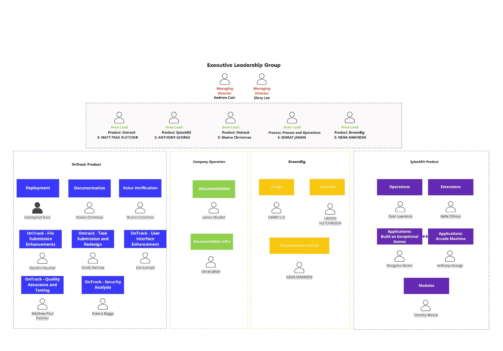

# Thoth Tech - Company Structure and Objectives for Trimester 2 2022

## Executive Summary

Thoth Tech (est. 2022) is a new software development company currently building from the ground up
in Melbourne Australia. Thoth Tech’s mission is to build, operate, and deploy education
technologies, creating tools that enhance education outcomes by empowering students, connecting them
with tutors, and facilitating personalised learning experiences. We value our people, and we value
excellence: We are people-focused, aim to produce sustainable products of excellent quality, and
provide frameworks that provide a safe environment for learning and support of our team.

This report is for stakeholders, investors, and employees, and will outline the company structure,
charter, objectives – both short and long term, and explore each product’s goals in depth.

Within the first third of 2022, Thoth Tech has recruited approximately 92 employees including four
area leads, three product leads and eleven delivery leads.

The second third of 2022 has seen Thoth Tech grow to approximately 104 employees, including five
product leads and sixteen delivery leads.

There will be another recruitment phase during the last third of the year, with the potential for
internships throughout the company.

Along with recruitment, Thoth Tech has taken onboard three external products, two live and
well-established products – **OnTrack** and **SplashKit** – and **DreamBig**, a in development
product which will leverage the OnTrack technology stack. Thoth Tech will also be creating our
internal architecture and platform for employees throughout this third of the year, referred to as
the **Internal System** project.

Both the OnTrack and SplashKit products have been identified as requiring extensions and additional
features to improve the quality and usability of the product. OnTrack is a platform designed to
facilitate student learning and reducing the pressure of achieving unrealistic grades. The focus is
on providing a tailored learning experience, using tasks and a portfolio assessment. This product is
live and is currently being upgraded to newer technology stacks and improving security and
documentation. SplashKit is currently a 2D game development Software Development Kit used to teach
object-oriented coding to beginners. It has been identified that SplashKit can be expanded to
explore other areas and languages. The DreamBig product is in response to a need identified by
Deakin,to provide a personalised development roadmaps to enhance students’ employability. Due to a
partnership with the School of IT at Deakin University, Thoth Tech and the subsequent products are
funded, supported, and leveraged by Deakin. However, all contributions by Thoth Tech members are
acknowledged due to the Open-Source nature of the company. Deakin provides ground zero end-user
testing and focus groups for product improvements.

\_\_\_\_\_\_\_\_\_\_\_\_\_\_\_\_\_\_\_\_

Andrew Cain,

_Managing Director_

\_\_\_\_\_\_\_\_\_\_\_\_\_\_\_\_\_\_\_\_

Glory Lee,

_Managing Director_

---

Table of contents

- [Executive Summary](#executive-summary)
- [Leadership Team](#leadership-team)
  - [Roles and Responsibilities](#roles-and-responsibilities)
- [Trimester Goals and Objectives](#trimester-goals-and-objectives)
- [Company Charter](#company-charter)
  - [Mission](#mission)
  - [Values](#values)
  - [Team Culture](#team-culture)
  - [Roles](#roles)
  - [Metrics of success](#metrics-of-success)
  - [Standards of quality](#standards-of-quality)
- [Company Structure](#company-structure)
- [Product Overview](#product-overview)
  - [OnTrack](#ontrack)
    - [Voice Verification](#voice-verification)
    - [Task and Submission Redesign](#task-and-submission-redesign)
    - [File Submission Enhancements](#file-submission-enhancements)
    - [Security Analysis](#security-analysis)
    - [User Interface Enhancement](#user-interface-enhancement)
    - [Google Cloud Deployment](#google-cloud-deployment)
    - [OnTrack Documentation](#ontrack-documentation)
    - [Quality Assurance and Testing](#quality-assurance-and-testing)
  - [SplashKit](#splashkit)
    - [Operations](#operations)
    - [Extensions](#extensions)
    - [Applications - Arcade Machine](#applications---arcade-machine)
    - [Applications - Build An Exceptional Game](#applications---build-an-exceptional-game)
    - [Modules Enhancements](#modules-enhancements)
  - [DreamBig](#dreambig)
    - [Prototype Technical Team](#prototype-technical-team)
    - [Design Team](#design-team)
    - [Dreambig Documentation and Quality Assurance Team](#dreambig-documentation-and-quality-assurance-team)
  - [Company Operations](#company-operations)
    - [Documentation Infrastructure System](#documentation-infrastructure-system)
    - [Company Documentation](#company-documentation)

---

## Leadership Team

---

## Roles and Responsibilities

<table>
<thead>
<tr class="header">
<th></th>
<th>Role</th>
<th>Responsibilities</th>
<th>Skills</th>
</tr>
</thead>
<tbody>
<tr class="odd">
<td><strong>Managing Director</strong></td>
<td>The role of the managing director is to oversee the Thoth Tech
company executive leadership team to ensure they are running the company
effectively and value is being added to the Thoth Tech products by the
projects they are supporting.</td>
<td><ul>
<li>
Provide guidance to executive leadership team
</li>
<li>
Provide high-level vision for the ongoing goals of the company
</li>
<li>
Provide a consistent company strategy due to low retention
</li>
</ul></td>
<td><ul>
<li>
Leadership
</li>
<li>
Communication
</li>
<li>
Mentor
</li>
<li>
Decision-making
</li>
</ul></td>
</tr>
<tr class="even">
<td><strong>Product Lead</strong></td>
<td>The role of the Product lead is to drive their focus on the projects of their product. They also organise, lead, guide, and support Delivery Leads to achieve their project goals.</td>
<td><ul>
<li>
Establish company structure, systems & processes
</li>
<li>
Establish a leadership cadence
</li>
<li>
Drive a focus on Technical Learning, Data, Documentation and Quality Assurance
</li>
<li>
Support Delivery leads with their
project
</li>
<li>
Drive the product in the direction
determined by the Managing
Directors.
</li>
<li>
Strong drive towards toward
objectives with bias for action
</li>
<li>
Proactively identify blockers and
opportunities
</li>
<li>
Make thoughtful decisions
motivated by data and research
</li>
<li>
Be transparent and accountable
by visualising objectives
</li>
</ul></td>
<td><ul>
<li>
Leadership
</li>
<li>
Organisation
</li>
<li>
Interpersonal Savvy
</li>
<li>
Problem-Solving
</li>
<li>
Collaborative
</li>
<li>
Mentor
</li>
<li>
Communication
</li>
<li>
Presentation
</li>
<li>
Stakeholder management
</li>
<li>
Empathy
</li>
</ul></td>
</tr>
<tr class="odd">
<td><strong>Delivery Lead</strong></td>
<td>The role of the Delivery lead is to lead, organise and support their
project teams to ensure ongoing success.</td>
<td><ul>
<li>
Establish a team cadence
</li>
<li>
Build rapport with all team members to foster a cohesive and
collaborative environment
</li>
<li>
Strong drive towards objectives with bias for action
</li>
<li>
Proactively identify blockers and opportunities
</li>
<li>
Communication on what the team is doing, their plans and what is
needed
</li>
</ul></td>
<td><ul>
<li>
Communication
</li>
<li>
Empathy
</li>
<li>
Interpersonal Savvy
</li>
<li>
Collaborative
</li>
<li>
Leadership
</li>
<li>
Stakeholder management
</li>
</ul></td>
</tr>
</tbody>
</table>

---

## Trimester Goals and Objectives

### Objective 1

Continue to grow Thoth Tech as a company in line with our mission and values.

- Even distribution of roles and responsibilities
- Foster and encourage self-motivation and autonomy
- Maintain the Thoth Tech project branching structure and approval process
- Enhance the Quality Assurance Policy and process across all the products
- Establish standards and expectations of product development
- Enhance and extend the handover document
- Enhace the Onboarding process for leadership team
- Maintain the Documentation guidelines for Thoth Tech

### Objective 2

Create a safe, supportive, and collaborative company culture that empowers our employees to learn
and develop their skills.

- Maintain a company culture where feedback is welcome, and success is celebrated
- Support development of chosen skills in every team member
- Help team members to develop soft skills such as leadership, teamwork, professionalism etc
- Empower those embracing learning of new skills, to pass their knowledge on to other team members
- Create a psychologically safe space for collaboration to thrive
- Optimise the company experience for future employees

### Objective 3

Add value to the SplashKit Product by extending functionality and languages

- Improve the SplashKit product through realistic physics, data visualisations and machine learning
- Improve SplashKit language compatibilities to expand learning accessibility for users
- Improve SplashKit installation process and compatibilties
- Complete a hardware product to showcase student game creations

### Objective 4

Add value to Company Operations

- Improve the Handbook
- Establish a website for centralised documentation as a part of Company Operation.
- Establish guidelines, protocols for all the major principles
- Include Standard Templates for different processes
- Improve company policies

### Objective 5

Add value to the OnTrack Product by adding and enhancing features

- Enhance Voice Verification as a new feature
- Create a company hosted deployment of OnTrack
- Move Ontrack front-end away from legacy technologies
- Analyse, update, improve and create retrospective OnTrack documentation

### Objective 6

Create the DreamBig prototype as a new product that adds value to the Thoth Tech company

- Build the vision and strategy for the DreamBig product
- Create a DreamBig prototype as proof of concept

---

# Company Charter

The Thoth Tech charter is a crucial tool for guiding our team, navigating decisions, establishing
boundaries, and aligning the team on how we work together. It defines how as a company we work
together to achieve success.

Our charter comprises of the following:

- **Mission:** As a team, what are we trying to achieve?
- **Values:** What do we care about?
- **Team Culture:** How will we work together, what do we expect?
- **Roles:** What roles do we need and what are the responsibilities of each role?
- **Metrics of Success:** What does success look like to us?
- **Standards of Quality:** What are our standards for high quality work?

## Mission

Our mission is to build, operate and deploy world class education technologies. This is achieved by
creating accessible tools that enhance education outcomes by empowering students, connecting them
with tutors and facilitating personalised learning experiences.

## Values

Our values describe how we work, what we represent, and guide us to be the kind of company and team
members we want to be. When we live up to these values we will:

**Be people-focused**

We expect the best from each other, give each other the benefit of the doubt, encourage each other
to take initiative to improve ourselves and the company, and provide direct and constructive help to
each other. We collaborate with kindness while being respectful of each other.

**Uphold sustainable excellence**

We create working, maintainable, and understandable software that is enjoyable and easy to use. We
strive to do it in a way that is sustainable for our team members and for our environment.

**Be inclusive and supportive**

We celebrate diverse perspectives and embrace uncomfortable ideas and conversations. We facilitate
an environment in which all team members feel psychologically safe enough to make requests for what
they need to do their job. We learn through failures while continually working to make things
better.

## Team Culture

- Our employees will always operate with transparency and accountability.
- We strive to always assume positive intent in our communication with each other.
- We promote individual empowerment, with group support.
- We achieve through iteration - progress before result is to be expected.

## Roles

- Roles and responsibilities should be clearly defined.
- Decision-making should be made based on company values and evidence.

## Metrics of success

- We take pride in our work
- We celebrate success regularly
- We collaborate and mentor with each other to share our learning.
- We define our success.
- We do not take shortcuts.

## Standards of quality

- Security and privacy are paramount.
- Everything we do must be well documented for ourselves and for the future.
- What we do should be easy to understand.
- Build everything with re-usability and iteration in mind.
- User satisfaction is key.

---

## Company Structure

The Company is broken up based on product, with the product leads spread company wide. There is a
tier system built into the company structure – directors, product leads, delivery leads, then team
members. This structure is primarily about support, guidance, and feedback, rather than authority.
Each employee has chosen their own role title based on their interests, skills, experience and what
they want to develop.

Click
[here](https://deakin365.sharepoint.com/:i:/r/sites/ThothTech2/Shared%20Documents/General/company_structure.png?csf=1&web=1&e=MJBk6i)
to view image externally

---

## Product Overview

## OnTrack

OnTrack is a platform designed to facilitate student learning by helping them achieve their unit
learning outcomes and goals. It reduces pressure on achieving unrealistic grades, and importance on
tailored content learning using tasks and a portfolio assessment. This approach provides students
with a simple but effective way to demonstrate their achievements and learning outcomes with the
assistance of teaching staff feedback throughout the unit. OnTrack is based on Doubtfire LMS and
Thoth Tech is working towards creating new and enhanced features that improve the teaching and
learning experience.

**Product Lead:** Shaine Christmas

### Voice Verification

#### Overview, Goals, and Objectives

Due to the rise in contract cheating, audio submissions to the OnTrack system need to be reviewed in
order to ensure that the Speaker within the submission is the student to be submitting the work. The
long term goal of this project is to implement a Voice Verification system into OnTrack Audio
submissions. This will allow assessors to identify cheating where possible, and to discourage
students from submitting work that is not their own.

#### Aims for Trimester

The Aims for this Trimester are:

- To Test the system for a range of different audio files with multiple speakers
- Implement the Voice Verification container into the OnTrack API
- Design a User Interface for displaying results of verification of a Submission

#### Deliverables

Short Term:

- Test how the system responds to audio submissions with multiple different speakers
- Wireframes and High-Fidelity designs for User Interface for displaying results
- Documentation of implementing the Voice Verification container into the existing OnTrack API
- Working validation of voices through a local distribution of the OnTrack API

Long Term:

- Full implementation, Testing and Documentation of Voice Verification system within the existing
  OnTrack System.

#### Project Members (6)

_Delivery Lead:_ Shaine Christmas

_Software Developers:_ Ha Nguyen, Devin Oshada Uvin Jayasinghe, Daniel Le, Simon Agahi, Jesse Kyle
Hancock

### Task and Submission Redesign

#### Overview, Goals, and Objectives

The Objective of this project is to redesign the task view and submission process for students
empowering students, connecting them with tutors and facilitating personalised learning experiences.
Our goal is creating UI and software designs for a "next generation" update to tasks in OnTrack. The
project effects all users of OnTrack, mainly for how students view and understand their tasks for
their units, as well as how submission is handled for students and assessors.

#### Aims for Trimester

The aims for this trimester are:

- Production of UI/UX design process for the task view and submission process of students.
- Begin the build and Integration of final design.

#### Deliverables

Short Term:

- Documentation Epic and User stories.
- Develop and deliver 4 wireframes.
- Develop and deliver 2 visual designs.

Long Term:

- Develop and deliver a final UI/UX design.
- Code review of final design
- Build and implementation of final design into OnTrack

#### Project Members (4)

_Delivery Lead:_ Grady Ramsay

_Software Developers:_ Daniel Patrick Norris, Ricky Dodd, Mat Perkins

### File Submission Enhancements

#### Overview, Goals, and Objectives

This project aims for enhance the file submission project for the OnTrack system. By increasing the
types of files that can be used for submission to OnTrack, ease of submitting tasks for students and
importing submissions for assessors will be increased. This project mainly effects the students, as
it will reduce steps needed to submit tasks; specifically the conversion of different file types.
Long term, this project aims to document accepted file types, identify file types that can be used
for the OnTrack system, and implement and document any new file types added to the system.

#### Aims for Trimester

The aims for this trimester are:

- Increase the compatability of different file systems for submission to the OnTrack System.
- Document currently available file types.
- Implement the Jupter Notebook file type for OnTrack submissions.

#### Deliverables

Short Term:

- Implement compatability for Jupiter Notebook file submissions.
- Investigation of different file types for future integration.
- Creation of Documentation for new file type implmentation.

Long Term:

- Maintenence of file updates and compatability of change file types.
- Integration of relevant file types into the OnTrack submission system.
- Ongoing documentation of valid file types new formats to add.

#### Project Members (7)

_Delivery Lead:_ Nandini Kaushal

_Software Developers:_ Keerat Kaur, Aaryan Sharma, Gurpartap Singh Panesar, Jayant, Yongqi Huang,
Aryan Bagoria

### Security Analysis

#### Overview, Goals, and Objectives

The aim of the Security Analysis project is to understand the vulnerabilities within the OnTrack
system, to aid in the implementation of security measures. Given that OnTrack has a high throughput
of task submission and user data, protecting the students and assessors data is paramount for
ensuring that both technical system remain secure. This will effect all users of Ontrack, as well as
the ongoing development of the OnTrack system.

#### Aims for Trimester

The aims for this trimester are:

- Creation of documentation on testing standards to be used in the OnTrack project.
- Testing of OnTrack systems for vulnerabilities.
- Creation of testing documents for existing parts of the OnTrack system.

#### Deliverables

Short Term:

- Identification of current security vulnerabilities.
- Creation of testing standards.
- Documentation of issues and proposed fixes.

Long Term:

- Further ongoing testing of the OnTrack system for vulnerabilities.
- Implementation of fixes for identified security vulnerabilities.
- Further documentation of vulnerabilities and proposed fixes.

#### Project Members (2)

_Delivery Lead:_ Ereena Bagga

_Developers:_ Ben Thomas

### User Interface Enhancement

#### Overview, Goals, and Objectives

The overarching goal of this project is to migrate the current components, which utilise
CoffeeScript and Bootstrap, to Angular framework with Typescript. CoffeeScript has outlived its
usefulness and falls short of more contemporary frameworks in terms of support, functionality, and
security. Developers can easily design dynamic single-page applications using Angular because to its
component-based architecture. As TypeScript provides types and enables early problem identification,
its use in its construction ensures improved security.

#### Aims for Trimester

The aims for this trimester are:

- Use bottom-up progression to migrate at existing components
- Restrict the conflicts between the old and new components
- Gain experience to enable speedier growth in future trimesters

#### Deliverables

Short Term:

- Develop and deliver at least 5 migrated components
- Carry on the components that are in the middle of migrating in last trimester

Long Term:

- Ensure all migrated components have been tested and function as expected by implementing test
  units.
- Prior to CoffeeScript support being removed, make sure that future team members are supported and
  set up for success to migrate all remaining components

#### Project Members (6)

_Delivery Lead:_ Leo Luong

_Software Developers:_ Anthony Papoutsis, Ahmed Ali, Aldy Putra Shavira, Kosta Constantinou, Nelson
Lai

### Google Cloud Deployment

#### Overview, Goals, and Objectives

The Google Cloud Deployment team aims to deploy the existing OnTrack system to the Google Cloud
Platform. This will aid in the interactions of the internal parts of the system, as well as scaling
the system for future development of the platform. The overall goal for this project is to fully
deploy and maintain the OnTrack system using the Google Cloud Platform.

#### Aims for Trimester

The aims for this trimester are:

- Build an Understanding of the OnTrack System and Google Cloud Platform to plan deployment.
- Deploy all parts of the OnTrack system to Google Cloud Platform
- Test relevant interactions between different systems to maintain current usability.
- Maintain OnTrack system using Google Cloud Platform tools.

#### Deliverables

Short Term:

- Creation of documentation of Google Cloud deployment of OnTrack.
- Initiate process of deployment of OnTrack system.

Long Term:

- Maintenence of the OnTrack system using the Google Cloud platform.
- Implementation of Google Cloud Platform tools to aid in testing and deployment of the OnTrack
  system.
- Ongoing Documentation of the OnTrack deployment to Google Cloud Platform.

#### Project Members (7)

_Delivery Lead:_ Harshpreet Kaur

_Developers:_ Anshuman Bishnoi, Dan Eastaugh, Sicheng Liu, Chetan Nagar, Pratham Gupta, Xuetong Zhao

### OnTrack Documentation

#### Overview, Goals, and Objectives

OnTrack is a growing and evolving system. OnTrack should be documented to ensure that future teams
who work on the project have a starting point to understanding and making changes to the existing
system. This will help all members of the OnTrack development team, current and future.

#### Aims for Trimester

The Aims for this Trimester are:

- Map out the existing OnTrack project, and related systems
- Discover areas of OnTrack that still need to be documented
- Ensure all mapped areas of the OnTrack Project are appropriately documented

#### Deliverables

Short Term:

- Mapping the existing OnTrack project
- Identifying areas to document
- Writing documentation for identified areas

Long Term:

- Ensuring the entirety of the current OnTrack project are documented
- Formatting documentation of new areas to match OnTrack documentation standards

#### Project Members (6)

_Delivery Lead:_ Shaine Christmas

_Documentors:_ Matt Clark, Jasdeep Singh, MD Fahim Mizi, Shiv Bhanu, Adrienne Gelbhauer

### Quality Assurance and Testing

#### Overview, Goals, and Objectives

This project’s main goal is to identify and document the current features of OnTrack and put in
place a Quality Assurance and Testing infrastructure to better maintain the quality of OnTrack and
allow for more polished product. As OnTrack continues in its development, ensuring that robust
testing is important for ensuring the quality of OnTrack as a system. The overarching goal of this
project is to ensure that the OnTrack product is robust and completes rigorous testing.

#### Aims for Trimester

The aims for this trimester are:

- Help strengthen the QA and testing structure within Toth Tech
- Maintain/Create testing practices withing OnTrack and the greater Toth Tech
- Create use cases and then test cases for existing features within OnTrack
- Develop Unit, Integration and possibly UI testing for OnTrack

#### Deliverables

Short Term:

- Identify QA best practices withing Toth Tech
- Investigate existing QA process in OnTrack and Thoth Tech
- Define testing balance and scope
- Creation of Test Cases for standardising OnTrack QA
- Create/Maintain bug board
- Define/Find feature list for different features of OnTrack
- Create use and test cases for existing functionality

Long Term:

- Create and maintain testing framework(s) and an automation codebase on Git
- Create an automated practice for Unit, Integration and UI testing.
- Create a suite of automated tests that can be run easily
- Maintain a bug tracker
- Create/use documentation for standardising the creation of use cases and test cases

#### Project Members (3)

_Delivery Lead:_ Matthew Paul Fletcher

_Testers:_ David Kwiatkowski, Parth Aneja

---

## SplashKit

SplashKit is an open-source Software Development Kit (SDK), created with the purpose of reducing the
overhead required for truly technical coding and allowing students new to coding to create
satisfying programs in a short period of time.

SplashKit enables beginning coders to quickly learn to construct fun and functional programs which
they can be proud to showcase. SplashKit is an open-source Software Development Kit (SDK), created
with the purpose of reducing the overhead required for truly technical coding which enables students
new to coding to create satisfying programs in a short period of time. SplashKit enables novice
coders to quickly learn to construct fun and functional programs which they can be proud to
showcase. It includes a large library of functions which can be utilized by the user to experiment
and apply for their own application or game.

This product is currently used by students at Deakin University and aims to become a global
educational toolkit. Currently the language used for development is C++ and the direction of the
product is to improve and expand the capabilities to increase SplashKit accessibility.

**Product Lead:** Anthony George

### Operations

#### Overview, Goals, and Objectives

The Operations team are responsible for delivering developments at a system level. This includes
foundational project, installation processes ('skm'), bug fixes and solutions to ongoing system
level problems.

This team has a goal of taking last trimesters existing research and extending on that to succeed in
delivering an installation process that is effectively 'one-click' and compatible across all
operating systems.

The team also has the objective to research and document the possibility (or lack thereof) a browser
based implementation, and should one exist, design and document an approach to take to make this
feasible.

#### Aims for Trimester

The aim for this trimester is to

- Design a bespoke SplashKit installer
- Develop this as an out-of-the-box SplashKit installer
- Research a browser-based implementation

#### Deliverables

Short-term

- A flow-chart of the intended process
- A UML diagram of the resources required for development
- The foundations of the installer
- Research papers on the possibility of browser based solutions

Long-term

- A 'one-click' SplashKit installer

#### Project Members (4)

_Delivery Lead:_ Ryan Lawrence

_Developers:_ Ismail Hassan, Auden Vitasa, Kevin Nguyen

### Extensions

#### Overview, Goals, and Objectives

This trimester, the Extensions team will continue to develop the SplashKit translator Ruby
application and enhance it to translate the original C++ library into Python versions > 3.8. The
SplashKit Extensions project’s aim is to provide the SplashKit library interface in additional
languages.

This team has a goal of taking last trimesters existing research and foundation, and extending on
that to succeed in fixing the incompatibilities it encountered.

The team also has the objective to translate other languages if possible, and reserach and develop
an alternative means to the use of MSYS during installation.

#### Aims for Trimester

The aim for this trimester is to

- Understand how the language translators works
- Investigate changes in Python between 3.8x versions and earlier to identify which of these changes
  have caused current incompatibilities
- Get SplashKit successfully working on the latest Python version (3.10.x)
- Fix Python incompatibilities
- Complete Python and Rust language extensions
- Translate to other languages if possible
- Test Python translator

#### Deliverables

Short-term

- Research and document exact versioning errors
- Research and document alternative approaches
- Design and document an alternative approach
- Implement changes to SplashKit-core to rectify incompatibilities

Long-term

- Complete this approach for other languages

#### Project Members (4)

_Delivery Lead:_ Bella Chhour

_Software Developers:_ Lachlan Cayzer, Nelson La, Nick Agiazis

### Applications - Arcade Machine

#### Overview, Goals, and Objectives

This trimester, the arcade machine team has a solid foundation to build on, given the creation of a
Windows application capable of cloning the games repository, and executing the games on a playable
interface. The work of last trimester allows the team of this trimester to take closer steps to
creating a physical arcade machine. The machine will perform similarly to a Multi-Game Arcade
Machine, allowing users to select a game from a local library of games. Objectives include:

o Software which:

- Is cross platform compatible
- Allows for game compilation on the host machine
- Is authored to be consistent with a chosen programming convention/style guide
- Implements an architecture that ensures long term maintainability is possible for future
  contributors

o The development of:

- A programming convention / style guide document
- Other General Project Documentation

o Research of:

- Appropriate tooling that can be used to assist with these objectives
- Unit tests and determining if they have any value for the project

Additional features which may be considered later in the lifecycle of the project include the
development and deployment of a website which:

o Supports the uploading of games o Stores and displays:

- User Reviews
- High Scores and Achievements

#### Aims for Trimester

The aim of this trimester is to enhance the existing application to accommodate cross-platform
compatibility. This will include developing methods to facilitate the compilation of games on the
host machine. Access to the game library will be offered through the platform where the user can
configure settings and select and play their desired game. If time permits, a physical Arcade
Machine will be designed and manufactured however the software platform is the primary focus for the
trimester.

#### Deliverables

Short-term

- Decoupling functional behaviour and modularising existing software
- Adding support for all three major operating systems
- Adding support for locally compiled games on the host machine
- Completion of an options menu
- Discussing and agreeing upon a programming convention and style
- Addressing style inconsistencies throughout the project’s source code
- Producing documentation around the project

Long-term

- Physical Arcade Machine built using RaspberryPi

#### Project Members (7)

_Delivery Lead:_ Anthony George

_Software Developers:_ Riley Dellios, Huy Nguyen, Richard Douglas-Denton, Lachlan Foy, Mohamed
Zirufaan, Zac Brydon

### Applications - Build An Exceptional Game

#### Overview, Goals, and Objectives

This trimester, this team will collaborate as a unit to create a single game of exceptional class
and quality.

The goal is to make a game so good it is worthy of commercial release game. The intension here is to
showcase to the world, the power of the SplashKit SDK, and encourage developers to develop games
using the engine. This trimester's student developers will aim to utilise as many methods that
SplashKit has to offer in order to ‘advertise’ SplashKit’s ability as a game engine.

The long-term objectives will showcase how by using SplashKit, game development quality can be
achieved such that the product created is of a high enough professional standard, the game can be
made available commercially. Synchronously, the game will be showcased on the arcade machine in
development.

#### Aims for Trimester

The aim for this trimester is to

- Compartmentalise the tasks to focus teams on specific areas of games development (Design,
  Mechanics, Animations, Collisions, AI, etc)
- Construct UML and foundational designs and specifications
- Acquire artwork and sound assets suitable to specifications
- Develop the foundations of the game
- Create game functionality, intro animations, menu, options, credits, etc

#### Deliverables

Short-term

- A decided genre of game
- UML Class diagrams and other designs
- Team creations and task allocations
- Acquisition of assets
- Class creation
- Documentation

Long-term

- Commercially releasable game, developed using the Splashkit SDK

#### Project Members (7)

_Delivery Lead:_ Morgaine Barter

_Software Developers:_ Daniel Agbay, Lachlan Morgan, Roy Chen, Robert Osborne, Lily Lan, Jiahao
Zheng

### Modules Enhancements

#### Overview, Goals, and Objectives

The Splashkit modules team has an exciting semester ahead of them, with each module in a position to
have deliverable components completed.

The machine learning module had a working reinforcement learning agent that can play turn based
games. Refactoring and code review was performed on the physics module, but external dependencies on
the Box2D library has left the module requiring a major refactor. This refactor would mean that
Splashkit would contain a native physics engine. The data analytics module has a structure for a
dataframe, pending it passing code review and testing.

Objectives for the modules project include:

- Building multiple machine learning agents utilising different algorithms to be used by developers
  for different features
- Create a 2D physics engine within SplashKit, allowing physics to be easily added to objects within
  a project
- Implement a dataframe structure that loads structured data and create an API that allows a data
  scientist to pre-process, transform and visualise the data.

With the addition of these modules, there is potential for Splashkit to be utilised in a greater
capacity within more disciplines. Building the data analytics module allows for more focused classes
to be designed for data science students, rather than only using Splashkit for building games. Both
the physics and machine learning modules will advance the quality and capability of games and
animations built while using Splashkit.

#### Aims for Trimester

The primary aim for this trimester is to have the reinforcement learning agent ready to use by
developers and to complete the first stage of deliverables for the physics and data analytics
modules. These initial deliverables are to complete the basic dataframe for data analytics and to
replace the existing Box2D library uses with native methods.

Secondary aims for the semester are to create a neural network agent, develop plots and
visualisations from the data in the dataframes and to begin creating methods for gravity, sinking
and projectile motion.

#### Deliverables - Data Analytics

Short-term

- Finish code review
- Load data row by row and column by column
- Working Dataframe with descriptive and transformative methods
- Build a way to display plots and subplots

Long-term

- Fully functioning dataframe
- Data type objects
- Full preprocessing method suite
- Multiple data visualisation methods created
- Integration with machine learning

#### Deliverables - Machine Learning

Short-term

- Create games to test reinforcement learning agent against different game styles
- Begin building neural network agent

Long-term

- Continue adding machine learning models as agents
- Create easy to call methods for developers to utilise these agents

#### Deliverables - Physics

Short-term

- Finish code review
- Refactor code to remove dependency on Box2D
- Create methods for sprite collisions, object collisions and gravity

Long-term

- Create a fully functioning 2d physics engine within Splashkit
- Expand the methods to include physics such as sinking, inertia and others

#### Project Members (7)

_Delivery Lead:_ Timothy Moore

_Software Developers:_ Alex Hocking, Devesh Juggiah, Gaganjeet Singh, Harry Dentry, Jingyu Zhang,
Munatsi Matipano

---

## DreamBig

DreamBig is a new product innovation driven by the School of IT at Deakin. DreamBig aims to provide
a personalised roadmap integrated with Ontrack to support students to develop their professional
identity across their course and improve their employability after graduation. In addition, it aims
to provide a platform to help set realistic expectations for students graduating into the real
world. In line with this vision, it is proposed to build a prototype that can help achieve the
following goals:

- Multi-dimensional visualisation of each student's growing professional identity
- Used within curriculum to encourage engagement.
- Scaffolds reflections on industry-readiness
- Increases awareness of important milestones and dates for graduate recruitment and internships
- Customised paths for career starters, career changers and career advancers.

**Product Lead:** Neha Makineni

### Prototype Technical Team

#### Overview, Goals, and Objectives

DreamBig is at its early inception. The customer needs and product requirements are gradually
discovered and refined. The Prototype Technical project is an attempt to explore the technicality
and possibility of the features discovered by the design team. The process includes determining
Backend API functionality and preparing frontend pages to prove that, identifying underserved
customer needs, UML diagram for backend DB design, database, specifying the MVP feature set,
building, and testing small build components of the prototype with the customers.

#### Aims for Trimester

Research will be conducted to investigate finalised frontend components and design the backend for
them and prioritise high-value features. These will form the minimum viable product (MVP). As part
of this work, the following will be established:

- Documentation of app developments
- Research and analysis on prototype backend functionality
- Focussing on connecting frontend to backend upon design conformation
- Complete technical prototype incorporating above analysis

#### Deliverables

Short-term

- Detailed UML diagram for backend DB design
- Documentation on how to setup DreamBig app using Docker
- Frontend pages that prove backend API functionality

Long-term

- Build frontend pages that deliver DreamBig planned functionality
- Ensure all aspects of DreamBig app have been unit tested
- Create e2e tests for DreamBig

#### Project Members (4)

_Delivery Lead:_ Linden Hutchinson

_Software Developers:_ Norbert Pop, Way Yan Min

_Technical Documentation Specialist:_ Xue Ting Jing

### Design Team

#### Overview, Goals, and Objectives

DreamBig Frontend design is at its early inception. The customer needs and product requirements are
discovered and are being refined at every step. The Prototype Design project is an attempt to
explore the product-market fit. The process includes re-determining our target customer, identifying
underserved customer needs, defining the product value proposition, specifying the MVP feature set,
building, and testing design the prototype with the customers.

#### Aims for Trimester

Research will be conducted to investigate customer needs and prioritise high-value features. These
will form the minimum viable product (MVP). As part of this work, the following will be established:

- Work on the UI design for every features
- Work on the UX design for application
- Documentation on simple and clear design

#### Deliverables

Short-term

- Finishing wireframes update and high-quality model.
- Complete high quality design documentation to communicate design concepts.

Long-term

- Complete a good quality UI/UX design prototype incorporating above analysis
- Keeping updating any users prefer features and UI.

#### Project Members (6)

_Delivery lead:_ Harry Liu

_UI&UX designer:_ Adam Sawczuk, Josephine Hannah, Junhua Ma, Monica Valentina Tasmin, Wei Min Voon

### DreamBig Documentation and Quality Assurance Team

#### Overview, Goals, and Objectives

DreamBig Frontend design is at its early inception. The customer needs and product requirements are
discovered and are being refined at every step. The Prototype Documentation and QA project is an
attempt to explore and build a standard structured framework of documentation and QA processes. The
process includes and testing of design/technical prototype with company standards.

#### Aims for Trimester

Research will be conducted to investigate possible structure and frameworks for documentations and
QA testings. These will form the minimum viable product (MVP). As part of this work, the following
will be established:

- Build a framework for documentation and QA testing
- Completed aligning the previous documents to the new framework
- Work on QA testing for existing design features and wireframes and keep doing the same for the
  work that will be completed in the project going forward

#### Deliverables

Short-term

- Complete research and trials of new frameworks for documentation and QA
- Test the framework with new documentation and features for QA Long-term
- Once the build of design prototype is done do the required testing
- Once the build of technical prototype (backend, frontend, API, database) is being built, do
  regular testing to see if they are produced according to company standards
- Finish converting previous documentation according to the new framework

#### Project Members (5)

_Delivery lead:_ Neha Makineni

_Technical writers:_ Alicia Threatt, Ashar Kamal

_Quality Assurance testing specialists:_ Gurpreet Kaur, Tiomothy Davies

---

## Company Operations

Managing company processes and operations. Keeping Thoth-Tech running. Help employees to understand
the systems, equipment, people, and processes need to make the organization function.

**Product Lead:** Ishrat Jahan

### Documentation Infrastructure System

Internal systems website will be for holding all company related documentation. This will provide
the benefit of making documentation centrally locatable and easily accessible for relevant internal
audiences.

#### Overview, Goals, and Objectives

- Establish an website for centralised documentation
- Documentation produced is accurate to current version of products
- A quick way for updating and distributing company and product details
- Site is automatically generated when contributions are made
- Site is hosted

#### Aims for Trimester

- Research privacy and security features
- Design the interface
- Deciding who gets access
- Deciding how will we test
- How will privacy be protected
- A prototype showing all design and functionality of the internal website

#### Deliverables

Short-term:

- Design the interface
- Establishing testing strategy
- Establishing hosting strategy
- Research solutions

Long-term:

- Establish a website for centralised documentation as a part of Company Operation.

#### Project Members (6)

_Delivery Lead:_ Ishrat Jahan

_Software Developers:_ Harrison Paul Allwood, Manveen Kaur Bhullar, Pratham Gupta, Sherap Thakur,
Tanish Dhapola

### Company Documentation

#### Overview, Goals, and Objectives

The Company Documentation team is responsible for reviewing, managing and improving the state of
documentation across the whole of the Thoth Tech company. Our goal is to review the current state of
company documentation within the company to improve and expand upon this documentation. In doing so,
our objectives are to streamline the quality and processes of documentation across the whole company
and to create additional documentation to support the needs of the company operation as it continues
to grow and change.

#### Aims for the Trimester

This trimester, the Company Documentation team aims to create, manage, maintain, and improve the
state of company documentation, company policies around transition and people operation. In meeting
this aim, the team will:

- Review the current state of documentation across the company (including company handbook)
- Identify gaps or areas of improvement
- Create new documentation, including templates, in order to address these areas
- Continue to think critically about the documentation needs of the company and create additional
  documentation to accommodate such needs
- Work to the best of our abilities to create meaningful and high quality documentation

#### Deliverables

Short-term:

- Various documentation to supplement current documents in order to better meet company needs
- Reviewed and improved documentation and handbook to better the state of documentation across the
  whole company
- Help product specific documentation team to operate more effectively

Long-term:

- Reviewed and improved company policies, guides, and Onboarding and Offboarding procedures
- Improvements to the Company Handbook
- Enhancing company policies and procedures

#### Project Members (6)

_Delivery Lead:_ James Micallef

_Company Documentation Members (specific roles TBA):_ Sarah Nicole Dyson, Ethan Graham Keirs, Durga
Maya Ghallay, Charanjeet Singh, Faiq Rehman
