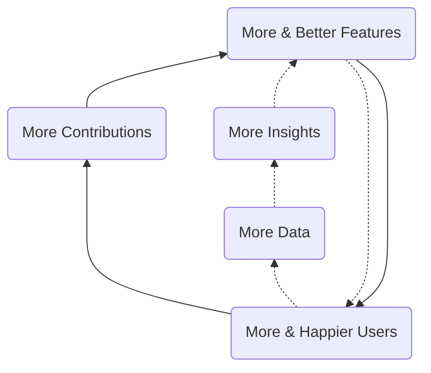

# Data Strategy

Mission: Help Thoth Tech Make Better Decisions, Faster.

At Thoth Tech, we endeavor to be user-centered. Users will be the center of our operations including
how we develop and support our products. To support that mission, we would like to have strong data
insights.

We are creating a Data Platform, a single unified data and analytics stack. The Data Platform will
power cross-functional reporting and analysis, and in general, allow all team members to make better
decisions with trusted data. Over time, the Data Platform will further enhance Thoth Tech's
analytics capabilities with features such as data products - enriched and aggregated data integrated
into Thoth Tech products for use by our users. This acceleration happens through the development of
"Data Flywheels".

What is a flywheel strategy?

[A flywheel strategy](https://www.ejorgenson.com/blog/flywheel-effect) has positive feedback loops
that build momentum, increasing the payoff of incremental effort.

## Data Flywheels

We call this User and Product Intelligence Flywheel. It is focused on improving the User Experience
and encompasses the data and analytics involved in the user-product interactions, user use cases,
product development and most aspects of the user journey.

In the open core flywheel, more features drive more users which in turn drive more contributions
which lead to more users.

## Data Platform

A complete data platform needed by a company consists of the following capabilities, but not limited
to.

- Advanced Analytics
- Dashboard
- Data Architecture
- Data Catalog
- Data Model Standards
- Data Products
- Data Quality
- Data Security
- Data Transformation
- Master Data Management
- Real-Time Data
- Reporting

We don't need to acquire all of the above capabilities. In fact, these are driven by the company
short and long term needs.

## Data Stack

Where are we heading

## Roadmap

So how are we getting there

### Data Pull or Push

- Identify and document data sources
- Develop Telemetry framework in OnTrack (API and Web)
- Develop Telemetry framework in SplashKit (Usages)

### Ingestion and Data Store

- Build Ingestion pipeline and data store

### Visualisations features

### Predictive capabilities
