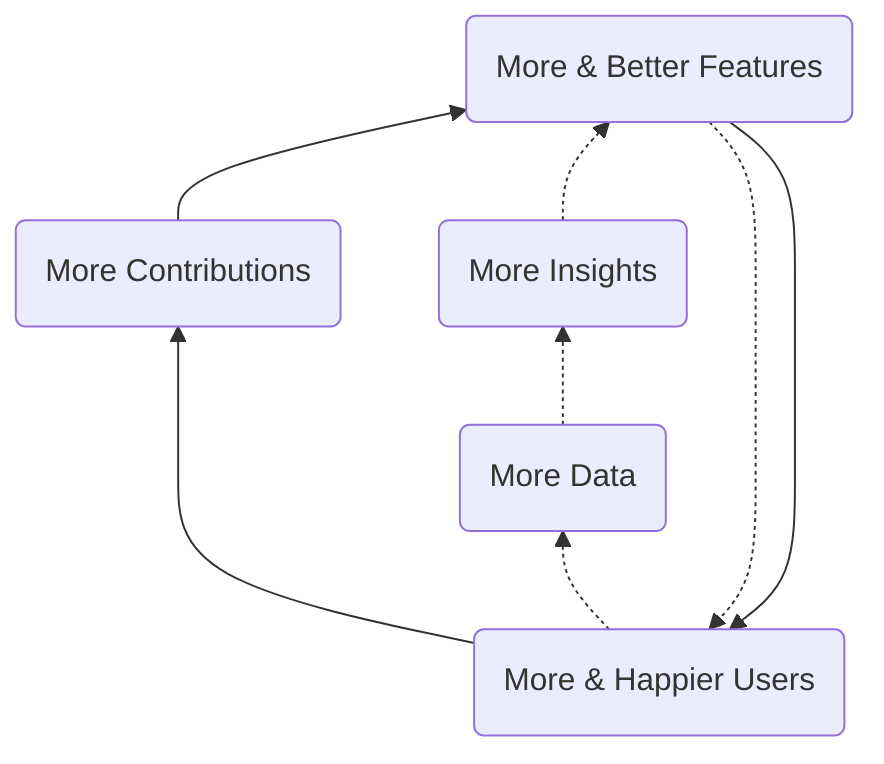
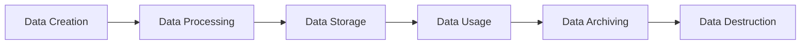
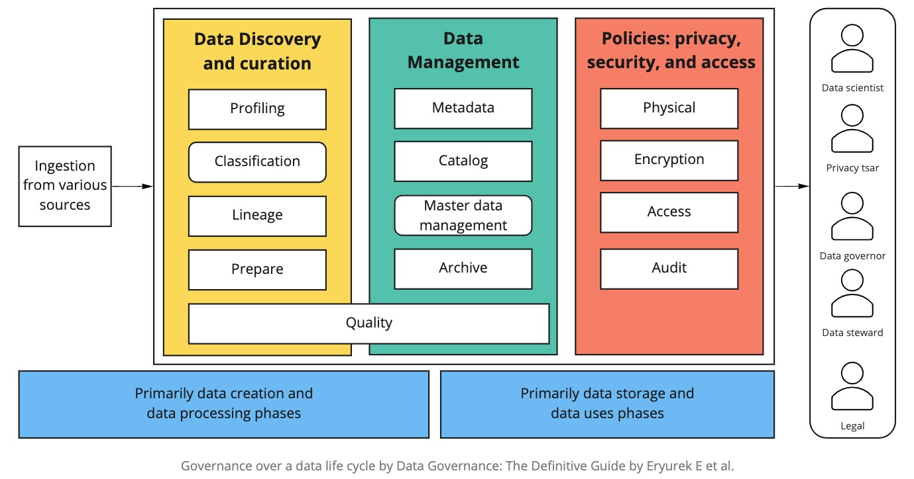
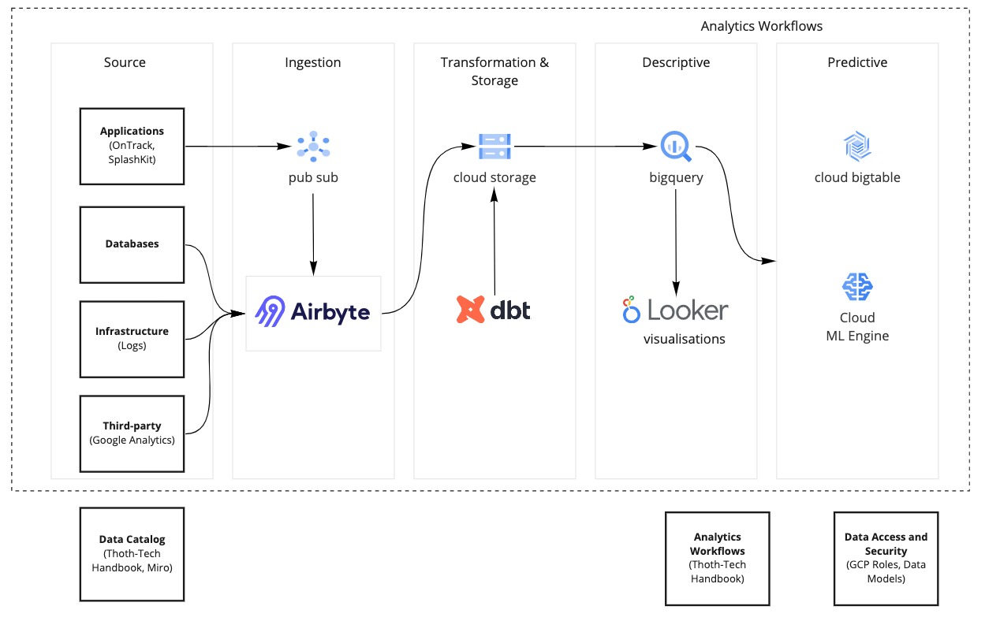
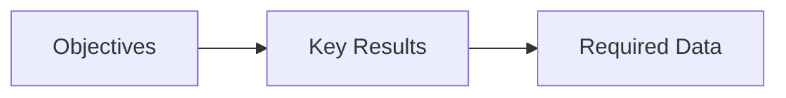

# Data Strategy

**Mission:** Help Thoth Tech Make Better Decisions, Faster.

At Thoth Tech, we endeavor to be user-centred. Users will be the centre of our operations including
how we develop and support our products. To support that mission, we would like to have strong data
insights.

We are creating a Data Platform, a single unified data and analytics stack. The Data Platform will
power cross-functional reporting and analysis, and in general, allow all team members to make better
decisions with trusted data. Over time, the Data Platform will further enhance Thoth Tech's
analytics capabilities with features such as data products - enriched and aggregated data integrated
into Thoth Tech products for use by our users. This acceleration happens through the development of
"Data Flywheels".

What is a flywheel strategy?

[A flywheel strategy](https://www.ejorgenson.com/blog/flywheel-effect) has positive feedback loops
that build momentum, increasing the payoff of incremental effort.

## Data Flywheels

We call this User and Product Intelligence Flywheel. It is focused on improving the User Experience
and encompasses the data and analytics involved in the user-product interactions, user use cases,
product development and most aspects of the user journey.

In the open core flywheel, more features drive more users which in turn drive more contributions
which lead to more users.

## Data Platform

Thoth Tech's Data Platform is built entirely with cloud computing technologies and data stores.
Building this platform requires us to adopt a Modern Data Architecture (MDA) that specifies how data
will be collected, cleanses, stored, transformed, processed, and made available to users.

MDA has the following characteristics:

- Security Layer
  - Authentication
  - Authorisation
  - Logging/traceability
  - Alerting
- Application Space
  - AI/ML Workspace
  - Microservices
  - Web Apps
  - Data Science
- Analytics Space
  - Dashboards
  - Reports
  - Trend Analysis
  - Modelling
- Data Governance Space
  - Metadata
  - Data Catalog
  - Data Classification
  - Data Lineage
- Acquisition Layer
  - APIs
  - ETLs
  - Pub/Sub
  - Stream Processor
- Source Layer
  - Data Warehouse
  - Real-time Data
  - Third Party Feeds

We must not acquire all of the above capabilities. In fact, these are driven by the company's short
and long term needs.

## Data Governance

Data is an asset, and just like other assets, requires strong and consistent management. Data
governance is a cross-functional management activity that help to ensure quality, integrity,
security and usability of the data collected by our organisation.

The purpose of data governance is to enhance trust in the data. Trustworthy data supports decision
making and management using key performance indicators (KPIs).

### Data Life Cycle

Data Governance must bring together people, processes and technology to govern data throughout its
life cycle. It is not a trivial task and requires collaboration across the organisation. For Thoth
Tech, we propose the adoption of the Data Governance Framework by Evren et al. (2021)

## Data Stack

Where are we heading

| Stage              | Tools                |
| ------------------ | -------------------- |
| Extraction         | Airbyte              |
| Loading            | Airbyte              |
| Data Warehouse     | Google Cloud Storage |
| Transformation     | dbt                  |
| Data Visualisation | Looker               |
| Advanced Analytics | jupyter              |

### Data Sources

Data can be generated from multiple sources, in different formats such as structured or unstructured
data, and in different frequencies (batch or stream).

| System    | Data Source                    | Frequency |
| --------- | ------------------------------ | --------- |
| OnTrack   | Application metrics (proposed) | Stream    |
| OnTrack   | Relational Databases           | Batch     |
| OnTrack   | Logs                           | Stream    |
| OnTrack   | Google Analytics               | Batch     |
| SplashKit | Usage metrics (proposed)       | Stream    |

## Roadmap

Our current data capability is extremely limited. We do not have a analytics infrastructure as well
as a sound understanding of our data sources and business KPIs.

### Discovery

- Identify and document data sources
- Classify data and level of access
- Identify product metrics and required data

### Data Pull or Push

- Develop Telemetry framework in OnTrack (API and Web)
- Develop Telemetry framework in SplashKit (Usages)

### Ingestion and Data Store

- Build Ingestion pipeline and data store

### Visualisations features

- Refine product metrics and build dashboards

### Predictive capabilities

- Analyse dataset and build model

## Quarterly Objectives

For the period of Trimester 1/2022, we would like to focus on the following items:

- explore document project objectives, whether they are related to people, process or product.
- define the key results that support those objectives.
- brainstorm on the required data that can help to validate the above key results

