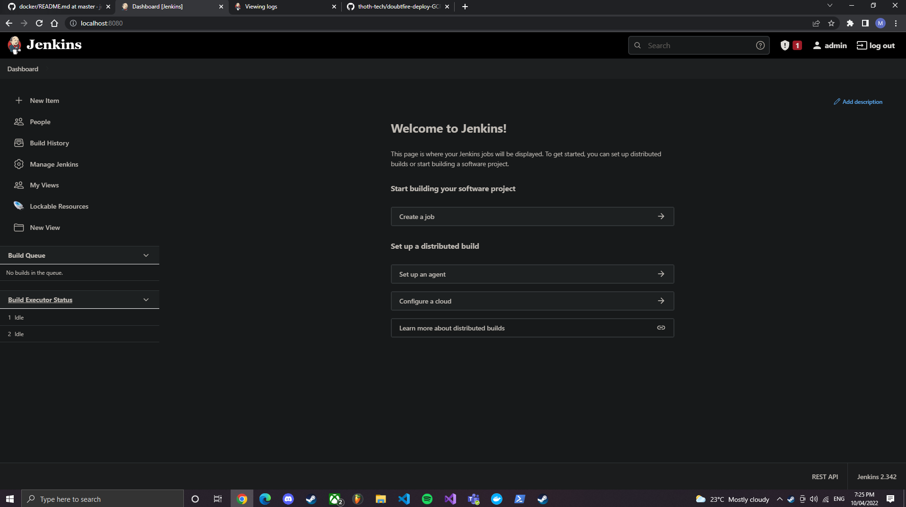

# How to download and install Jenkins

## Why Jenkins 

This guide is for how to download and install Jenkins and how to run on GCP (GCP is not yet added)
 
- Running Jenkins locally to get a good idea of how it works. Should be run using Docker as this is how it will run when in GCP
- Hosting it on GCP, through either Cloud Run or Google Kubernetes Engine (GKE)
- Connecting our GitHub repo and configuring how the builds will work
- The auth team will need to work out how to authenticate on Jenkins. Since the URL will be publically exposed obviously we don't want anyone with the URL to have access.  

 ## How to run Jenkins locally

Prerequisites

- Docker installed on your machine. Can download [here](https://docs.docker.com/get-docker/)
- Docker Daemon running. This is simply running the Docker GUI in the background
- If using Windows, use powershell. Mac users can use the default terminal  

Steps to install and run

1. Run the follow command to pull jenkins to your local registry `docker pull jenkins/jenkins`
2. Run and expose the container with the following command `docker run -d -v jenkins_home:/var/jenkins_home -p 8080:8080 -p 50000:50000 --restart always jenkins/jenkins` If you go to `localhost:8080` in a web browser you'll see Jenkins running
3. You need to grab the password that is within the container, the easiest option is use `docker logs container_id` After running this command you will see the passsword within the logs, it's pretty easy to find. You can find the container id by going to the Docker GUI and going to the container section, you'll see it running.
4. Enter the password and then you can start using Jenkins.

**Jenkins running locally on my machine** 
 
 
