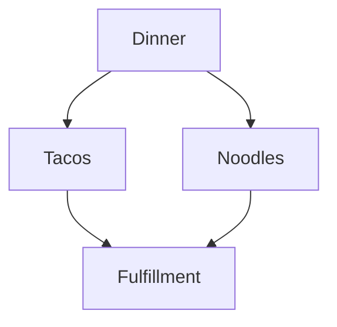

# Markdown Guide

- [What is Markdown?](#what-is-markdown)
- [Thoth Tech and Markdown](#thoth-tech-and-markdown)
- [Guide to Using Markdown](#guide-to-using-markdown)
- [Using VS Code to Preview Markdown](#using-vs-code-to-preview-markdown)
- [Markdown Templates](#markdown-templates)

## What is Markdown?

Markdown (`.md`) is a markup language, similar to a `.txt` file, but with basic **in-text**
formating elements. Although it can produce similar outputs as a word processor, there are other
benefits that Thoth Tech can leverage.

### Thoth Tech and Markdown

Thoth Tech will use Markdown as it default documentation standard.

This decision is based on a number of factors:

1. Widespread acceptance and support
1. Readability
1. Existing products have a md presence
1. GitHub support (**ensuring accountability and transparency**)
1. HTML and static site capability

Many tools are capable of working in Markdown (**Dillinger and VS Code are good starting points**)

## Guide to using Markdown

### How do I create a Markdown file?

It's simple to specify a file as Markdown. Simply name it with the extension `.md`.

### How do I format a Markdown file?

[The Markdown Guide](https://www.markdownguide.org) is an excellent online resource providing
at-a-glance formatting examples.

Commonly used formatting options include the following:

| Markdown                                     | Result                                     |
| -------------------------------------------- | ------------------------------------------ |
| `# H1 `                                      | <H1>H1                                     |
| `## H2`                                      | <H2>H2                                     |
| `### H3`                                     | <H3>H3                                     |
| `**bold text**`                              | **bold text**                              |
| `*italicized text*`                          | _italicized text_                          |
| `> blockquote`                               | <blockquote>blockquote                     |
| `1. First item`                              | 1. First item                              |
| `1. Second item`                             | 2. Second item                             |
| `1. Third item`                              | 3. Third item                              |
| `- First item`                               | <li>First item                             |
| `- Second item`                              | <li>Second item                            |
| `- Third item`                               | <li>Third item                             |
| \``code`\`                                   | `code`                                     |
| `---`                                        | <hr>                                       |
| `[Link Name](https://www.markdownguide.org)` | [Link Name](https://www.markdownguide.org) |

### Diagrams

You can generate diagrams and flowcharts from text by using
[Mermaid](https://mermaid-js.github.io/mermaid/#/).

The [Mermaid Live Editor](https://mermaid-js.github.io/mermaid-live-editor/) helps you learn Mermaid
and debug issues in your Mermaid code. Use it to identify and resolve issues in your diagrams.

To generate a diagram or flowchart, write your text inside the mermaid block:

````markdown

````


#### Collapse

A collapsed content section is used to hide information until a user chooses to reveal it with a
click or tap on the summary text. The hidden content is revealed inline. For example, this code:

```markdown
<details>
<summary>This is the summary text, click me to expand</summary>

This is the detailed text.

You can learn more about expected usage of this approach in the
[Thoth Tech markdown guide](https://github.com/thoth-tech/handbook/blob/main/docs/learning/training/markdown-guide.md).

</details>
```

results in:

<details>
<summary>This is the summary text, click me to expand</summary>

This is the detailed text.

You can learn more about expected usage of this approach in the
[Thoth Tech markdown guide](https://github.com/thoth-tech/handbook/blob/main/docs/learning/training/markdown-guide.md).

</details>

## Using VS Code to preview Markdown

VS Code has built in support for previewing Markdown files.

### Mac Users

To open your **current tab** in **Markdown preview**, use _shift + command + v_.

To create a **split screen view** (allowing you to edit your Markdown file in one screen while
previewing in another, side-by-side), press _command + k_, release the keys, then press _v_.

### Windows Users

To open your **current tab** in **Markdown preview**, use _shift + ctrl + v_.

To create a **split screen view** (allowing you to edit your Markdown file in one screen while
previewing in another, side-by-side), press _ctrl + k_, release the keys, then press _v_.

## Markdown Templates

- [Epic Markdown Template](../leadership/epic-template.md)
- [Meeting Markdown Template](../leadership/meeting-template.md)
