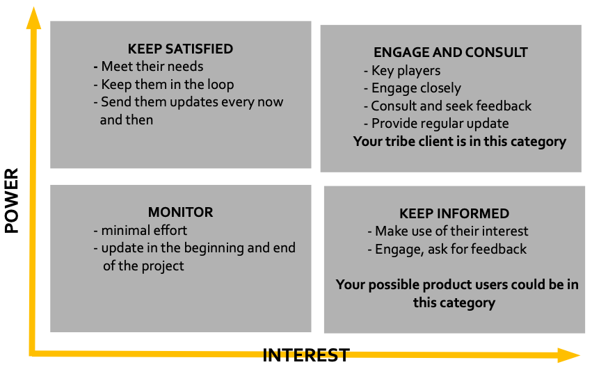

# Working with people and stakeholders

We all work in teams, even when we are in isolation! Your ability to perform your job as an
individual is hugely dependent on your workability – i.e. ability to communicate well with people
you directly and indirectly work with; your squad members, your industry coach and the client. Let’s
explore general communication skills.

## Know your audience

One of the most important things you should do before attending a meeting or writing an email is to
find out who the audience is. You must talk to each audience in their language

Generally:

- Technical people like be talked about technical aspect of project, they like details, numbers and
  reasons.
- Business people like to hear impacts/results in business sense i.e improvement in specific aspect
  of business. They like summarised information.

## Communications channels

## Meetings

- Have clear agenda for your meeting and be prepared
- Know why you are having the meeting and what you are trying to achieve by the meeting
- Make sure activities are followed up on

### Conference calls/MS Teams meetings

We are now doing most of our meeting online (or virtual) so all the points mentioned above applies
to online meetings. In addition, make sure there is link or attachment to materials you are going to
refer to in the meeting (should be sent before meetings)

### Emails

- Be clear and concise – remember usually LESS IS MORE specially when talking to client. If you are
  talking to technical people, a bit of more detail does not hurt
- Have links to what you are referring to

Let’s dive a bit deeper into different people you will have interaction with

## Talking to executives, managers and clients

They are the client for your Capstone product. Secret to communicating with them is being brief.
Remember they are the busiest people at the company so compact but meaningful messages show you
value their time. So instead of writing them 2 paragraphs, write them 2 bullet points.

It’s OK if you can’t get them enough information in 2 bullet points, if they need more information
and data, they will ask.

Here are few tips when talking to your client:

- **Communicate in style they like best**: some don’t like emails, they rather prefer a quick call.
  Ask them how they like to be communicated, if they like calls, send a short summary of the
  conversation after the call
- Ensure they understand that you know the user base, technology and the business
- Update them on the latest development as frequently as possible. Make it clear whether or not they
  should be replying or this is just a weekly update
- When you are updating stakeholders on completion of a feature, tell them the **reason the solution
  is what it is**, tell them other options you considered and why they didn’t turn out to be ideal
  and why you ended up building what you built

In bigger organisation and teams, it is a great idea do a more complete stakeholder analysis using
power-interest matrix.

## Talking to technical people & developers

This could be your tech-savvy client or someone from the client team who is in charge or technical
aspect of the project. They are lovers of details and numbers. They always think about what we say
may or may not work in technical setting.

The clearer you are the better, they need to know details that other people don’t. E.g. what happens
when user clicks on this, what happens at empty state (when there is no data on a page), etc.

Here are few tips for communicating with technical people:

- If something goes wrong, it’s your fault (not client). Make sure the specs are confirmed, right
  and clear
- When you are pitching a feature, be prepared and also have an idea of where it’s going to go in
  the future, and what MVP is going to look like
- Try to do work upfront before asking the client a question. **Trying yourself before asking
  someone else's time is a big sign of respect**
- Watch out for **tech debt**: tech debt is something that needs to be dealt with later as a result
  of not doing something correctly the first time. Everyone specially developers hate tech debt
  because they have to do it. Talk to developers about the technical stuff, scalability, future
  plans, etc.

## Talking to designers

They are creative people, give them space to explore design features but clear any limitations for
them early because one slight change could change their entire design.

Same as developers, designers are not agencies or only the people who make things pretty! Most of
the time, designers know more about user interactions than other team members and it’s their job to
make sure what they design fits well with other areas of the product (ideas for upskilling: customer
journey, user interaction, UI design)

Designers should be given a chance to give their opinion about the product but also they should have
resources like data and user feedback to design an intuitive UI (if available).

Don’t tell designers what to do. They are responsible for **the how** e.g. remind them how user
interface needs to be clear as possible because big part of user base is not technologically - adapt
people but don’t them to do this and that.

Always talk about user problem first, and the solution second. Don’t tell them users should be able
to send photos to another user (description of solution). The problem is users can’t express
themselves with photos and visuals.
