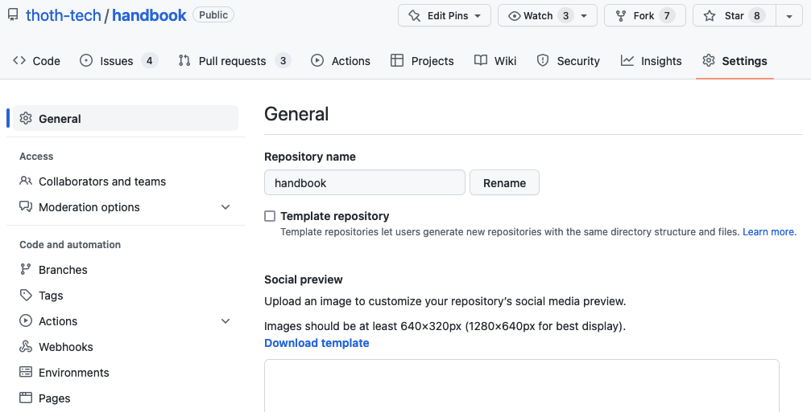
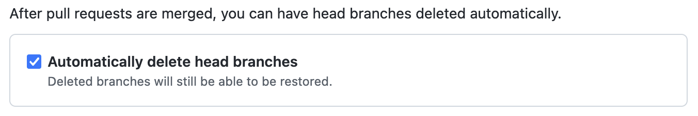
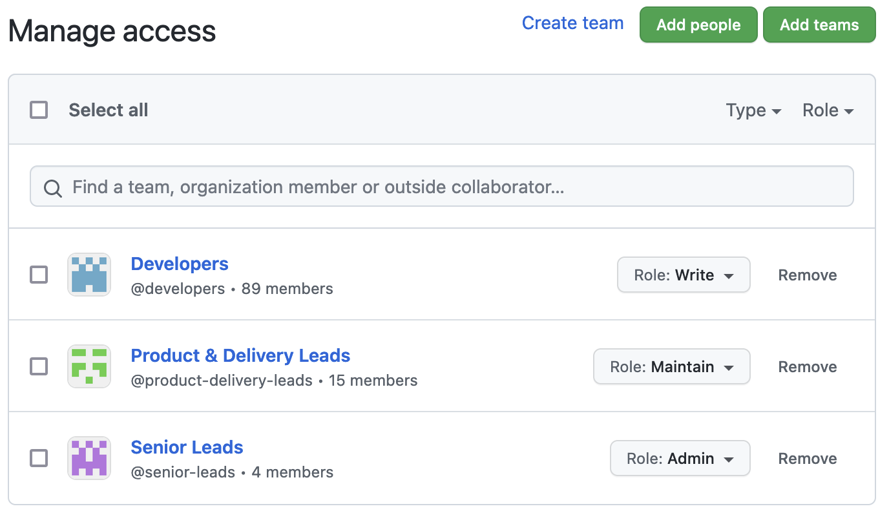
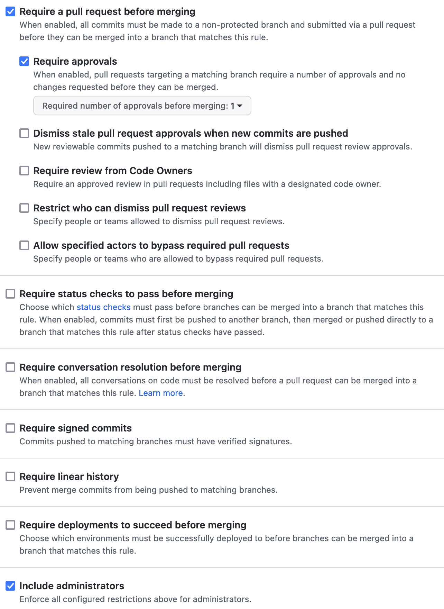

# Setup new GitHub repository

Everyone at Thoth Tech has permission to create new GitHub repositories. To adhere to the
[Git Contribution guide](../../processes/quality-assurance/git-contribution-guide.md), we suggest to
implement the following GitHub settings:

- [Delete merged branches automatically](#delete-merge-branches-automatically): enabled
- [Access control](#access-control): role-based with least privilege
- [Branch protection](#branch-protection): enabled

You can find these settings under the repository settings page.

## Delete merged branches automatically

This setting helps to reduce the number of branches that are already merged to the default branch.
On large repository, this improves code checkout time and reduce disk storage.

1. Go to the `Settings > General` page. For example,
   `https://github.com/thoth-tech/handbook/settings`.
1. Scroll down to
   `After pull requests are merged, you can have head branches deleted automatically.` setting.
1. Enable `Automatically delete head branches`.

## Access control

To reduce accidental deletion and risk of compromised accounts, we would like to keep elevated
permissions to a smallest number of individual as possible. Generally, roles are assigned as
follows:

- Senior Leads: `Admin`
- Product & Delivery Leads: `Maintain`
- Developers (everyone in the organisation): `Write`

The administrators or repository creators can ensure the above roles assignment.

1. Go to the `Settings > Access` page. For example,
   `https://github.com/thoth-tech/handbook/settings/access`.
1. Select `Add teams`.
1. Type the team name and assign the roles as stated above.
1. Repeat for the rest of the teams.

## Branch protection

We recommend feature branch strategy and Pull request workflow for code development. This ensures
code quality, knowledge sharing and collaboration. Pushing to the default branch must be prohibited.

1. Go to the `Settings > Branches` page. For example,
   `https://github.com/thoth-tech/handbook/settings/branches`.
1. Select `Add rule`.
1. Type the name of the default branch in the `Branch name pattern` text box. For example, `main`.
1. Enable `Require a pull request before merging`.
   1. Enable `Require approvals`.
   1. Select `Required number of approvals before merging` according to the
      [Code Review guidelines](../../processes/quality-assurance/git-contribution-guide.md#required-approvals).
1. Enable `Require status checks to pass before merging`.
   1. Ensure `Requires branches to be up to date before merging` **is disabled**.
1. Enable `Include administrators` so everyone is subjected to the above rules when contributing.
   code to the repository.
1. Select `Create`.

