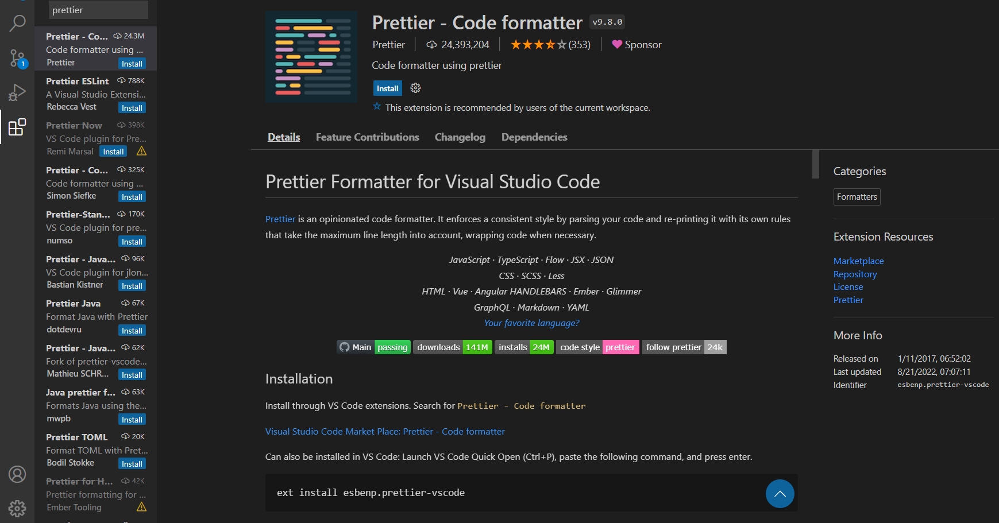
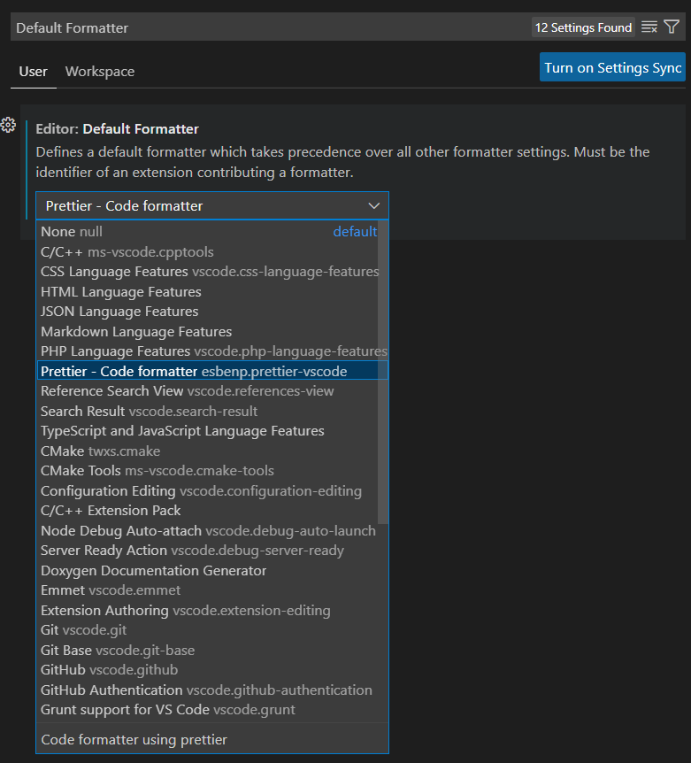
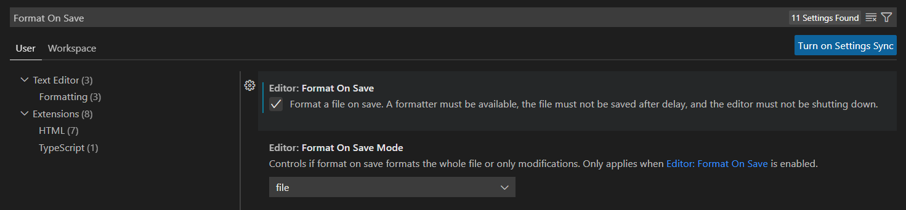
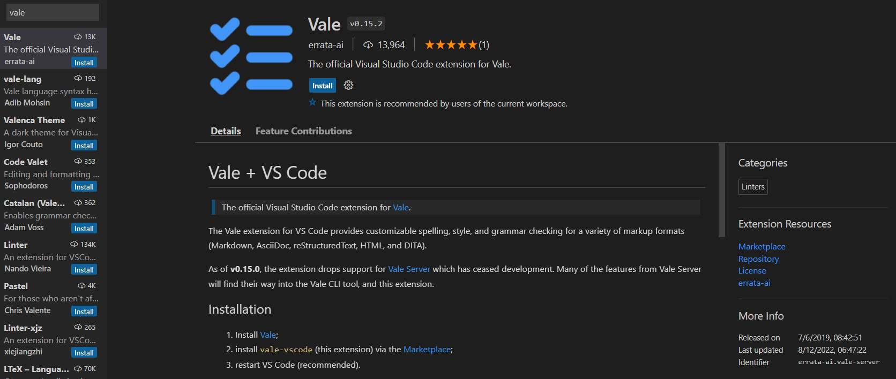
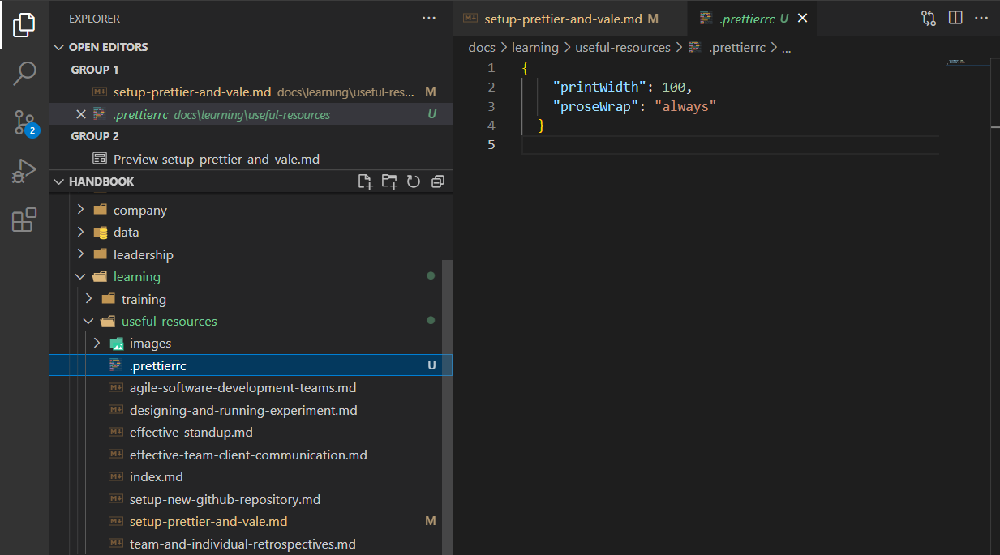

# Setup Prettier and Vale in VS Code

## Requirements

---

- Visual Studio Code is required to follow this guide

## Author Information

---

- Author: [Matthew Fletcher (Fletch99)](https://github.com/Fletch99)
- Team: OnTrack - QA and Testing
- Team (Delivery and/or Product) Lead: Matthew Fletcher

## Document Summary

---

- Documentation Title: Setup Prettier and Vale for VS Code
- Documentation Type: On-boarding
- Documentation Information Summary: Guide document for installation and set up of Prettier and Vale

## Document Review Information

---

- Date of Original Document Submission to GitHub: 15/09/2022
- Documentation Version: 1.0
- Date of Previous Documentation Review: 15/09/2022
- Date of Next Documentation Review: to be decided

## Key Terms

---

**Prettier**: A formatter used across Thoth Tech to make sure that all our documents are formatted
consistently.

**Vale**: A spell checking extension that allows editors to see spelling and grammar mistakes

## Key Links/Resources

---

- [Vale full install documentation](https://vale.sh/docs/vale-cli/installation/)

## Contacts for further information

---

See [Thoth Tech Handbook](https://github.com/thoth-tech/handbook/blob/main/README.md).

# Introduction

Everyone at Thoth Tech should be using both [Prettier](https://prettier.io/), as well as
[Vale](https://marketplace.visualstudio.com/items?itemName=errata-ai.vale-server). These allow for
Pull Requests to run smoothly and allow Thoth Tech to have a consistent format, free from grammar
and spelling issues.

## Installing Prettier

To install Prettier do the following:

1. In Visual Studio code go to `Extensions` page
1. Search for `Prettier`
1. Select Install

## Setting prettier as default formatter

1. Go to `Manager > Settings`
1. Search for `Default Formatter`
1. Under `Editor: Default Formatter` select Prettier - Code Formatter

## Setting prettier to format on save (Optional but recommended)

1. Go to `Manager > Settings`
1. Search for `Format On Save`
1. Under `Editor: Format On Save` tick the checkbox

# Vale

_Vale is a spell checking extension that allows editors to see spelling and grammar mistakes. Vale
is also set to prevent long sentences so we can keep our documents succinct._

## Installing Vale

1. Open a new Command Line and run '`choco install vale`' (You must run as administrator so either
   append `sudo` for Linux or open you command line as an administrator for windows).
1. In Visual Studio code go to `Extensions` page.
1. Search for `Vale`
1. Select Install.

See here for the [full Vale install documentation](https://vale.sh/docs/vale-cli/installation/)

## Final Steps

Finally its good to make sure that everything is setup and working correctly to do this:

1. Open a new Terminal and enter `npm install`
1. After the `npm` install finishes close down Visual Studio Code completely
1. optionally you can also do a restart

## Potential Issue fixes

1. If you face issues, go back through this guide and make sure all the settings that were changed
   have saved
1. If prettier doesn't seem to be working, try to create a file named `.prettierrc` in your current
   folder and copy the contents from the same `.prettierrc` file in main the repository

