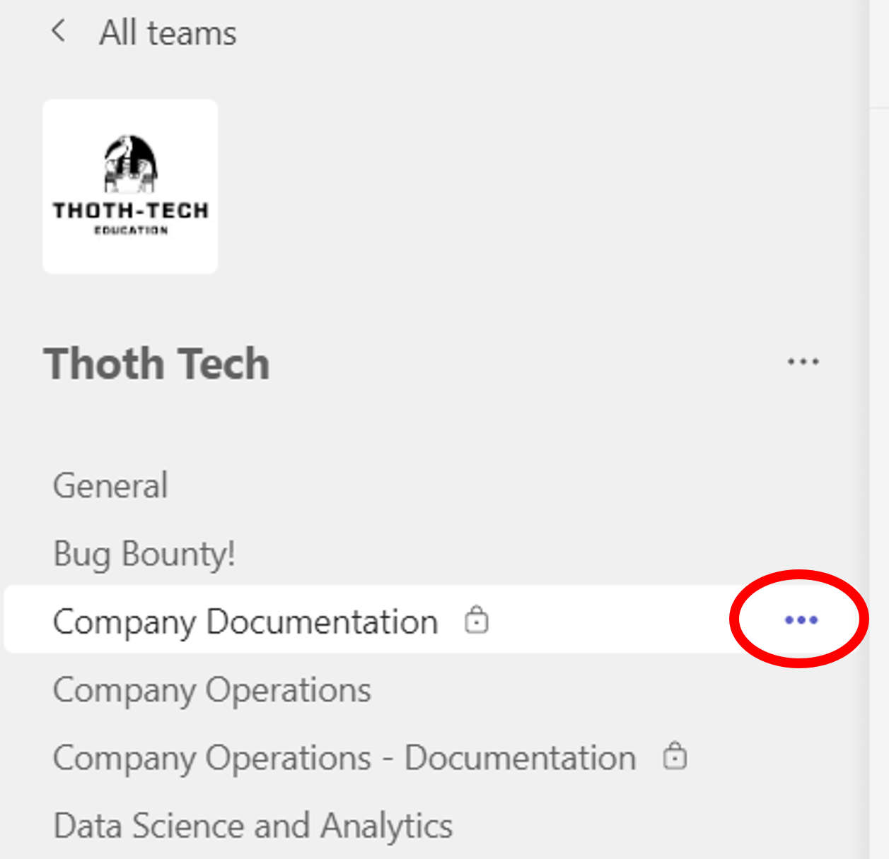
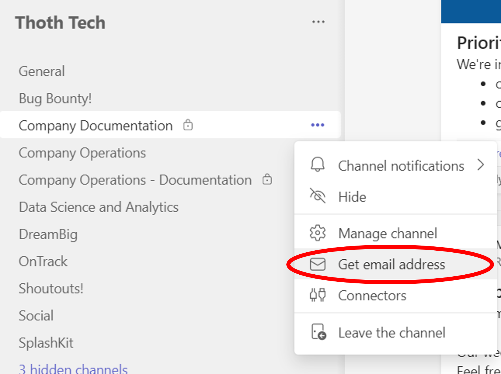
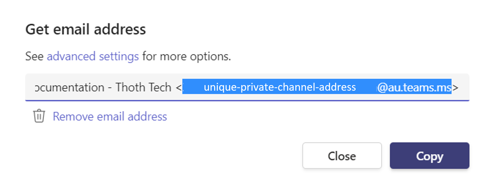
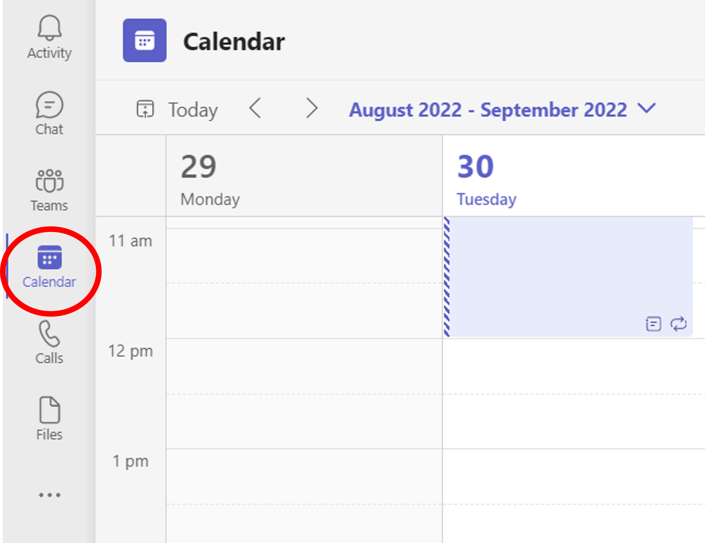
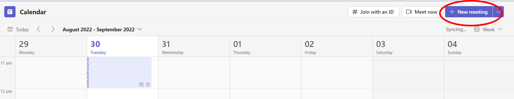
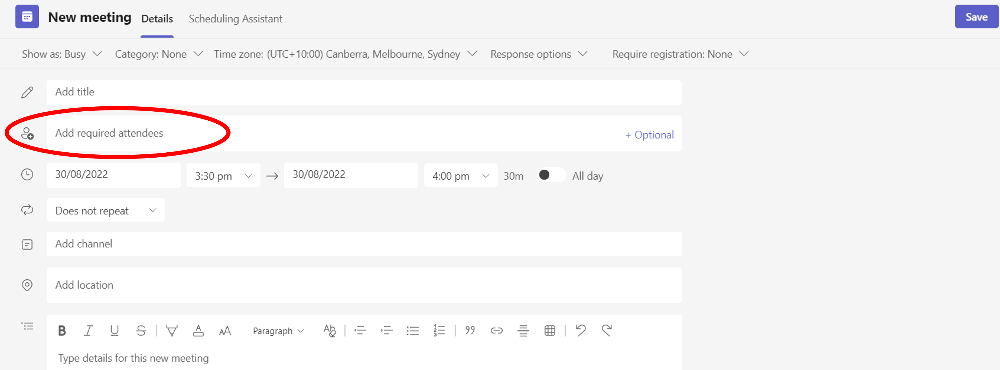

# Company Operations Guide

The Company Operations Guide informs Thoth Tech members of how to conduct certain company
activities. The contents of this guide will assist in achieving consistency in micro-level company
operations across all teams and products.

## Table of Contents

- [Storage of documentation](#storage-of-documentation)
  - [Company Handbook](#company-handbook)
  - [Documentation Repository](#documentation-repository)
  - [Microsoft Teams channels](#microsoft-teams-channels)
    - [File & Folder Naming Conventions](#file--folder-naming-conventions)
- [Conducting Team Meetings](#conducting-team-meetings)
  - [Location of Team Meetings](#location-of-team-meetings)
    - [Scheduling Meetings in Private Channels](#scheduling-meetings-in-private-channels)
  - [Meeting Recordings](#meeting-recordings)

---

## Storage of Documentation

Undertaking documentation is a key company operations process within Thoth Tech. This includes
documenting:

- Research findings
- Meeting notes
- Testing processes and results
- And much more.

It is important to ensure that this documentations adheres to the
[Writing Style Guide](https://github.com/thoth-tech/handbook/blob/main/docs/processes/documentation/writing-style-guide.md)
and is stored in the correct location. The next sections outline where to store various
documentation and recommended documentation practices.

### Company Handbook

As best stated by Thoth Tech Managing Director Andrew Cain, the
[Company Handbook](https://github.com/thoth-tech/handbook) is "_the source of **truth** - the place
we go when we want to know something about a project, product, or team_". The Company Handbook
contains high-level information about the Company and its projects, products, and teams. Also, it
contains guidelines and process information that is relevant to the whole company.

The following are examples of information relevant to be added to the Company Handbook:

- Product information, including:
  - Product overview
  - Product goals and objectives
  - Guides for new members getting started
- Team information, including:
  - Team members and role titles
  - Trimester objectives and goals
- Information relevant to the whole company, including:
  - Communication guidelines
  - Contribution guidelines
  - Best practice policies
  - Learning resources (for example, how to use Markdown)
  - Onboarding and Offboarding processes
  - Company reports, charter, and structure
  - Leadership information
  - Data strategies
  - Quality assurance practices

### Documentation Repository

The [Documentation Repository](https://github.com/thoth-tech/documentation) stores any documentation
which is not significant enough to go into the Company Handbook. Although not relevant to the
Handbook, adding all other documentation to this Documentation Repository is important for
transparency and demonstrating team progress. Within this repository, there is a folder for each
team (under the relevant product folder) for members to store their non-Handbook documentation.

Specifically, the Documentation Repository can be used to store:

- Research notes and findings
- Planning notes
- Diagrams
- Meeting notes
- Collaborative documents
- Testing processes and results

that are generated by each team. This centralised location for all such documentation can be used to
evidence the work performed by individuals, and by the team as a whole.

### Microsoft Teams channels

While the most documentation should be stored in the Company Handbook or Documentation Repository,
Microsoft Teams channels may also be used to store:

- In-progress collaborative documents (for example, a shared Word doc for collaborating on goals for
  the trimester)
- The Team Worklog

Once collaborative documents have been completed, teams are to convert these documents into Markdown
and add them to the Documentation Repository.

#### File & Folder Naming Conventions

For documents within the Microsoft Teams channels, teams are to store them in a folder which follows
this naming convention: **Trimester-Year-TeamName** (for example, "T2-2022-CompanyOperations"). This
ensures that the documents are stored under a relevant location and assists future trimester’s teams
in finding and accessing relevant documentation.

The name of each file within these folders must be logical and succinctly describe the file contents
(for example, "CompanyDocumentation-Team-Worklog" rather than "Untitled1"). This will ensure that,
at a glance, team members can understand the overall content of each file. Such naming conventions
will also assist in locating these documents.

## Conducting Team Meetings

Conducting and engaging in regular team meetings (at least weekly) is an important part of team
engagement, collaboration, and management. These meetings are an opportunity to revisit and discuss
the direction and tasks of the team, as well as how members are progressing.

The next few sections provide guidance on team meeting location and recordings of these meetings.

### Location of Team Meetings

Each team within Thoth Tech is assigned their own private channel within Microsoft Teams to enable
communication and collaboration. **This private channel is also the location where team meetings are
to be conducted**. Doing so ensures that all team communication activities are conducted within the
same location for ease of access and transparency. Further, conducting the team meetings within the
same private channel allows company directors to keep track of team engagement and attend meetings
as necessary.

#### Scheduling Meetings in Private Channels

The following steps are a guide through the process of setting up a recurring meeting within a
private Microsoft Teams channel. From following this process, a meeting invite is sent to all
channel members and the meeting is added to the calendar.

1. In Microsoft Teams, select the three dots/elipsis next to the name of the relevant team channel.
   The three dots/elipsis appear to the right of the lock icon when the team name is hovered over.

   

2. Select "Get email address" from the drop-down menu.

   

3. In the resulting window is the channel name followed by the channel's private email address in
   angle brackets (eg **Name of Channel** <**Channel email address**>). Highlight and copy
   (right-click, then select "copy") only the channel email address contained in the angle brackets.

   

4. Next, select "Calendar" from the left side pane of Teams,

   

   and then "New meeting" in top right-hand-side of the calendar window.

   

5. Paste the channel email address into the meeting participants section (the section that says "Add
   required attendees").

    

   Then, fill in the rest of the appropriate meeting details (including meeting name, date, whether
   it is recurring, and a brief description), and select "Save".

6. And you're done! A meeting invite will be automatically sent to all members of the private
   channel and the scheduled meeting has been set up.

(Note: this guide has been adapted from the instructions provided in
[this article](https://scoutsaustraliansw.zendesk.com/hc/en-us/articles/360041835192-How-to-Schedule-a-meeting-from-within-a-private-Teams-channel))

### Meeting Recordings

Meeting recordings are a highly valuable source of evidence to demonstrate engagement and
collaboration by Thoth Tech members. Additionally, recordings of meetings can be accessed by members
who were unable to attend. This allows all members to be up-to-date with what has been discussed in
the meetings.

**As such, all team meetings must be recorded** using the MS Teams recording function.

It is recommended that recordings are placed in an appropriately named folder within the "Files" tab
of the team's private channel. This allows relevant team members, leadership members, and company
directors to access the recordings as necessary.
