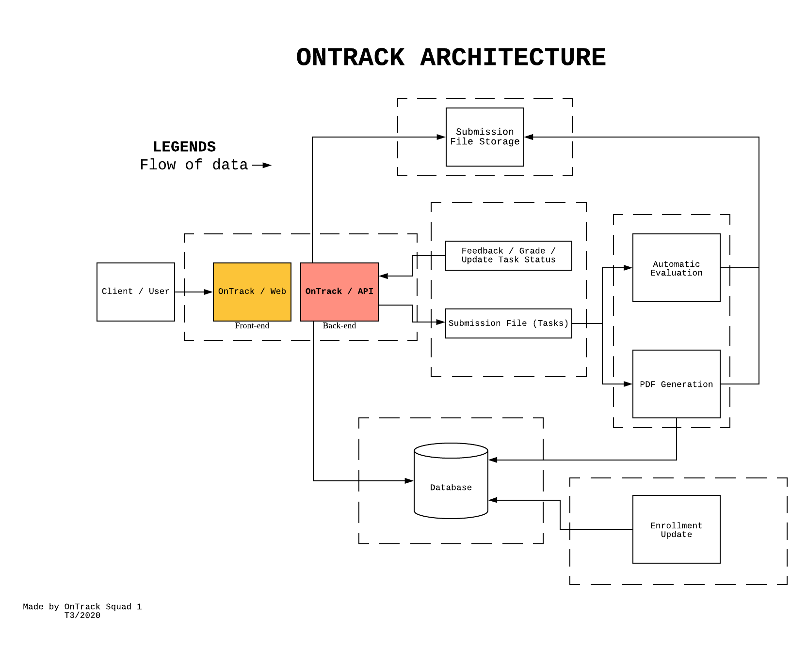
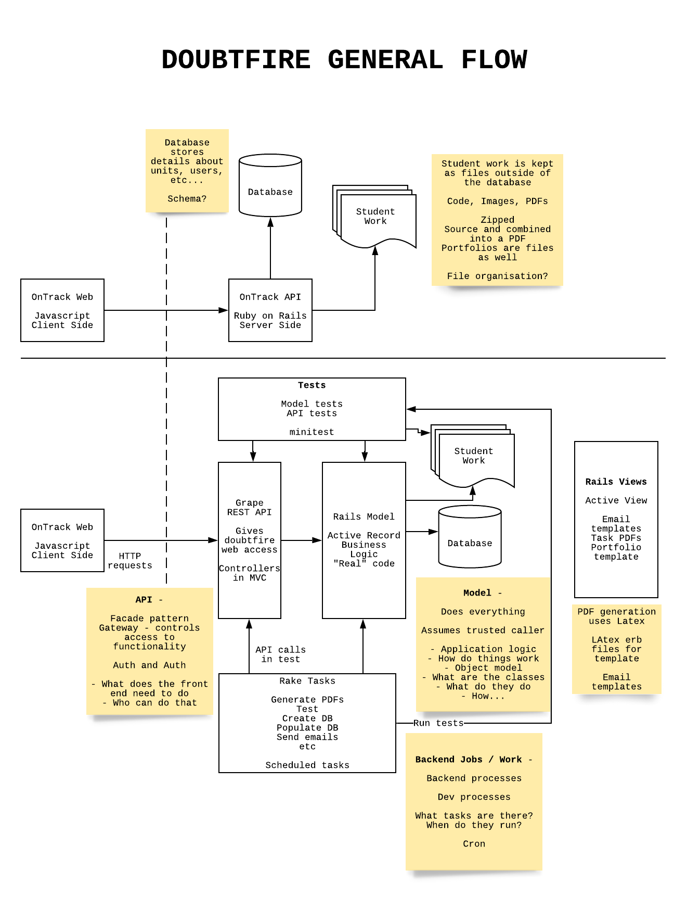

# OnTrack

## What is OnTrack?

OnTrack is a web assessment tool that provides students with a task oriented
approach to portfolio assessment to stay aligned by completing tasks as part
of their learning. More information can be found on the OnTrack [website](https://www.deakin.edu.au/students/help/about-clouddeakin/help-guides/assessment/ontrack).

## What are the goals for OnTrack?

The OnTrack group is to focus on the maintenance and development of Doubtfire. [Doubtfire](https://doubtfire.io/guides/overview) is a learning management system which is used at Deakin University by both students and staff. The group has been tasked with creating new features to enhance both the teaching experience for tutors and learning experience for students.

## Understanding OnTrack

### High level architecture

### Getting Started

Please follow the [installation instructions](https://doubtfire.io/guides#developer) for developers on the official
product website.

For DoubtFire Web, if you are on Windows, it might be more convenient to set
it up via Docker Desktop. Please follow the instructions laid out in this [doc](https://deakin365.sharepoint.com/:w:/r/sites/ThothTech2/Shared%20Documents/General/OnTrack%20Product/Useful%20Resources/Docker%20Auto%20Reload%20Instructions.docx?d=w46db2b73edfa41c8a1a18af8d07157be&csf=1&web=1&e=9DOKOr).
